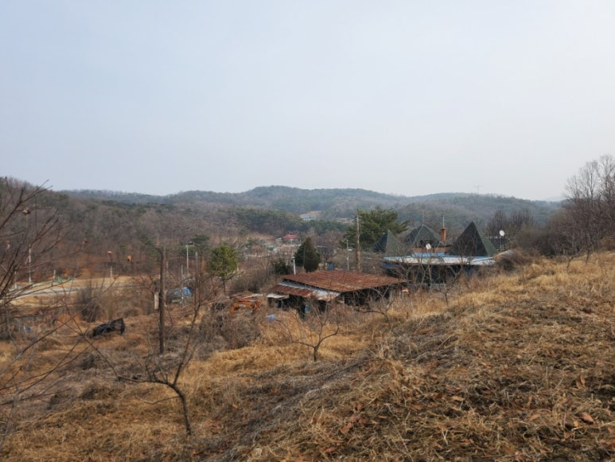
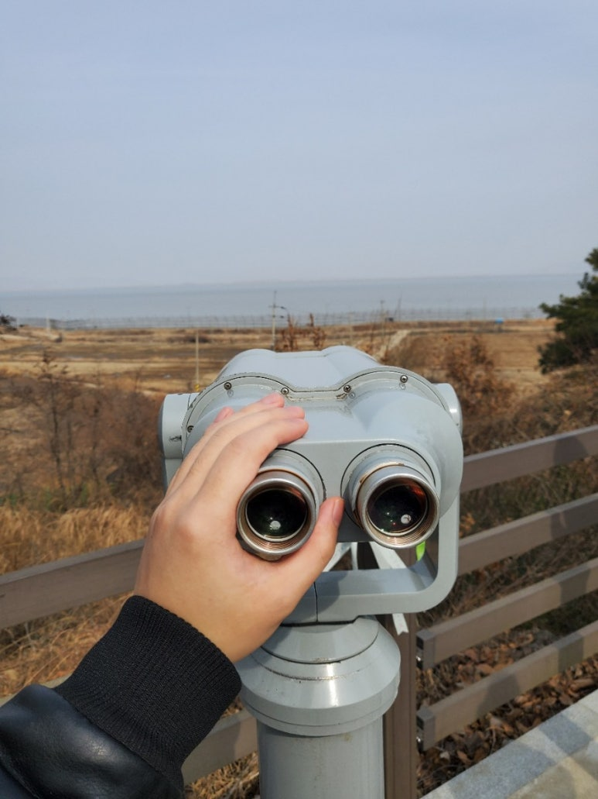
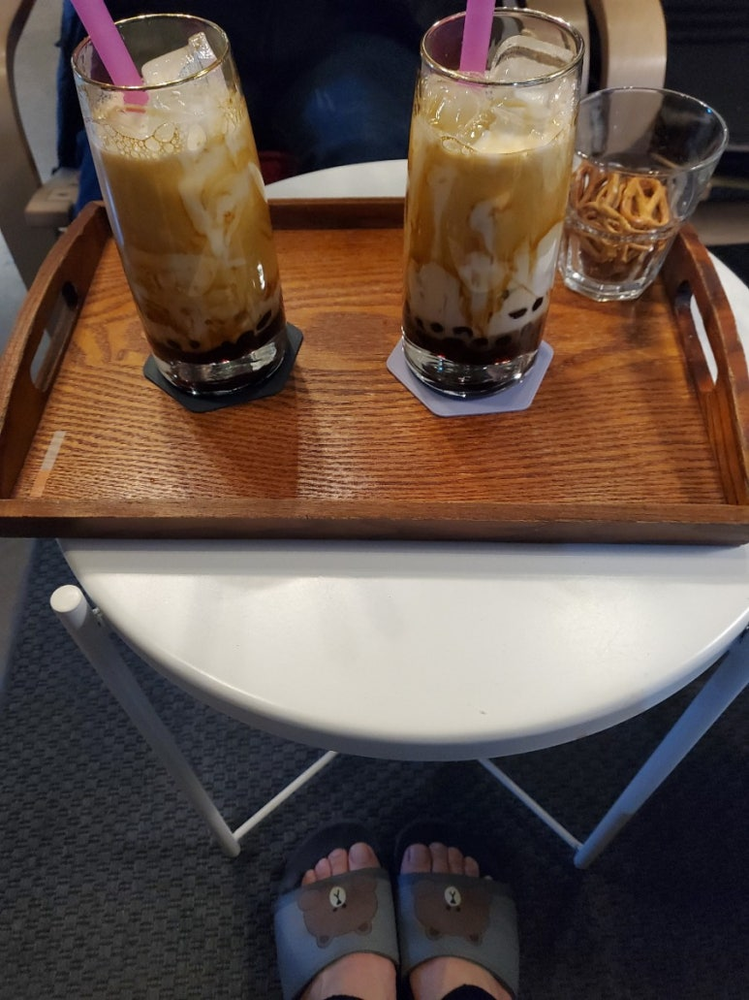
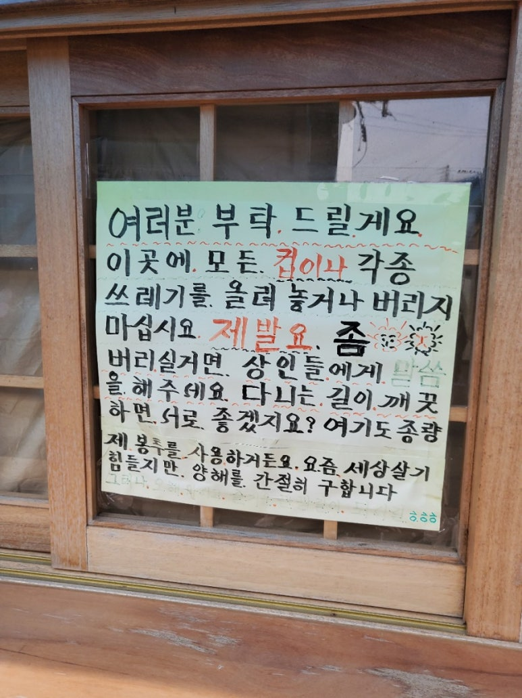

## 난생 처음 가지치기해보고 교동에서 밥 먹고옴!

토요일에 어머니랑 이모랑 사과, 복숭아, 자두 나무 가지치기 하러왔다.ㅋㅋㅋ

이거 할 돈이면 과일 몇 십 박스 사먹을텐데~ 이 소리하면서 가지치기했다. 유튜브 알고리즘에 가지치기 컨텐츠로 가득참;;;

가지치기하고 밥 먹으러 왔는데 촬영장인줄. 사람도 없고 분위기 한적해서 편하게 식사하고옴.

카페 갔는데 카페 테이블이 옛날 장롱 문짝 ㅋㅋ 문 손잡이도 그대로 달려있는데 너무 예쁘고...  누가 이런 장롱 하나 안 버리나.... 

방학 동안 살 찐 내 손

​

​

오랜만에 힘 쓰고 바람 맞으니까 기분 너무 상쾌했다. 개강했는데.. 아마 이번학기가 마지막 학기. 졸업 무사히 했으면 좋겠다.

 해시태그 : 