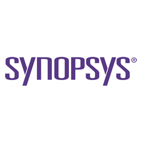

## Synopsys 파일 확장자 종류, 개념 베릴로그, Verilog, Design compiler, Primtime, IC compiler Synopsys 文件扩展名类型、概念

​

오늘은 Synopsys (Design conmpiler/DC/Primetime/PT/IC compiler/ICC/ICC2 등..)에 쓰이는 파일 확장자에 대해 알아보겠습니다.

​

_*_.v - verilog RTL source file

​

_*_.ddc - synopsys internal database format. Design compiler에서 Write를 하면, ddc파일 형태로 포맷이 나옵니다. ddc는 RTL code, Top design 적용이 된 로직(Gtech, 부울식으로 풀린) 포맷입니다. ddc를 안하고 매번 베릴로그 파일을 읽고, top design 적용하고, 연결하고, Gtech으로 적용하면 많은 시간이 소요되어 이 포맷을 사용합니다. 

​

_*_.svf - 자동 셋업 파일. 보통은 이 파일로 default setup을 지정합니다.

​

_*_.tcl - 내가 수정한 setup의 형태를 저장시켜놓은 파일 (본래 tcl은 Tool command language라고, 하나의 언어입니다.)

​

_*_.sdc - Synopsys Design Constraints입니다. (이것도 TCL이 Base입니다.)

​

_*_.lib - Technology library source file. Vendor에서 주는 셀 정보가 있습니다.(어떤 셀을 사용할 수 있고, 어떤 셀의 이름 area와 delay 등 정보가 담겨있습니다.)

​

_*_.db - Technology library (_*_.lib이 synopsys tool에 의해 compile 된 형태)

​

여기서 앞에 p가 붙으면 physical library(Layout, R, C값 정보가 담김.)고, s가 붙으면 symbol library(Library cell을 표현하는 Graphic 등의 정보가 담김.)입니다.

​

_*_.map - mapping file

​

_*_.tluplus - metal의 단위 길이당 R, C값 정보가 담깁니다. Net delay 계산이 쓰입니다.

 해시태그 : 