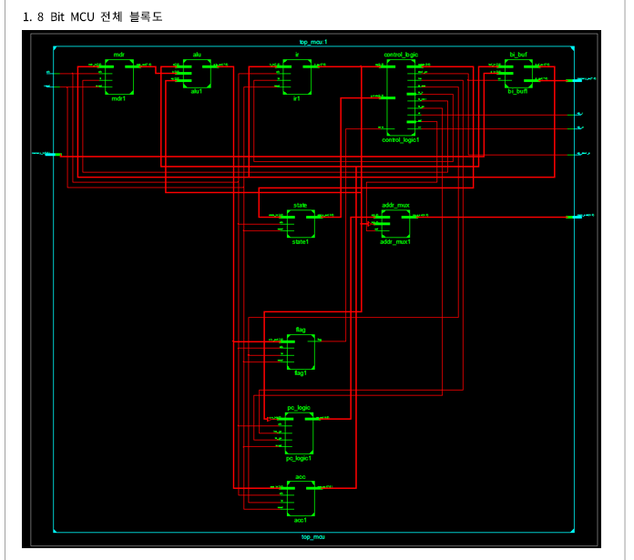

## RISC CISC 차이, 폰노이만 하버드구조 장점 단점 장단점 비교 컴퓨터구조 RISC CISC差异，冯诺依曼哈佛结构优点缺点优缺点对比

현대 RISC, SoC Design 왕좌인, ARM의 SoC design Architecture에 대해 먼저 알아보겠습니다.

​

ARM이라는 회사가 익숙하지 않으신 분들이 많으실겁니다. Acorn Compueters에서 나온, Acorn RISC Machine이 ARM입니다.

여러분은 이 회사를 매일 간접적으로 접하실거에요. 왜냐하면, 아이폰이든, 갤럭시든(퀄컴, 엑시노스), 맥북이든(M1) 다 ARM의 구조를 쓰거든요.

모바일 AP를 제외하고도, 자동차에 들어가는 ECU(Engine Control Unit)나 전투기의 항공전자장비... 뭐.. 일상에 쓰는 가전들도 ARM의 구조를 많이 씁니다. (Cortex series)

"왜 요즘은 거의 다 ARM을 쓰나요?"라는 질문을 한다면, 당연히 "효율 때문에 그렇습니다." 라고 말할 수 있겠죠.

​

처음 컴퓨터가 개발될 때에는 '스위치에 전선들과 전자소자들이 연결'로 되었어요. (그냥 한가지 기능만 할 수 있게 만들어진 컴퓨터라고 생각하면 됩니다.)

이 구조에서 '폰 노이만 구조'로 발전하게 되요.. CPU, 메모리, 프로그램이 나눠져서 설계된 형태에요.

아래의 사진은 제가 학부생 때 만든 폰노이만 구조 8bit CISC MCU입니다. 

​

​

이전 구조에서는, 컴퓨터로 새로운 기능을 구현하려면... 하드웨어를 처음부터 다시 설계했어야했어요.

그러나 폰노이만 구조에서는, 메모리 블록만 새로 설계해서 넣어주면 완성!

이 메모리가 지금으로는 소프트웨어와 비슷합니다. 아마 이 때부터 소프트웨어 개발자, 펌웨어 개발자가 태동한 것 같아요.

​

폰노이만 구조에서는, 데이터 메모리와 명령어(프로그램) 메모리가 한 버스(데이터 교환이 일어나는 통로)로 들어와서 병목현상이 일어납니다.

그래서 데이터 버스를 2개로 나눈 '하버드 구조'로 발전하게 됩니다.

현대에는 이 두 구조를 많이 쓰고있고, 현재 연구중인 구조는 뉴런을 본뜬 '뉴로모픽 구조'입니다. 관심있는 분들은 찾아보세요!

​

​

CPU를 개발하다보니까~ IBM은 기존 CPU의 명령어 구조(Instruction set)보다 더 짧은 명령어 구조, 정해진 길이 등의 규칙을 갖는게 더 효율적이라는 것을 알게됩니다.

그래서 새로운 명령어 구조를 "RISC(Reduced Instruction Set Computer)라 부르고, 예전 구조는 복잡하니까 CISC(Complex Instruction Set Computer)로 부르자!"

​

RISC의 장점을 알기 전에 대표적인 최적화 기법인 PIPELINE에 대해서 비유하여 설명하겠습니다.

​

a 한칸을 지나는데 1초가 걸린다고 생각하면

1. "입력 -> a1 a2 a3 a4 a5 -> 출력"

입력을 보내주면 a1이 입력받아 a2에 출력해주고, 그러고나서 a1은 새로운 일을 하지 않고 a2는 a3로 값을 전달하여 a5의 출력까지 갑니다.

입력에서 최종 출력단까지 5초가 걸립니다. 10초를 주면, 2번의 출력이 가능하겠죠.

​

2. "입력 -> a1 -> a2 -> a3 -> a4 -> a5 -> 출력"

a1에서 a2를 값을 출력해주고, a1은 바로 새로운 입력을 받을 수 있습니다.

10초동안 a1은 10개에 입력을 받을 수 있고, 최종 출력단에 5초~10초니까 6개의 출력값을 받을 수 있습니다.

​

이런거를 하려면, 명령어 구조가 짧을 수록 좋고, 명령어 길이가 고정된게 좋아서~ 이런 것들을 위해 RISC가 생겼습니다.

RISC가 대부분의 상황에서 빠르지만, 단점으로는 아래와 같습니다.

1. 중간중간에 계속 값을 저장해줘야하기 때문에 Flip Flop(기억장치)을 넣어주면서 크기가 커집니다.

2. CISC에서 한번만 하면 끝나는 명령어의 경우엔, RISC는 여러번 처리를 해야하기 떄문에 느릴 수 있습니다.

3. 명령어 길이를 제한해놨기 때문에, 긴 명령어를 짜거나, 한번에 큰 범위의 JUMP(n1번째 코드에서 n2번째 코드로 가는 것)를 할 수 없습니다.

​

CISC와 RISC의 각자 장점이 있는데, 아마 대부분은 RISC로 바뀔 것 같고, 일부 영역만 CISC로 남을 것 같습니다.

현재 RISC 시장은 ARM의 독주인데, 역사가 짧은 오픈소스인 RISC-V 아키텍쳐도 빠르게 발전중이라, 기대가 되네요.

앞으로 ARM의 아키텍쳐와 SiFive의 아키텍쳐와 프로토콜에 대해 알아보겠습니다.

 해시태그 : 