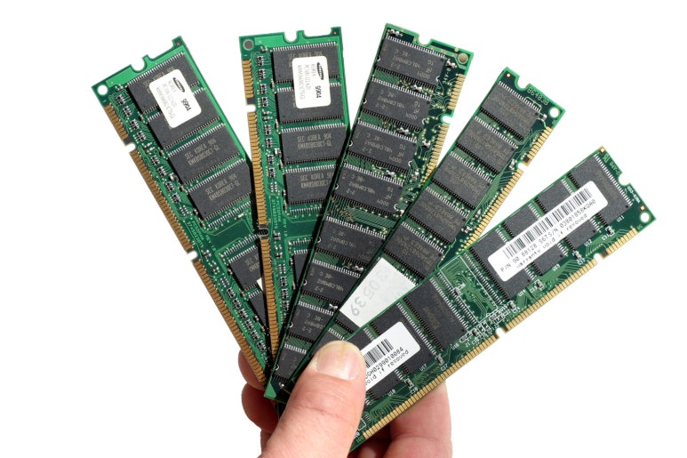

## 메모리 반도체 정리. RAM, ROM 개념부터, 차세대반도체 PRAM, FeRAM, MRAM, ReRAM, PoRAM까지.

기억장치는 주 기억장치, 보조 기억장치로 나뉜다.

주 기억장치는 컴퓨터 지금 사용할 정보들을 위해, 빠른 것들이 필요한데, 현재는 대부분의 RAM들이 주 기억장치로 쓰인다.

보조 기억장치에는 컴퓨터에 저장해 둘 많은 정보를 위해, 넓은 저장 공간이 필요한데, ROM, HDD가 보조 기억장치이다. ROM은 RAM보다 느리고, 쓰기(Write)작업은 특히 느리다. PROM은 한번만 쓰기가 가능하고, EPROM(자외선)과 EEPROM(전기)은 여러번 쓸 수 있지만, 쓰기 횟수 제한이 있다.

​

​

RAM은 Random Access Memory의 약자이다. 사용자가 어느 위치든 같은 속도로 '읽고, 쓰고, 지울 수 있는 기억장치'이다. 자격증 시험에선 '주 기억장치'로 불리며, 전원이 들어오는 내내 이 장치에 저장된다.

(ROM은 쓰기가 안되고, HDD는 위치마다 속도가 달라진다.)

RAM은 휘발성과 비휘발성 메모리로 나눠진다.

휘발성 메모리 - SRAM은 전류 차단과 동시에 빠르게 정보가 지워지고, DRAM은 서서히 지워진다.

비 휘발성 메모리 - 자격증 시험에선 '보조 기억장치'로 불리는 HDD는 전류가 끊기더라도, 정보가 저장된다.

​

플래쉬 메모리 - 비휘발성이지만, 램처럼 읽고 쓸 수 있다. 하지만, 플래쉬 메모리 컨트롤러가 내장된게 아니라면, 프로세서에서 직접 읽고 쓸 수 없고, RAM처럼 Byte 단위로 읽고 쓰는게 아닌, Page 단위 읽고 쓰기이다. 직렬처리에는 매우 느리지만, 병렬처리에는 빠르다.

SSD - 플래쉬 메모리를 병렬화한 보조기억장치로, HDD와 비교하여 용량 대비 가격은 비싸지만 속도가 매우 빠르다.

HDD - SSD이전엔 보조기억장치의 왕좌. 자성 원판을 회전시켜 자기르 정렬하는 원리로 읽고 쓰기, 지우기를 한다. 그래서 소음도 있고, 전력도 더 들지만 가격이 싸다. 구글 같은 곳에선 HDD를 많이 쓰고 있다.

eMMC - 플래쉬 메모리에 컨트롤러를 통합한 BGA IC 칩으로, 2020년 이전의 대부분 스마트폰, 게임기에 들어가는 보조 기억장치이다. SSD보다 살짝 느리다.

UFS(Universal Flash Storage) - eMMC를 개선해서 나온 최신 보조 기억장치. 비싸지만, 저전력에 고성능이라 최신 삼성 플래그쉽 스마트폰은 UFS로 출고되고 있습니다.

​

낸드 플래쉬에 대해 들어는 보셨을텐데, 뭔지 아시나요?

반도체의 논리 회로에는 다양한 회로소자가 있는데요. 모든회로소자를 NAND소자 혹은 NOR소자만으로도 만들 수 있습니다.

낸드 플래쉬는 말 그대로 NAND로만 만든 소자입니다. 근데 왜 노아 플래쉬는 못 들어봤을까요?

낸드플래쉬는 용량 대비 싸고, 노아플래쉬는 용량 대비 비싸서, 낸드가 시장을 지배하고있습니다. (참고로, 낸드는 쓰기가 빠르고, 노아는 읽기가 빠릅니다. 공정으로의 성능 개선 한계가 오니까, NOR가 다시 주목받고 있습니다.)

시장에는 대부분 낸드만 쓰이고, 낸드를 세분화해서 쓰고 있습니다. 한번에 얼마나 많은 데이터를 취급 하느냐에 따라 달라지는데, SLC(1비트), MLC(2비트), TLC(3비트), QLC(4비트), PLC(5비트), OLC(8비트이상)로 나뉩니다.

​

다시 돌아와서, RAM! 

현대 가장 많이 쓰이는 RAM은 DRAM과 SRAM이고, 둘 다 휘발성 메모리입니다.

SRAM(Static Random Access Memory, 정적 RAM) - 교차 결합된 인버터 조합의 플립플롭을 통해 데이터를 읽고 쓰고 지움.

DRAM(Dynamic Random Access Memory, 동적 RAM) - 트랜지스터에 축전기(Capacitor)를 통해 데이터를 읽고 쓰고 지움.

SRAM이 DRAM보다 빠르지만, 구조가 복잡하고, 크기가 크고 매우 비싸고, 가격이 떨어지지도 않아서 '사용할 가능성이 높은 일부만 읽고 쓰고 지우는' 캐시메모리로 씁니다.

​

SDRAM(Synchronous Dynamic Random Access Memory, 동기식 동적 RAM) - 기존에 시판 되는 DRAM은 비동기식이었는데, 이를 동기식으로 만든 DRAM입니다. (삼성전자가 개발했고, 여기서 삼성전자는 메모리 반도체의 왕좌에 올라서는 초석을 다졌습니다.)

(동기식이란, 데이터 신호와 클럭 신호를 별도로 입력하는 것을 말하는데, 비동기식 환경에선 대량의 데이터를 고속으로 보내면 많은 오류가 생기지만, 동기식 환경에선 이를 방지할 수 있습니다.)

​

DDRSDRAM(Double Data Rate Synchronous Dynamic Random Access Memory, 이중 정보 동기식 동적 RAM) - 기존 SDRAM은 한 클럭에 한 번(Rising edge 혹은 Falling edge에서) 동기 되었으나, DDR은 두 번 한다.

현재 우리 컴퓨터에 들어가는 DDR RAM, 스마트폰애 들어가는 LPDDR(Low Power)이 쓰입니다. 

참고로, SDRAM은 삼성이 개발했지만, 현재 쓰이는 DDR은 IBM, 인텔에서, 컨트롤러는 램버스에서 개발했다. 삼성은 약간 경감된 로열티를 지불하면서 메모리 반도체를 제작하고 있습니다.

​

이상으로, 현대에 가장 많이 쓰이고 있는 기억장치를 모두 소개했습니다.

아래부터는 차세대 기억장치를 소개하겠습니다.

​

현대 주 기억장치들은 모두 모두 __휘발성__ 인 반면에, 차세대 기억장치들은 모두 __비휘발성__ 입니다.

휘발성 기억장치는 전원 공급이 끊기면, 정보 유지가 안된다는 것인데, 기존의 비휘발성 장치는 느려서 어쩔 수 없이 휘발성 메모리를 사용했던 것이죠.

차세대 기억장치들의 저장 방식은 축전 상태나 저항 상태를 통해 정보를 저장하는 방식이고, 전원공급이 끊겨도 정보가 유지되는 비휘발성 기억 장치입니다.

​

PRAM(Phase-change RAM, 상변화 메모리) - DRAM에 축전기 대신, 상변화막(GST)을 이용해 막을 변화시켜 비정질 상태(고 저항), 결정상태(저 저항)로 바꾼다. DRAM보다 공정 비용이 저렴하고, 비휘발성이다.

FeRAM(Ferroelectric RAM, 강유전체 메모리) - 강유전체란, 전압을 강하게 가하면 물질 내부에 분극이 유지되는 물질이다. 강유전체 메모리는 PZT, SBT 등 강유전체를 이용한 RAM이다. DRAM 정도의 속도이고, 무한한 수명, 비휘발성이며, 저전력이고, 대용량화가 가능하다.

MRAM(Magnetoresistive RAM, 강자성체 메모리) - 자기성 재료를 이용하여 전원이 없어도 남아있는 자성을 응용하여, 자기저항 정보를 저장하는 장치이다. SRAM처럼 빠르고, DRAM처럼 집적화가 가능하며, 비휘발성이다.

(HDD나 자기테이프는 자성 정보를 이용한 것이다. 과거에는 대형 컴퓨터에 사용되었지만, Giant magnetoresistance, Tunneling Magnetoresistance을 통해 소형 메모리로 사용할 수 있게 되었다.)

ReRAM(Resistive RAM, 저항메모리. RRAM으로도 불림.) - 전기 펄스를 통한, 금속 산화물의 저항 변화의 원리를 이용한다. SRAM만큼 빠르고, 공정 비용이 저렴하다.

PoRAM(Polymer RAM, 고분자 메모리) - Polymer는 가해준 전압에 따라 이온의 이동경로가 변하고, 전하전달 상태가 변화하여 전기전도도의 스위칭 현상이 일어나는데, 이를 이용하여 정보를 저장한다. DRAM보다 셀 크기가 훨씬 작고, CMOS 과의 접합 설계가 단순하다.

​

​

이상으로, 현대 기억장치부터 차세대 기억장치까지 정리했습니다.

참고로, 저전력의 장점은 스마트폰에만 국한되는 것이 아닙니다. 2021년 기준, 세계 1위의 슈퍼컴퓨터도 저전력 설계를 바탕으로 만들어졌습니다. 높은 전력으로 만들면, 과부하 발생으로 일을 100% 할 수 없기 때문입니다.

그리고 이 메모리 반도체는 비휘발성이고 고성능 저전력이며, 공정 비용은 상대적으로 저렴하나, 재료, 공학 연구가 핵심인데, 매우 어려워서 아직은 연구개발이 더 필요한 상태입니다.

 해시태그 : 