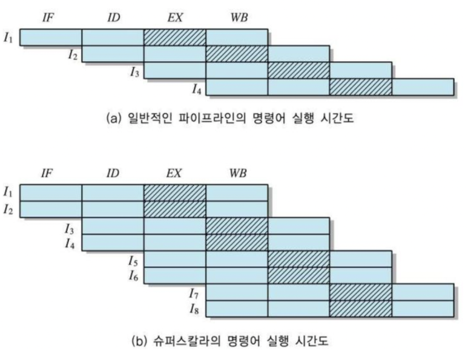

## 병렬처리 방법론. 멀티 코어, 멀티 프로세스, 멀티 쓰레드 기법 개념 정리

병렬처리(Parallel Processing) - 일의 다수의 프로세서 분담, 동시 처리 기법

많은 수의 프로세서들로 하나의 시스템을 구성할 수 있도록 작고 저렴하며 고속인 프로세서 사용

한 프로그램을 여러 개의 작은 부분들로 분할하는 것이 가능해야 하며, 분할된 부분들을 병렬로 처리한 결과가 전체 프로그램을 순차적으로 처리한 경우와 동일한 결과를 얻을 수 있어야 함

​

멀티 코어 (Multi core) : 다이 하나에 2개 이상의 코어를 집적한 것.

멀티 쓰레드 (Multi thread) : 멀티 프로세스보다 적은 메모리 공간을 차지하고 Context Switching이 빠른 장점이 있지만, 동기화 문제와 하나의 스레드 장애로 전체 스레드가 종료 될 위험을 갖고 있다.

멀티 프로세스 (Multi process) : 하나의 프로세스가 죽더라도 다른 프로세스에 영향을 주지 않아 안정성이 높지만, 멀티 스레드보다 많은 메모리공간과 CPU 시간을 차지하는 단점이 있다.

​

​

필요한 관련 기술들

문제 분할(problem partition) : 병렬처리를 위하여 문제(혹은 프로그램)를 여러 개로 나누는 것

프로세서간 통신(interprocessor communication) : 분할된 부분을 나누어 처리하는 프로세서간의 데이터 교환을 위해 메카니즘 필요

필요한 관련 기술들

병렬 프로그램 언어와 컴파일러의 개발

상호 배타 메커니즘(mutual exclusion mechanism) 지원

공유자원들에 대한 경합(contention)을 줄이고 이용률을 극대화할 수 있는 운영체제의 개발

​

병렬컴퓨터의 분류 Flynn의 분류(Flynn's classification) 구조적 특징에 따른 분류 방식

명령어 스트림(instruction stream) : 프로세서에 의해 실행되기 위하여 순서대로 나열된 명령어 코드들의 집합

데이터 스트림(data stream) : 그 명령어들을 실행하는 데 필요한 순서대로 나열된 데이터들의 집합

프로세서들이 처리하는 명령어와 데이터의 스트림(stream; 흐름)의 수에 따라 분류

​

(1) SISD(Single Instruction Single Data)

한번에 한 개씩의 명령어와 데이터를 순서대로 처리하는 단일프로세서 시스템

파이프라이닝(pipelining), 슈퍼스칼라(superscalar)구조를 이용

​

(2) SIMD(Single Instruction Multiple Data)

배열 프로세서(Array Processor)

여러 개의 프로세싱 유니트(PU)들로 구성되고, PU들의 동작은 모두 하나의 제어 유니트에 의해 통제

모든 PU들은 하나의 명령어 스트림을 실행

데이터 스트림은 여러 개를 동시에 처리

​

(3) MISD(Multiple Instruction Single Data)

n개의 프로세서들이 서로 다른 명령어들을 실행하지만, 데이터 스트림은 한 개. -> 매우 단순한 명령어 셋이면 가능할 수도 있지만, 일반적으로 사용하기 부적합.

​

(4) MIMD(Multiple Instruction Multiple Data)

프로세서들간의 상호작용 정도에 따라 두 가지로 분류

밀결합 시스템(tightly-coupled system)

공유-기억장치 구조(shared-memory architecture)

다중프로세서 시스템(multiprocessor system)

소결합 시스템(loosely-coupled system)

지역 기억장치(local memory)를 가진 독립적인 컴퓨터 모듈로 구성

프로세서간 통신은 메세지 전송(message-passing) 방식을 이용

다중컴퓨터 시스템(multiple-computer system)

Computer Architecture

​

​

PE(Processing Element) : 모든 프로세싱 요소들이 하나의 제어유닛 아래에 동기적으로 작동하는 시스템

구조 : 각 PE는 프로세서(마스크 레지스터와 ALU를 포함한 컨트롤 로직)와 기억장치(데이터 레지스터, 주소 레지스터, 인덱스 레지스터, 데이터 전송 레지스터, 상태 플래그 레지스터 등을 포함한 메모리)를 연결한 망으로 구성.

방법 : 제어 유닛들은 명령어를 읽어서, 일을 수행할 PE의 상태 플래그 레지스터에 enable주면, 각 PE들은 각자 연산을 수행한다.

​

연결 구조가 고정된 Static(정적) 상호 연결망과 Dynamic(비정적) 상호 연결망으로 나뉜다. 

​

1차원 토폴로지 : 선형 배열(linear array)

2차원 토폴로지 : 원형(ring), 별형(star), 나무(tree), 매쉬 (mesh), 시스토릭 배열(systolic array)구조

3차원 토폴로지 : 완전연결(completely connected) 구조, 코달 원형(chordal ring) 구조, 큐브(Cube) 구조로 나뉜다.

​

복잡한 명령어를 각 PE에 나눠서 빠르게 처리할 수 있다는 장점이 있다. 면적은 좀 커지겠지만..

​

​

다중프로세서시스템 구조 MIMD 조직으로서, 여러 개의 프로세서들이 비동기적으로 프로그램을 실행하는 시스템

기억장치 모듈을 사용하는 (소유하는) 방식에 따른 분류

공유-기억장치 시스템(shared-memory system)

분산-기억장치 시스템(distributed-memory system)

​

공유-기억장치 시스템 구조 밀결합 구조로서, 주기억장치가 어느 한 프로세서에 속해 있지 않고 모든 프로세서들에 의해 공유

상호연결 구조

공유-버스(shared-bus) - 하드웨어가 매우 간단 버스 경합으로 인한 지연 시간 증가. 버스의 전송 속도를 높이거나 캐쉬를 사용하여 성능 저하를 보완

다중-버스(multiple-bus) - 경합을 줄이기 위하여 버스의 수를 증설. 계층버스 구조(hierarchical bus structure) : 용도가 다른 여러 계층의 버스들을 사용

크로스바 스위치(Crossbar Switch) - 프로세서들과 기억장치들 사이의 완전 연결성(full connectivity). 비용이 많이 들고 하드웨어가 복잡

다단계 상호연결망(Multistage Interconnection Network: MIN) - 크로스바 스위치의 기본 개념을 이용하면서도 하드웨어 복잡성을 감소시킨 상호연결망. 예 - 오메가 네트워크(Omega network)

​

공유-기억장치 시스템 구조의 장단점 장점 단점

프로세서들이 공통으로 사용하는 데이터들이 공유 기억장치에 저장되므로 별도의 프로세서간 데이터 교환 메커니즘이 필요하지 않음

프로그램 실행시간 동안에 각 프로세서들이 처리할 작업들을 동적으로 균등하게 할당할 수 있으므로 프로세서 이용률을 극대화할 수 있어서 시스템 효율을 높일 수 있음

단점

프로세서들과 기억장치들 간의 통로(버스 또는 상호연결망)상에 통신량이 많아지기 때문에 경합으로 인한 지연 시간이 길어질 수 있음

두 개 이상의 프로세서들이 공유자원(기억장치 모듈 또는 입출력장치)을 동시에 사용하려는 경우에 한 개 이외의 프로세서들은 대기해야 함  프로세서 수가 증가해도 선형적 성능 향상 불가능 (고속 상호연결망과 캐쉬 기억장치의 사용으로 보완)

​

​

오메가 네트워크 입력단과 출력단이 각각 N 개인 경우 스위칭 소자의 접속 방식(connection mode)

필요한 단계(stage)의 수 s = log2N

각 단계의 스위칭 소자(switching element)들의 수 m = N/2

스위칭 소자의 접속 방식(connection mode)

직진(straight) : 같은 위치의 입출력 단자들이 서로 접속

교차(swap) : 서로 다른 위치의 입출력 단자들이 접속

​

방송 접속 (broadcast connection)

하나의 근원지 노드로부터 여러 개 또는 모든 노드들로 데이터를 전송하기 위하여 사용

방송 접속을 포함한 제어 신호와 스위치의 구성

Computer Architecture

하위 방송(lower broadcast) : 하단의 입력단자가 모든 출력단자들로 접속

상위 방송(upper broadcast) : 상단의 입력단자가 모든 출력단자들로 접속

​

​

분산-기억장치 시스템 구조 소결합 구조(loosely-coupled structure)

각 프로세서가 자신의 지역 기억장치(local memory)를 소유

다른 프로세서들과의 통신은 메세지 전송(message-passing) 이용

장점 - 공유자원에 대한 경합 감소

단점 - 통신 프로토콜에 의한 지연 시간 증가

네트워크 지름(network diameter) : 네트워크 내에서 가장 멀리 떨어져 있는 노드들 간의 거리(즉, 링크의 수)

​

선형 배열(linear array) 구조 네트워크 지름이 N-1로서, 다른 구조들에 비하여 가장 길다

버스 구조 보다 동시성이 더 높다

통신 시간이 노드들 간의 거리에 따라 서로 다르며, 노드의 수가 많아지면(N이 커지면) 통신 시간이 매우 길어진다

Computer Architecture

​

원형(ring) 구조 네트워크 지름 각 링크가 양방향성(bi-directional)이면  N/2 

단방향성(uni-directional)이면 N-1

변형 구조: 코달 원형(chordal ring)

링크의 수가 증가될수록 네트워크 지름은 감소

d(degree) : 각 노드가 가지는 링크의 수

​

2진 트리(binary tree) 구조 층(level)의 수를 k라고 할 때 N=(2k-1)개의 노드들이 접속

37 2진 나무(binary tree) 구조 층(level)의 수를 k라고 할 때 N=(2k-1)개의 노드들이 접속

시스템 요소들의 수가 증가함에 따라 성능이 선형적으로 향상

​

패트 트리(fat tree) 구조 상위 층으로 올라갈수록 노드간의 통신 채널 수가 증가하는 구조

트리 구조에서 상위 층으로 올라갈수록 통신량이 많아져서 채널이 병목이 되는 문제점을 해결

Thinking Machine 사의 CM-5시스템에서 실제 사용

​

매쉬 구조(mesh network) Illiac IV, MPP, DAP, CM-2 및 Intel Paragon에서 사용

​

토러스 네트워크(torus network)

원형 구조와 매쉬 구조가 혼합된 구조로 확장이 용이

​

첨단 프로세서 구조 슈퍼스칼라(superscalar) 구조

프로세서 내에 파이프라인된 기능 유니트(functional unit; ALU 또는 명령어 실행 유니트)를 여러 개 포함시켜서, 매 사이클마다 한 개 이상의 명령어들이 동시에 처리될 수 있도록 하는 구조

4단계 파이프라인, 슈퍼스칼라 정도가 2인경우의 예

단계 1 : 명령어 인출(instruction fetch: IF)

단계 2 : 명령어 해독(instruction decode: ID)

단계 3 : 연산 수행(EX)

단계 4 : 연산 결과 저장(writeback: WB)

두 명령어들 사이에 데이터 의존성이 존재하지 않아야 그들을 동시에 실행 가능

​

펜티엄 프로세서의 내부 구조

​

VLIW(Very Long Instruction Word) 구조

프로세서는 여러 개의 기능 유니트들을 포함

컴파일러가 동시에 실행될 수 있는 연산을 가진 명령어들을 찾아서 하나의 명령어 코드 내에 재배열

슈퍼스칼라와 다른 점 : 인출과 해독은 한 회로에 의해 수행,

실행 사이클만 여러 개의 기능 유니트들로 나누어져 동시에 처리

TRACE-7 시스템 : 기능 유니트의 수 = 7, 명령어 길이 = 256 비트

TRACE-28 시스템 : 기능 유니트의 수 = 28, 명령어 길이 = 1024 비트

​

슈퍼파이프라인(super-pipeline) 구조

각 단계를 두 개 혹은 그 이상으로 분할

슈퍼파이프라이닝의 정도(degree of superpipelining)가 n인 기능 유니트의 클럭 사이클 시간은 기본 사이클의 1/n

​

Superpipelined Superscalar 구조

슈퍼파이프라인과 슈퍼스칼라가 결합된 구조

최근 대부분의 고성능 프로세서들에서 사용

​

​

자주 헷갈리는 개념이라, 찾아볼 때마다 쉽게 보려고 특징 위주로 정리했습니다.

 해시태그 : 