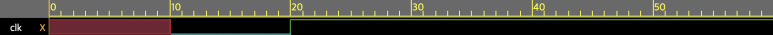
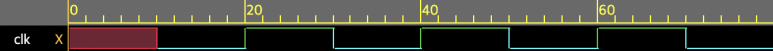

## Verilog blocking non blocking 차이. NBA(NonBlocking Assignment >=), BA(Blocking Assignment =) 차이.

Verilog를 하면서, 왜 NBA를 쓰는지 모르고, NBA가 단순히 '동시에 실행'이라고 알고 있는 사람들이 많은 것 같아서 정리.

​

Verliog HDL에서 '='는 Blocking Assignment라고 부르는데, 이 실행을 하기 전에 다음 코드의 실행을 막기 때문에 이렇게 부른다.

NBA는 반대로, 다음 코드의 실행을 막지 않고 실행한다.

​

NBA 쓰는 이유? -> Race condition을 막기 위해서 씀.

Race condition이란? -> 여러개의 코드가 실행 될 때, A가 먼저 실행 되면  A1의 결과. B가 먼저 실행되면 B1의 결과가 나오는데.. 이게 설계하다보니 섞여버려서 설계자의 의도와 다르게, 어떤 출력이 나올지 알수가 없는 상태.

​

이 두 링크에 좀 더 자세하게 Race condition을 없에는 Coding style이 설명되어 있음.

https://course.ece.cmu.edu/~ece447/s13/lib/exe/fetch.php?media=synth-verilog-cummins.pdf

http://www.sunburst-design.com/papers/CummingsSNUG2002SJ_FIFO1.pdf

​

Event Flow는

​

Active Region -> Inactive Region -> NBA Region -> Postponed 순으로 이어짐.

​

​

연습 1. 아래의 코드는 어떻게 동작할까?

```
module osc1 (clk);
 output clk;
 reg clk;
 initial #10 clk = 0;//first trigger
 always @(clk) #10 clk = ~clk;//event list
endmodule 
```

연습 2. 아래의 코드는 어떻게 동작할까?

```
module osc2 (clk);
 output clk;
 reg clk;
 initial #10 clk = 0;//first trigger
 always @(clk) #10 clk <= ~clk;//event list
endmodule 
```

​

연습 1의 코드는, first trigger -> event list

연습 2의 코드는, first trigger -> event list -> clk에 ~clk 값 들어감. -> event list ->... 무한반복.

확인해보자. 테스트벤치 코드는 아래와 같다.

```
module tb_osc ();
osc1 test(clk);
initial begin
$dumpfile("dump.vcd");//Delete it if you're not going to save it.
$dumpvars;//Delete it if you're not going to save it.
#100 $finish;//Delete it if you're not going to save it.
end
endmodule
```

1. BA Testbench wave



2. NBA Testbench wave



​

한번 더 강조하면, HDL은

Active Region -> Inactive Region -> NBA Region -> Postponed 순으로 queue에 올라탄다.

​

Active Region : Blocking Assignment / NBA의 우항 / Continuous assignment / &display / Evaluating / Funtions and tasks

NBA Region : NBA단의 좌항 Update

 해시태그 : Race condition을 막으려면 NBA만 써야하나? -> #0 delay를 이용해서 Race condition을 막을 수 있으나, 설계와 디버그가 너무 복잡해지므로 NBA를 쓴다.