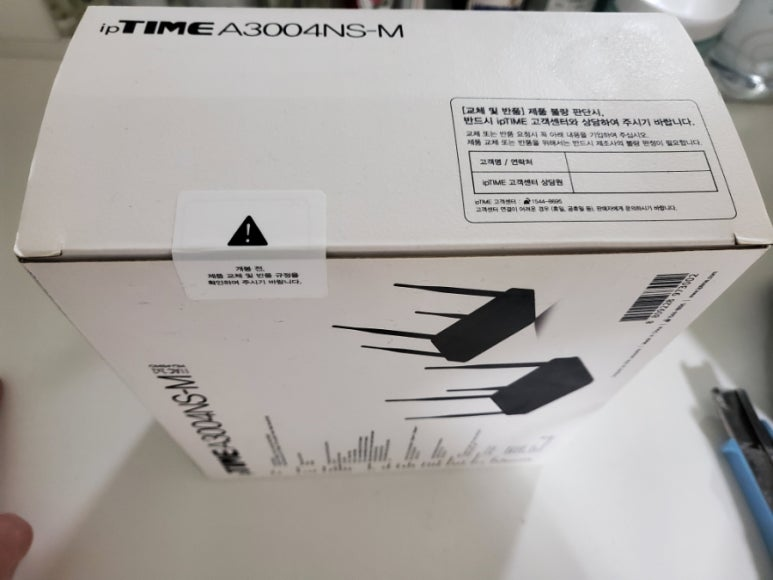
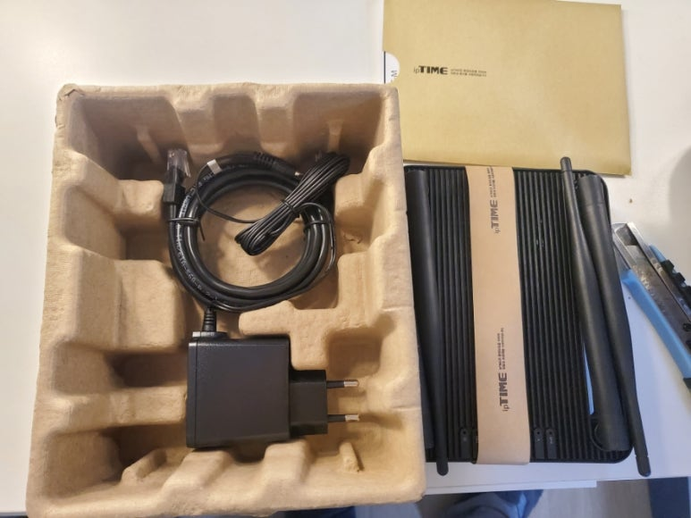

## IPTIME A3004-NS-M 리뷰, 5G, 빔포밍, Multiple User – Multiple Input Multiple Output(다중 사용자 - 다중 입력 다중 송출)

임대인님이 기가인터넷을 설치해주셨고, 이전 공유기가 매일 지맘대로 꺼져서... 10년만에 샀다.

사실 이것도 돈 아까워서 당근마켓에서 4만원에 샀다.

​

이렇게 생겼다. 설명서를 참 많이도 싸주셨는데, 누가 공유기 설치하는데.... 50페이지가 넘는 매뉴얼을 볼지..

​

간단하게 한페이지로 요약하고, QR코드 찍어서 상세 메뉴얼 볼 수 있게 하면 되는거 아닌가; 오히려 더 불편함.

​

이렇게 생겼구, 꽤 크다.

​

1기가인터넷은 충분히 처리해내고, MU-MIMO 기술이 들어가 있어서, 많은 기기를 동시에 사용해도 지연현상이 타 공유기에비해 덜하다.

​

그리고... 본체와 선 모두 검정색이라 아주 깔끔해보인다.

​

3분 정도 사용했는데 만족스럽다.

​

MIMO – Multiple Input Multiple Output(다중 사용자 - 다중 입력 다중 송출)이란, 이름에서 알  수 있듯.. 다중사용자의 사용에 최적화된 기술입니다.

​

특히 MU MIMO는 MIMO와 빔포밍이 합쳐진 기술인데, 기존의 공유기는 설치된 방의 사방에 전파를 뿌렸다면, 빔포밍 기술은 빔프로젝터처럼 사용량이 많은 곳으로 전파를 집중하는 기술입니다.

​

그리고 이 공유기에도 2.4G, 5G를 선택 할 수 있습니다.

​

현재 무선이동통신망에서 가장 많이 사용되는 4G LTE의 주파수는 850MHz~1.8GHz이고, 5G는 3.5GHz~28GHz입니다.

매초당 주파수만큼의 정보를 교환한다고 생각하면 됩니다.

(M은 mega로 10^6의 단위이고, G는 Giga로 10^9 단위입니다.)

​

전파의 파장은 주파수와 반비례 관계임.

전파의 파장이 클수록 장애물로 인한 속도 저하 문제가 덜함.

​

주파수가 높아질 수록 속도는 빨라지는데, 장애물로 인한 속도 문제가 있으니... 설치한 방에 따라 5G가 오히려 더 느릴 수도 있음.

 해시태그 : 