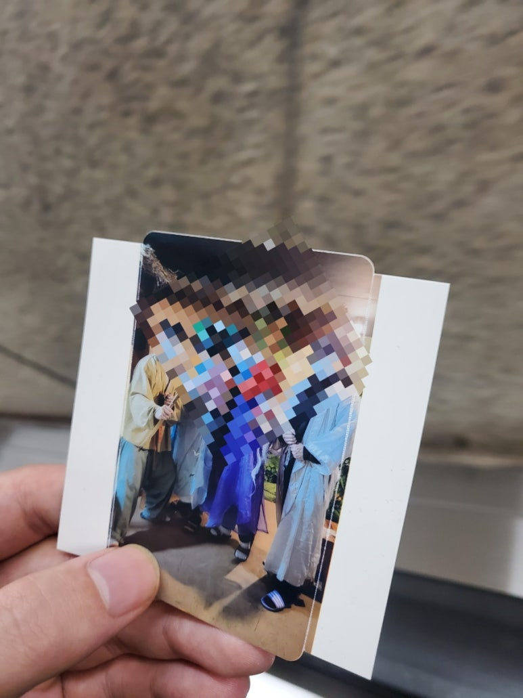

## 알찬 하루. 강남역 크라임씬을 다녀왔다.

요즘은 회사에서 eda tool 사용을 연습중이다. 이 단계가 뭔지는 가르쳐주시지만, tool 사용법은 self study+직접 찾아가서 질문한다. 그래서.... tool 처음 쓸때 엄청 해맸다.

​

​

학교에서 할 때는 dc_shell -f으로 스크립트만 묶어서 실행했는데, 회사에선 make run으로 한다.

​

이건 누가 다 만들었는지 신기.... 쓰는 입장에서 수정 하고 그런건 비교적 스트레스가 덜하다.

​

​

강남역 크라임씬 카페를 다녀왔다.

1시간 정도 플레이 했다. 3팀으로 나눠서 했는데.... 나만 범인으로 잡혔다.

​

난 거짓말하면 바로 들어나고, 사람 몰아세우는것도 잘 못한다는것을 느낌 ㅋㅋ 착하게 살자.

이번에 너무 못해서, 아쉬움이 남는다.

​

​

회사에서 공기청정기를 새해선물로 줬다. 체감은.... 모르겠는데 먼지는 잘 먹는듯. 설 선물이 기대된다!

 해시태그 : 