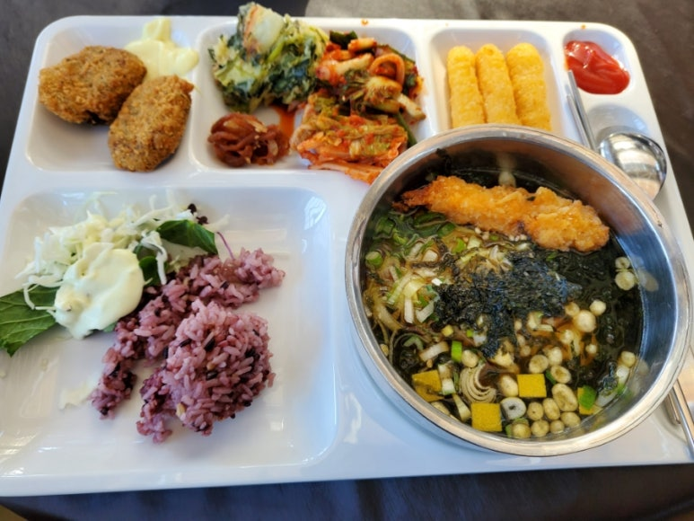
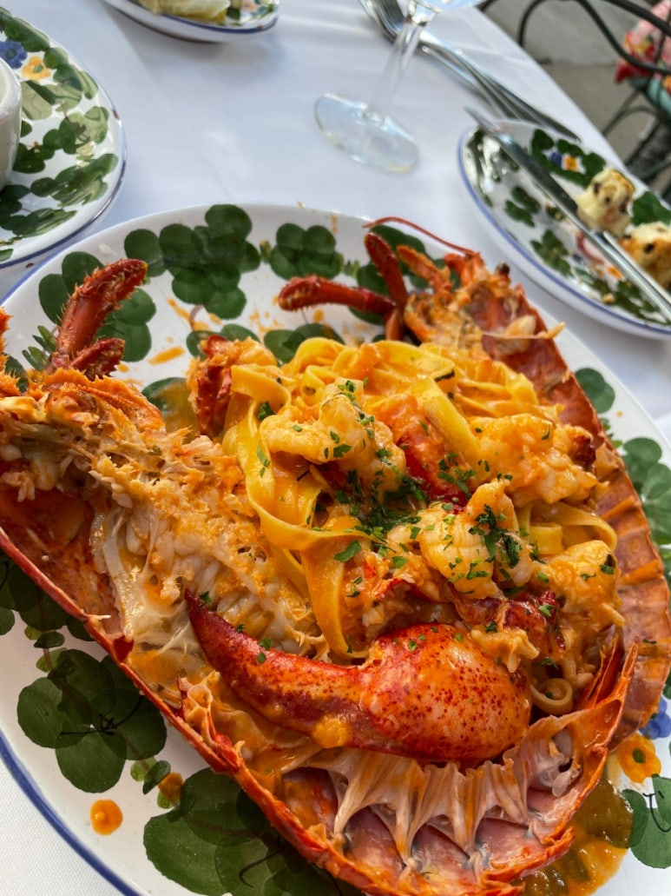

## 돼지는 배우는 중

장어덮밥

배달로 시켜먹은 목살

​

숯불 쎄서 별로

회사 밥

​

사실 이거 말고도 회사 스낵바도 엄청 가구... 선배님들이 사주시는 음료 엄청 마심.. ㅎㅎ 밀크티랑 녹차..

​

물어보는 것도 다 가르쳐주시고... 어떤 날은 옆에 앉으셔서 10시부터 6시까지 계속 봐주신적도 있음...

​

두 분에게 진~짜 많이 얻어먹고... 정말 많이 가르쳐주셔서 너무 미안하다. 티는 안 내려고 하지만.

​

뭔가 익명으로 선물이나... 그런거 하고싶다.

​

한 분은 정말 일 머리가 좋으신 것 같고, 한 분은 정말 다정함이 느껴진다.

​

일하면서 어려워하고 있으면 어느새 옆에 와서 뭐 어려워하는지 물어봐주시고, 알려주시거나... 찾아보시거나... 더 선배님들에게 대신 물어봐주신다.

​

이러니... 다른 사람들이랑 대화할때, 'xx님 진짜 좋은 것 같다'라는 말로 물꼬를 트면 다들 칭찬+존경 일색

​

얼른 회사에도 도움 되고, 선배들에게도 도움 되는 후배 되면 좋겠다.

 해시태그 : 