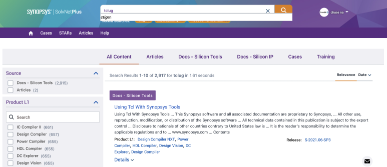

## TCL 언어 script 예제. synopysis EDA tool의 기본.

Chase TCL:

https://vlsi-korea.gitbook.io/chase-tcl

[Intro | Chase TCL](https://vlsi-korea.gitbook.io/chase-tcl) : Intro 지금 우리는 인류 역사상 가장 혁신적인 순간에 서 있습니다. ChatGPT, Claude, Gemini, Copilot으로 시작해서 모든 AI 도구들이 우리 업계를 뒤흔들고 있죠. 멋집니다, 정말로. 하지만 잠깐, 이걸 아셨나요? 이 도구들이 여러분이 원하는 걸 100% 완벽하게 만들어주진 않는다는 것을요. 결국 사람이 마무리합니다. 소개 🧑‍💻 Synopsys의 Senior Engineer, VLSI Korea의 Chase Na 입니다. 저도 한때 대학을 갓 졸업한 새내기 엔지니어였습니다. 그리고 지금, 여러분에...

​

원나라 TCL:

https://blog.naver.com/narawon

[narawon님의블로그 : 네이버 블로그](https://blog.naver.com/narawon) : 당신의 모든 기록을 담는 공간

위 블로그에 한국어로 정리가 있습니다. 한국에서 TCL 기본서 같은 파일입니다.

​

​

synopsys tool은 TCL(Tool Command Language) base로 되어있습니다.

그 예시중 하나로 Design Compiler에서 constraint file(이하 sdc)를 적용할 때,

set xxx 1 이런식으로 적용을 시키죠.

학교에서 DC tool을 처음 접할 때에는, dc_shell -gui로 들어가서, analyze.. elaborate.. link.. 다 직접 손으로 치면서 하지만,

현업에선, 작성해야할 코드가 방대하고, 수많은 반복작업이 필요하기 때문에 script를 작성해서 실행을 합니다.

Synopsys EDA tool들이 tcl base로 되어 있으므로, 이 스크립트를 tcl로 작성하면 자동화하기가 매우 편리합니다.

알아서 디자인에 맞게 분석을 해주니까요.

근데 문제는, tcl을 공부할만한 자료를 찾는게 매우 힘듭니다. 그래서 볼만한 자료들을 몇 개 정리해보면,

원나라 tcl/tk 기본

using tcl with synopsys tools

​

​

solvnet 사용 가능하시면, solvnet에서 많이 참고하세요. 양질의 정보가 많습니다. synopsys 최고,, 역시 대기업👍

​

우선 1번으로 tcl만 보시구요. tk는 쓸 일 거의 없을겁니다.

저나 제 팀원들 조차도 gui가 필요한 경우 python이나 다른 툴을 사용합니다.

​

그리고, 2번자료를 통해 synopsys사에서 권장하는 tcl script 작성 권장 규칙들을 한 번 읽어보세요.

원나라님 교재를 기본으로, 예제 문제들을 풀어보시고, 제가 만든 예제들을 한번 풀어보세요.

제한 : Big-O <= n

1단계

n개의 텍스트파일을 병합하고 이름 정하기. (2개가 들어오든 10개가 들어오든.)

e.g.

$tclsh cat.tcl a b c sub.txt 하면, a, b, c 파일 모두 있다면 sub.txt가 생성되며, 용량 오름차순으로 sub.txt에 작성됨.

2단계

베릴로그 파일들에서 모듈, 인풋, 아웃풋들의 각각의 이름과 개수를 출력하고, 모든 파일에 중복되는 인풋의 이름과 개수 출력하기

3단계

input

​

name1/data1/d Q[3]

name1/data1/d Q[2]

name1/data1/d Q[1]

name2/data1/d Q[0]

name2/data1/d Q[2]

name2/data1/d Q[1]

name3/data1/d Q[2]

name4/data1/d Q[3]

name4/data1/d Q[4]

name4/data1/d Q[2]

name4/data1/d Q[1]

​

output

name1/data1/d [3:0]

name2/data1/d [2:0]

name3/data1/d [2:2]

name4/data1/d [3:1]

타임스탬프 찍는법

puts "Running time : $time_taken ms"

microseconds로 바꾸면 us로 잴 수 있다. 당연히 Runnig time에서 ms도 us로 바꿔줄 것.

 해시태그 : set time_start [ clock clicks -milliseconds ];#를 맨 위에!set time_taken [ expr [ clock clicks -milliseconds ] - $time_start ];#를 맨 밑에