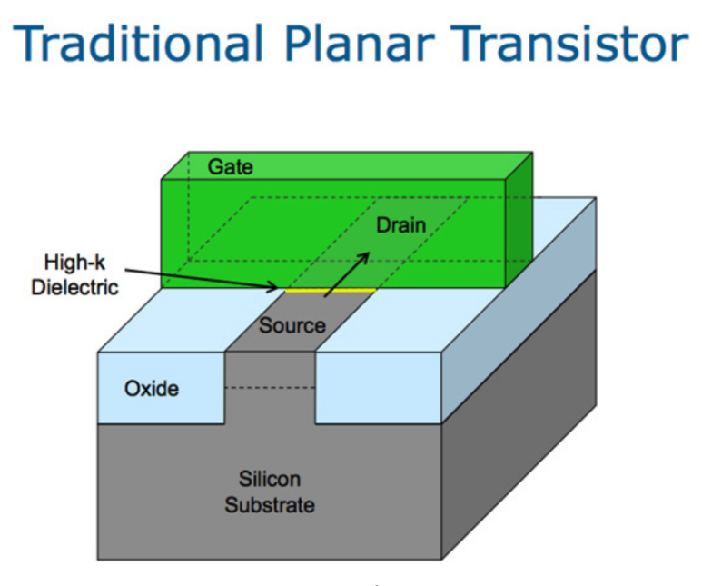
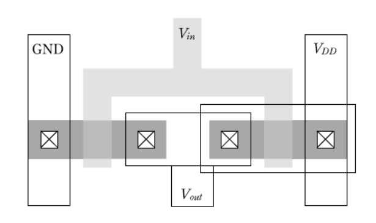

## VLSI란 무엇인가?

포털에 검색해보면 VLSI 트랜지스터 n개가 한 칩에 들어있는 대규모 칩이라고 합니다.

근데 이게 n-1개 까지는 LSI고, n개 부터 VLSI? 이거는 좀 이상하잖아요.

​

트랜지스터라는게 전기신호를 내보내고 못 내보내고 할 수 있는 문 같은 소자입니다.

1) 초반에는 진공관 / 칩 하나가 트랜지스터 하나의 역할을 했음.

2) 어느순간부터는 칩 하나에 트랜지스터 여러개가 들어있는 AND, OR 같은 간단한 회로가 들어가다가

3) 칩 하나로 전자시계, 계산기.... CPU, GPU, AP, NPU 같은걸 만드는 시대가 왔습니다.

VLSI라는게 3번에 있는 칩들입니다.

​

VLSI 설계라는게 저런 칩 설계를 하는거구요.

​

우리가 사용하는 스마트폰, 컴퓨터는 계속 성능 발전이 이뤄져왔는데.. 사실 곱씹어 생각해보면, 이상합니다.

​

컴퓨터 역사가 50년이 넘었는데, 어떻게 성능이 계속 좋아져가는걸까?

​

반도체의 성능 개선은 크게 두 가지로 나뉜다. '설계 최적화 + 공정 선폭 감소'

참고로, 기본적인 로직(가산기, 감산기 등..) 설계는 옛날이나 지금이나 동일하다.

​

무어의 법칙​

2년마다 반도체 집적도가 2배씩 올라간다는 무어의 법칙.

​

옛날에는 planar transistor(Source - Drain - Gate)를 사용했다, 

집적도를 2배 올리기 위해, 세대 기준을 선폭을 30%로 설정했다. (0.7 * 0.7 = 0.49)

​

허나, 무어의법칙이 나온지 30년이 되었다. 현재와 당시 기준으로, 10,000배의 집적도가 올라왔고, 더이상 더 집적도를 높이기도 힘들고 집적도를 높여도 성능 향상이 전처럼 일어나지 않는다

​

​

처음에 말한 것처럼, 성능 향상은 공정 / 설계 기술로 일어남.

​

More Moore 기술

- 기하학적 스케일링 : 집적도와 성능(속도, 전력)을 향상시키기 위해서 지속적인 수평적(2차원), 수직적(3차원) 구조의 논리회로와 메모리의 크기를 줄이는 것

- 등가적 스케일링 : 3차원 디바이스 구조를 개선하거나, 전기적 성능을 개선시키는 새로운 물질을 통해서 기하학적인 스케일링이 가능하도록 하는 것

​

More Than Moore 기술

- 기능적 다양화 : “RF + 전력제어 + 수동소자 + 센서” 등의 집적화를 통하여, 보드 설계 수준에서 SiP와 SoC를 통합하여 설계하는 방법

​

집적도도 늘어났고, 최적화하려는 반도체 로직도 늘어나다보니 반도체 트랜지스터 개수가 매우 많아짐. 이런 design을 VLSI라고 한다. vlsi very large scale integration의 약자인데, 어떤 트랜지스터 개수를 기준으로 VLSI라고 나눈다. 근데 어떤 개수로 나누는지는 알 필요 없다.

​

​

​

+++++++++++++++++++++++++++++++++++

참고로, 무조건 낮은 공정이 높은 공정보다 좋은 것은 아니다.

일단 Foundry에서 Process name을 정하는 방법이 다르고, process 외에도 pitch/track 등 고려할게 많다.

그리고 이번 Apple의 M2가 3nm공정임에도 M1과 큰 차이 없는거 보면.. memory bandwidth를 잘못 잡았거나 하는 문제가 있을듯.

​

​

반도체 설계 구현 과정은 아래와 같다.

Algorithm level -> RTL Level -> Gate Level -> Physical level. 참고로 나는 Gate level을 Physical level로 구현하는 업무도 하고 있다.

​

​

알고리즘 수준​

RTL   수준

Gate level 수준

Physical 수준​

이런식으로 내려온다.

알고리즘 / 아키텍쳐 수준은 누구나 대강 알테고,

RTL 수준은 디지털 논리를 코드에 작성했다고 보면 된다.

Fabless Startup들은 보통 이 단계까지만 한다.아래 단계부터는 돈, 시간, 엔지니어가 많이 필요하다.

​

양산 회사나 MPW를 도전하는 학교/회사/연구소에서는 ASIC Flow로 들어선다.

공정사는 Standard cell이라고 불리는 기본 로직들의 집합을 library로 묶는다.

​

설계사는 RTL code를 공정사에서 준 Library에 있는 Standard cell을 갖고 Gate level 바꾸는 '합성'부터 

Gate level netlist를 physical level로 만드는 과정까지 많은 검증/구현 과정을 거친다.

​

간단하게 나타내면 아래와 같다.

​

예를들어 Physical design에서는 Floor planning이라는 과정이 필요하다. 이 과정에서는 I/O를 어디에 배치하고, 각 블록들을 어디에 배치할지 결정, P/G선 연결 등.... 계획을 한다.

​

아주 예전엔 이런식으로 하면 되었는데, 요즘은 미세공정이다보니 확인해야 할 rule도 많고, 레이아웃 설계하고나서 생성한 DEF file, Back annotation file로 다시 합성 단계부터 시작해야한다.

​

그러고 나서 Design Rule Check

위 자료처럼 공정사에서 guide하는대로 선폭 등이 설계가 되었는지 확인.

​

​

NAND 혹은 NOR로 모든 Logic을 설계 할 수 있다. 그래서 Gate count 등의 기준이 된다.

아무튼, 

Algorithm으로 표현하면 : A, B에 (1,1)이 들어오는 순간에만 Y에 0이 출력되고, 나머지 경우엔 1이 출력된다.

RTL : 

module nand_data(c,a,b);

input a,b;

output c;

assign c =~(a&b);

endmodule

​

이걸 갖고 합성 Tool (Design Compiler)로 compile하면 (a) 그림 같은  Gate level netlist가 나온다. 물론 저것은 스케매틱이고, code형태로 나온다.

​

​

양산 프로젝트에서는 수율이 관건이다. 공정 상에 문제로 수율 문제가 생긴다.

뉴스에 tsmc / SEC에서 정말 낮은 공정에서 성공했다는 뉴스가 나오면, 성공은 했는데 아직 양산은 불가한 수준이라고 보면 된다.

​

각 다이에 불량이 있는지 없는지를 확인하기 위한 설계가 따로 있다. DFT. DFT는 SCAN / MBIST 등 방법들이 있고, 자세한 내용은 이전에 포스팅했다.

​

​

​

여기까지 VLSI 가 무엇이고, 어떻게 만들어지는지 간단히 설명했다.

참고로.. 설계를 업으로 한다고 해도, inverter / MOSFET / CMOS 동작 특성 정도는 알아둬야한다. 

​

앞으로 PLL / NPU / SRAM 등.. 설계를 간단히 다뤄볼까... 아니면 physical implementation / design / dft에 대해 다뤄볼까....

 해시태그 : 