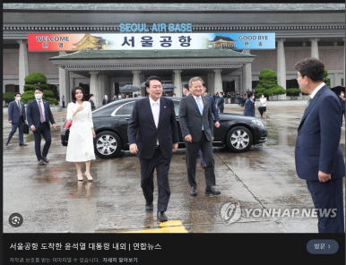
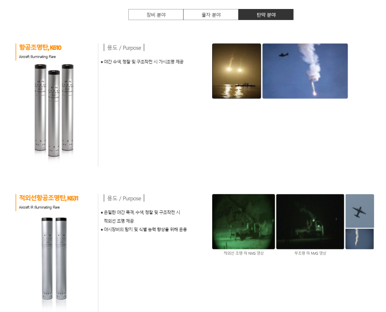

## 공군 기상무장사: 병사로 비행기 타는 희귀 보직

저는 서울공항(15특수임무비행단)에서 비행기를 타는 공중근무자로 '공군 병장 만기전역' 했습니다.

​

강남~성남에 걸친 서울공항에서 자대 생활을 했고, 외출 나가면 보통 강남에서 놀았는데 기억이 새록새록 나네요.

주변에서 많이 물어보기도하고, 궁금한 사람이 많은 것 같아서 정리합니다.

​

참고로 아래 사진은 나무위키에서 퍼왔습니다.

서울공항의 위치가 강남~성남이라 좋긴한데,

1) 특수임무 + 대통령, 외국 대통령, 왕들. 귀빈 전용으로는 김포/인천공항이 아닌, 서울공항을 사용합니다. 일주일에 10번 이상 왔다가실때도 있습니다.

군기강이 엄청 삼엄합니다. 딱 아래 사진이 서울 공항이에요.

2) 위치가 강남~성남이다보니까 경쟁률이 매우 높습니다.

요즘은 어떤지 모르겠는데, 2015년까지만 해도 공군은 수능, sat 성적 순으로 들어올 수 있었고,

이 그룹 안에서 훈련소 기간 동안 "종합 평가, 훈련 평가"에서 상위 3%정도 들어야 15비에 들어올 수 있었습니다.

​

저는 체력은 자신 있고, 1달 벼락치기형 공부는 잘하는 스타일이라 쉽게 왔습니다. (몇 년 동안 꾸준히 해야하는 공부는 못함ㅋㅋ)

​

공중근무자

비행기는 기본적으로 파일럿이 탑승하고,

임무에 따라

Load Master

Flight Engineer,

Flight Armorer,

항공의무, 항공구조사, 항공촬영사 등 다양한 사람이 탑승합니다.

​

대부분 공중근무자는 사관학교(공사, 간사)를 졸업한 장교들이고, 저는 그 사이에서 Flight Armorer(기상무장사)로 사격 임무를 수행했습니다.

공군 들어와서 시험 잘 보면 됩니다. 1등 아니면 2등 정도??

​

미국에서는 CSO라고 불립니다. 이 영상이랑 99%똑같습니다.

https://www.youtube.com/watch?v=X80aN8wdDiY

설명 : Serving as the mission commanders for electronic warfare, weapons systems and navigation, Combat Systems Officers are the eyes of their fellow Airmen. Utiliz...

​

아니 그래서 우리나라를 위해서 하는게 뭔데?

자세한 내용은 알려드릴 수 없고 국방일보에서 발표하는 내용만 얘기 드린다면,

제가 실제작전으로 나가본 임무들은 대부분 '선박 침몰에 대한 수색 작업'을 위해 연막탄 + 조명탄 사격이었습니다.

조명탄 사격이라는게... 쉬워보이지만,

1. 조명탄 한 발당 거의 20kg 정도 되고, 조심히 들고와서(조명탄도 폭발물입니다.) 발사대에 장전해야 하고

2. 기내에서 불량 조명탄이 부풀거나 연소되는 경우, 이에 대한 조치도 해야하고

3. 사격이니까 어느 위치에서, 어느 고도로, 어떤 타이밍에 발사를 할건지에 대한 계산을 해야하고

4. 방금 한 사격이 성공적이었는지 확인을 해야합니다.

​

연막탄은 가벼워서 편한데, 조명탄 사격이 힘들어요 ㅜㅜ

[매일 5억, 조명탄만 2백억 쏜 세월호 현장](https://www.newdaily.co.kr/site/data/html/2014/09/13/2014091300012.html) : 매일 5억 이상을 쓰고, 조명탄만 200억원어치를 쏜 세월호 潛水수색 현장을 가다①언론, 정치인, 유가족 눈치 보느라 公益(공익)이 私益 앞에 무릎을 꿇다4분 정도 빛을 발하는150만 원짜리 군용 조명탄을 41일간 1만3204발, 198억600만 원을 하늘에 퍼붓다.李東昱(조갑제닷컴 記者)       사건 첫날 안전행정부의 중앙재난안전대책본부(중대본…...

선박 사고가 나는 이유는 악기상 때문이고.. 공중근무자는 악기상 속 저고도 상공에서 임무를 해야해요.

역풍을 맞는 경우, 비행기가 순간적으로 올라가거나 떨어질 수 있는데, 이러면 갑자기 몸이 뜨거나 중력에 크게 눌릴 수 있습니다. 이 때 조명탄을 들고 있으면, 20kg보다 3~5배는 훨씬 무겁게 느껴지고 중간 중간 날아다니는 경험도 합니다. (비행기 기종마다 다르긴한데, 작은 비행기는 허리를 펴고 설 수 없어요.)

​

그래서,

멀미 + 무거움 + 허리 피고 못 섬 + 비행기에 탄약으로 꽉차서 낑낑 거리면서 움직여야 됨 + 소음 때문에 귀 아픔 + 계속 다음 사격 위치 어떻게 할건지 계산해서 입력해야됨 + 이걸 쉬는 시간 없이 조난자 찾을 때까지 계속 반복해서 쏴야함 + 내가 잠깐 쉬면 옆 사람이 못 쉼 + 나랑 옆 사람이 쉬면 비행기만 빙빙 돌고 시간/연료 낭비가 됨.

​

조난자가 탄약 다 쏠때까지 발견 안 되면 이걸 6시간씩 계속 하고 있다고 보면 됩니다. 그리고 착륙해서 탄약 + 연료 보급하고 다시 올라가구요 :)

[처음에는 긍정 마인드로, 헬스장 왔다고 웃으면서 시작하는데, 한 2시간 넘어가면 허리 엄청 아프고, 그 이후로는 그냥 정신력으로 합니다. 그리고 다시 비행기 탈 생각 하면... 조난자 찾다가 나도 죽을 것 같은데.... 생각이 듭니다. ㅎㅎ]

​

제가 힘들다는 말 거의 안 하는 사람인데, 이거 할 때 너무 힘들었습니다.

​

https://youtu.be/HGRbsGzp-Zg?si=bt-i2MD5PgMTMcdf

설명 : 칠흑같은 밤바다를 밝히는 구원의 불빛 '조명탄'.해상 실종자 탐색과 구조를 위해 공군은 조명탄을 투하해 밤을 비춥니다. 공군 CN-235 수송기에서 투하되는 K-610 조명탄은 한번 점화되면 촛불 181만 개 밝기의 빛을 약 4분 간 뿜어냅니다. 공군은 실전같은 훈련을 통해 밤이든...

​

​

아래는 국방일보의 기사인데요. 제가 복무했던 공군15특수임무비행단의 해상탐색구조훈련이네요. 저는 훈련도하고, 실전도 했습니다.

https://youtu.be/cuAovK0NTWU?si=tSzwrEQaqf2lVx4O

[![[공군] 제5공중기동비행단 CN-235 항공조명탄 투하훈련](https://i.ytimg.com/vi/cuAovK0NTWU/hqdefault.jpg)](https://youtu.be/cuAovK0NTWU?si=tSzwrEQaqf2lVx4O)

설명 : 지난 3월 14일 밤, 울산 앞바다. 6000피트 상공.공군 장병들이 181만개 촛불의 밝기의 K-610 조명탄으로 바다 위 어둠을 뚫고 생명의 빛을 밝히는 항공조명탄 투하훈련에 임하고 있습니다. 항공기 조명탄 투하는 해상 사고 실종자 탐색 구조에 큰 역할을 합니다. 대한민국 공...

​

훈련은 안전상 좋은 기상에서 하지만, 항상 실전은 악기상에서 발생하더라구요. 그래서 실전이 진짜 너무 힘들었습니다.

​

비행기를 타면 "수당"으로 월급에 추가 급여가 들어오는데, 그냥 담배 값 정도 들어왔습니다 ㅎ

써있는대로, 장비대대 병사들이 C-130 항공기에서 MA-1 해상구조장구 + MK-25라는 해상연막신호탄을 던집니다.

이것도 반도체 산업의 Fabless + Foundry처럼.. 설계하는 회사, 공정하는 회사가 있습니다. Korea가 만든 MK25라서 KMK25, K610 이렇게 불린다고... 군수학교 시절에 들었습니다.

​

​

​

훈련/실전 비행 후, 조명탄을 모두 소모했다면, Base return을 합니다.

활주로 근처에 준비되어 있는 예비 조명탄 수백발을 트레일러에 올리고,

트레일러를 활주로에 가져가서 비행기에 적재하고,

탄약고에 가서 트레일러에 조명탄을 적재하고 활주로 근처에 예비 조명탄을 배치해요.

​

이러고 나면 오전 6시 쯤 되는데요. 생활관 가서 보고 드리고, 아침 체조+뜀뛰기 후 조식 식사하러 갑니다. 

비상대기를 해야 하기 때문에, 활주로 바로 옆 작은 건물에서 자게 됩니다. 당연히 비행기 때문에 창문이 흔들리고 시끄럽습니다.

샤워를 하든 화장실을 가든 보고를 올리고 가야하고, 잠 잘 때도 비행복 입고 자야 합니다. 긴급소집되는 경우, 바로 비행기로 뛰쳐나가야 하거든요.

​

12시쯤 일어나서 점심 먹고, 탄약고로 출근해서 탄약 조립하고.. 4시30분쯤 되면 식당 가서 식사 배식을 준비해야 합니다.(병사식당에서 출발한 트럭에서 음식 받아서 간이식당에서 배식준비+잔반처리+식당청소)

​

비행 크루들이랑 미팅에서 오늘 예상 작전 시간, 기상예보 등 이야기를 합니다.

​

​

설명 : 공군은 8월 26일(목), 수년간 駐아프가니스탄 한국 대사관과 바그람 한국병원 등 아프가니스탄에서 한국 정부 활동에 협력한 아프가니스탄 현지인 직원과 가족들을 국내로 수송하는 ‘미라클 작전’을 완벽하게 수행했습니다.   이번 작전에는 KC-330 다목적공중급유수송기(MRTT, Mu...

​

아래는 유튜브에서 공군을 홍보해주시는 장교님이 쓰신 C130 탑승기입니다.

[![현역 대위 유튜버의 공군 수송기 탑승 후기 [공대리]](https://i.ytimg.com/vi/3f2XeUOLGvc/hqdefault.jpg)](https://youtu.be/3f2XeUOLGvc)

설명 : #공군 #c130 #uae #수송기 #데저트플래그-공군 페이스북 : https://www.facebook.com/rokairforce/공군 인스타그램 : https://www.instagram.com/rokaf_official/공군 공감 블로그 : https://afplay.kr/...

​

​

되는 법?

1.일단 관련 TO가 발생해야해요. 모집하는 인원이 많지 않아서, 운이 좋아야합니다.

2.공군에서 선발 된 후, 최상위 성적으로 훈련소+특기학교를 필기+실기+체력검정을 종합적으로 최상위로 통과하면 됩니다.

3.공중근무자 신체검사에서 통과해야 합니다. (시력, 청력, 심폐능력 등..)

4.공중근무자, 기상무장사 평가 (필기 + 실기)에서 통과해야 합니다. (자격 유지를 위해 합격 이후에도 주기적으로 평가를 봅니다.)

5.비행환경적응훈련에서 통과해야합니다.

​

설명 : #가속도내성훈련 #좋은예 #나쁜예

​

[![모아공주, 신체의 한계에 맞서다!(feat. 공군 비행환경적응훈련) [공군 군무원 브이로그(V-LOG)]](https://i.ytimg.com/vi/MvdWVgYE_n0/hqdefault.jpg)](https://www.youtube.com/watch?v=MvdWVgYE_n0&ab_channel=%EB%8C%80%ED%95%9C%EB%AF%BC%EA%B5%AD%EA%B3%B5%EA%B5%B0)

설명 : 국민조종사 후보와 함께 공군 비행환경적응훈련에 나선 모아공주!태어나 처음 겪어보는 온갖 경험에 정신차릴 새가 없는데?!그 이름도 유명한 가속도훈련(a.k.a. G-TEST)부터 공중에서 일어날 수 있는 일들을 버티고 견디기 위한 체계적 훈련에 돌입한다!하늘을 지키는 사람들이 견뎌야...

​

​

​

​

마지막은 사진 남기고 끝냅니다. 궁금한 것 있으면 댓글 달아주세요 ㅎㅎ 답변은 안 할 수도 있어요!

​

​

https://youtu.be/pHnj1KUvBss?si=HlpLMemCZ91zB3nU

​

[![[100인의 공군] 46화. C-130J 수송기 조종사](https://i.ytimg.com/vi/pHnj1KUvBss/hqdefault.jpg)](https://youtu.be/pHnj1KUvBss?si=HlpLMemCZ91zB3nU)

설명 : 공군 장병들의 임무수행 현장을 보여주는 미니 다큐멘터리 100인의 공군!마흔여섯번째 공군은 C-130J 수송기 조종사 양진우 소령입니다.#공군 #100인의공군 #수송기조종사-공군 페이스북 : https://www.facebook.com/rokairforce/공군 인스타그램 : ht...

​

 해시태그 : 