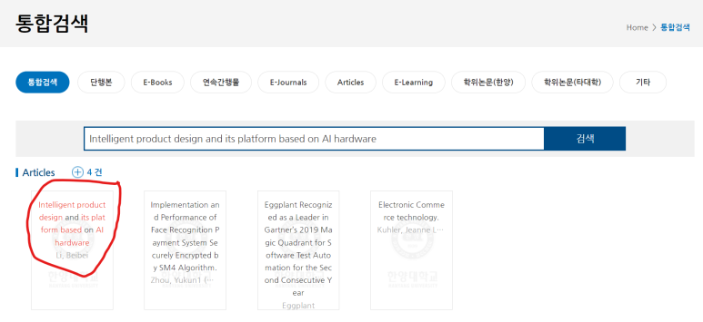
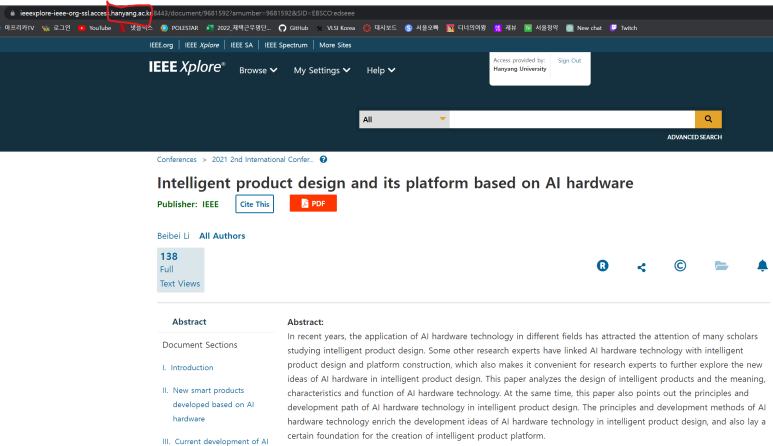

## 전기 전자 컴퓨터 공학 논문 찾을만한 사이트, 최대한 돈 안 내고 보는법

원하는 분야의 논문을 찾는다.

Chat GPT한테 xx 분야 논문 찾아줘~ 했는데, 없는 논문을 찾아주는 경우가 너무 많았다.

있는 논문인 척 말하면서.. 막상 실제로 찾아보면 없는 논문.

그리고 나는 최신 논문을 찾고싶은데, GPT는 과거 몇년 전 데이터를 기반으로 찾다보니, 더 못 찾는 것 같다.

​

결국, 내가 찾아야함.

​

미국친구, 중국 친구, 스웨덴 석사생 친구들이 있어서 너넨 어디서 논문 보니? 물어보니, 아래와 같다.

"Google sholar, DBLP, IEEE"

​

​

참고로 IEEE논문 같은 경우엔, 회원비를 내야한다. 지역에따라 다르긴한데, 연 구독료가 10~30만원 사이이다. 논문 한 편 볼 때 추가비용을 내는 경우도 있다.

​

PDF 버튼을 클릭하면, 위처럼 가입하라는 메세지가 뜨고... 가입하려면 돈을 내라는 메세지가 뜬다.

​

​

그리고 내가 개인적으로 논문을 보는 곳은

IDEC : 반도체 설계 관련 논문을 무료로 빠르게 찾아 볼 수 있다... 근데 자료량이 많지 않다.

[반도체설계교육센터](https://www.idec.or.kr/professor/paper/list/) : 성과 : 논문 홈 | 참여교수 | 성과 : 논문 IDEC 사사문구 가이드 논문제목 작성자 소속 작성일 9004 FlexBlock: A Flexible DNN Training Accelerator with Multi-Mode Block.. 궁재하 고려대학교 23.03.30 9003 LightNorm: Area and Energy-Efficient Batch Normalization Hardware fo.. 궁재하 고려대학교 23.03.30 9002 An n79 Sub-1-dB Noise Figure Highly Linear Varia...

DBPIA, KISS, RISS : 국내 논문을 많이 찾아 볼 수 있다.... 설계관련해선 일부 교수님들이 논문을 많이 내시긴하는데,,, 분야가 넓진 않다.

​

그래서 결론적으론, 전자공학 쪽 선행연구를 보려면! 돈을 내야 볼 수 있다. 이걸 최소화하려면 방법은 아래와 같다.

​

SCI HUB

위 사이트는 일단.. 불법인 것 같은데, 최근에 이공계열 석박사 하신 분들 중 모르는 사람이 있을까 싶은 사이트이다.

DBPIA나 KISS 같은 사이트는 논문 수가 1000~3000개 정도 등록되어있는데,, SCI HUB에는 1억개의 논문이 등록되어있다.

뭐 이런거로 보는 사람도 있더라~ 알려주려고 썼다.

​

​

​

2. 졸업/재학중인 학교가 있는 경우,

학교 도서관 이용. 일단 대부분의 학교 도서관을 가면, 논문을 볼 수 있도록 되어있다.

그렇지 않은 경우, 강력하게 요청하면(?) 해주신다.

​

그리고 일부 학교의 경우, 집에서도 도서관 서버를 통해 논문을 볼 수 있다.

예를들어 보고싶은 논문을 찾고,

​

​

학교 도서관 사이트로 입장

​

접속시 학교 서버를 통해 접속된 것을 확인 할 수 있다.

똑같이 PDF 버튼을 누르면,

이전과 다르게 PDF를 다운 받아서 볼 수 있게된다.

​

​

 해시태그 : 