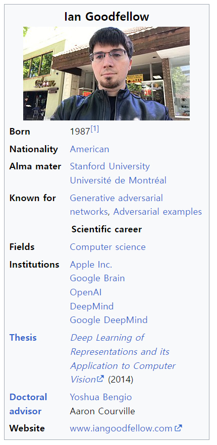

## MIT 인공지능 무료 강의, 책 추천. Ian Goodfellow

SWE guy들 중에 AI 하시는 분들은 다 아실 Ian Goodfellow님의 강의를 유튜브에서 무료로 보고,

교재를 MIT 사이트에서 공식적으로 받을 수 있길래 공유드립니다.

[Alena Kruchkova](https://www.youtube.com/@AlenaKruchkova/videos) : Deep Learning Book Club

저는 사실 학교 다니면서 이미 Phil kim과 Goodfellow Deep learing을 이미 배웠는데....

아시잖아요? 시간 지나고.. 직접적으로 써먹지 않으면 다 까먹는다는 것.

그리고 제가 matlab을 제대로 배우질 못했는데 matlab으로 deep learning을 공부했고,

python을 할 줄 아는데, 요즘 대세인 pytorch를 다뤄본 적이없어요.

​

앞으로 주말에 시간 있을 때마다 간단 정리를 해나가려고 합니다.

EDA쪽 실험을 해보고 싶은게 많은데.... 능력과 의지가 모자라네요. 이렇게 공언을 해두면, 제가 언젠간 하긴 하더라구요. 상반기에 보려던 IEEE 문서들은 쭉 다 훑어봤고.

주 관심사는 constraint나 몇 가지 옵션들에 대해 PPA나 Fault coverage 관련 실험을 해보려고 합니다.

​

그러기 위해선 딥러닝 공부를 해야겠죠. 그래서 하반기 목표는 이겁니다. 굿펠로 형님 책과 논문들 읽어보기.

굿펠로님은 20대때부터 AI쪽으로 이름을 날리셨습니다.

요즘 Chat GPT, 구글 Bard, Deepfake 기술.. 이런게 놀라운 이유가 "이게 진짜 정보인지 가짜정보인지 구분하기 어렵고, 사람이 쓴 글인지 기계가 쓴 글인지 구분하기 어려운" 이 이유들이 있잖아요? 

Generative Adversarial Network이라고 하는 GAN 덕분에 크게 발전했는데,,, 이 GAN의 발명자가 굿펠로우입니다.

이전에 제가 힌턴 교수님이 AI의 대부라고 했었죠. 굿펠로우 형님은 지금도 코딩하고 팀 매니징하고 논문 쓰는 현역입니다. (이런 분들은 하루를 어떻게 보내는걸까 궁금하네요)

​

아무튼... 하반기 동안 ai 공부 좀 다시 해보려고 합니다. 지켜봐주세요.

 해시태그 : 