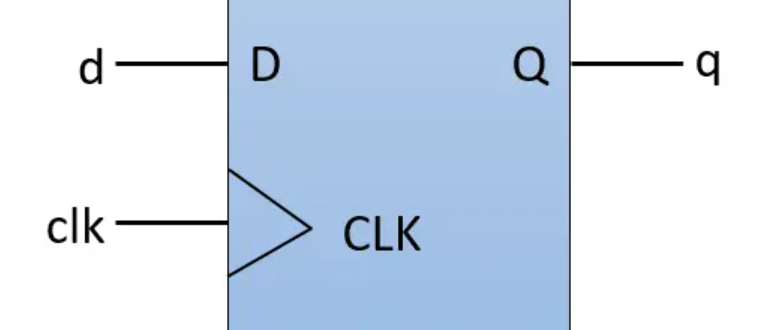
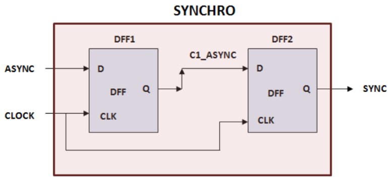
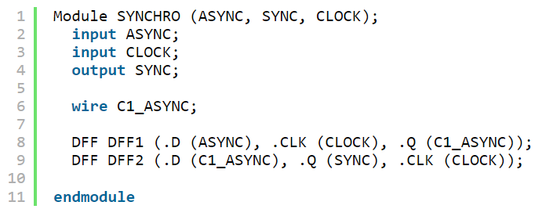

## 전자, 반도체에서 말하는 Port란? Pin이란? Port와 Pin의 차이

회로에서의 Port란?

회로 설계에서의 "Port"는 신호가 들어가고 나오는 곳을 가리키는 것입니다. 

반도체, HW 분야에서 있어서 포트(Port)란, 전기적 신호 데이터가 오가는 통로를 의미합니다. 즉, MCU로부터 외부로 노출 된 핀(Pin)들이 바로 포트가 될 수 있는 것입니다.

​

사용자가 누르는 마우스 클릭, 모니터로 받는 화면도 다 입출력에 관련된 것들입니다.

우리는 사실 컴퓨터를 쓰는 이유가.. I/O를 인터페이스 하면서, 특정 작업을 더 편리하고 정확하게 하고자 컴퓨터를 사용하는 것이죠.

각 Port는 일반적으로 데이터 라인, 제어 신호, 클럭 신호 등과 관련되며, 회로의 동작에 중요한 역할을 수행합니다.

​

​

회로를 설계하는 컴퓨터 언어 수준에서 본다면,

아래처럼 기술을 할 것 입니다.

현재 디자인은 DFF라는 module이고, 해당 input port는 D, CLK가 있고, Output으로는 Q가 있네요.

Verilog HDL는 하드웨어 기술을 기술적으로 설명(Hardwared Description Language)하고 디지털 논리 회로를 모델링하기 위해 사용되는 하드웨어 기술 언어입니다.

Verilog를 사용하여 디지털 시스템을 설계할 때, "module"이라고 불리는 논리 블록을 정의하고, 이러한 블록들 간의 상호 연결을 위해 Port를 사용합니다. 각 모듈은 입력과 출력 Port를 가지며, 이를 통해 모듈 간의 데이터 흐름과 제어 신호를 정의하고 연결할 수 있습니다.

​

​

위 DFF를 이용해서, 아래와 같은 synchronizer를 설계했다고 합시다.

현재 design을 바라보는 레벨이 DFF1라는 module이라면

port는 d, clk, q가 되고,

input port : d, clk

output port : q가 됩니다.

​

현재 design을 바라보는 레벨이 SYNCRO이라는 module이라면,

port는 ASYNC, CLOCK, SYNCH가 되고,

input port  : ASYNC, CLOCK

output port : SYNC가 됩니다.

​

SYNCHRO라는 모듈에서 내부 계층에 있는 i/o를 보고싶다면, 이것을 "Pin"이라고 부릅니다.

정리하면, 아래와 같은 구조입니다.

​

port : Current design의 I/O

pin : Sub-hierarchical design의 I/O

근데.. 다시 Verilog code를 보면,

Module SYNCHRO 옆에 ASYNC, SYNC, CLOCK이라고 되어있고, 아래에 input, output으로 작성되어있습니다.

port라는 속성 안에 input, output이라는 속성이 있는거죠.

근데 input, output 외에도 다양한 속성들이 있습니다. 이 Attribute name은 Standard는 없어서, EDA Tool 회사마다 상이합니다.

FPGA나 ASIC 개발을 할 때 EDA Tool을 사용한다면, 아래 같은 attribute가 있습니다.

get_ports *

get_ports *data*

get_ports -filter {DIRECTION == OUT}

all_inputs

get_ports -filter {DIRECTION == IN} *data*

get_ports -filter {BUS_NAME != ""}

​

이런 속성은 port 뿐만아니라, pin이나 다른것도 다 있습니다. 다만 적용되는 옵션은 약간 상이하구요.

​

​

​

보통 하드웨어 엔지니어라고 하면, 설계된 칩을 갖고 보드위에서 작업을 하는 엔지니어들을 말하는데요. 저도 한 때는 이런게 재밌었는데..

학교 다니면서는, ARM사의 Cortex M series, atemega 128 등을 써봤네요. 칩 구현, 테스트 벡터 만드느라 ARM사의 Cortex A Series와 SiFive의 U Series 구현해봤네요.

아무튼 저는 이 칩들을 어느정도 설계, 구현, 개발을 조금씩 다 해봤다고 얘기를 드리려했습니다.

​

​

Atmega 시리즈는 AVR 아키텍처를 기반으로 한 마이크로컨트롤러의 일종입니다.

이러한 마이크로컨트롤러는 다양한 응용 분야에서 사용되며, 예를 들어 임베디드 시스템, 로봇 공학, IoT, 다양한 전자제품 등에서 활용됩니다. Atmega 마이크로컨트롤러를 프로그래밍할 때, 각 핀은 특정한 기능을 수행하기 위해 구성됩니다.

atemga128 Chip의 Port는 아래처럼 64EA의 Port가 있습니다. (디지털 설계하는 사람 입장에서, 0~63이 아닌, 1~64는 참 보기 불편하네요.)

​

51번 핀부터 시계 방향으로 보면, 44번 핀까지 PA라는 이름이 붙어 있습니다. 

즉, PA0, PA1, PA2, PA3, PA4, PA5, PA6, PA7 이렇게 총 8개가 PA라는 공통된 이름을 사용하고 있습니다. 이를 Port A라고 부릅니다. 

같은 방식으로 ATmega128엔 총 7개의 포트들이 존재합니다.

 

  - Port A : PA0 ~ PA7

  - Port B : PB0 ~ PB7

  - Port C : PC0 ~ PC7

  - Port D : PD0 ~ PD7

  - Port E : PE0 ~ PE7

  - Port F : PF0 ~ PF7

  - Port G : PG0 ~ PG4 

​

Atmega에서는 A~F 7개의 포트들을 자신이 원하는대로 이용할 수 있습니다. 

예를 들어, LED 1개 제어가 필요할 때, 이 것을 PA3번에 연결해도 되고, PF0번, 혹은 PE3번에  개발자 마음대로 연결하여 사용할 수 있습니다. 그리고 각각의 핀에 전기 신호를 출력할지, 혹은 반대로 전기 신호 입력을 받을지도 직접 결정할 수 있습니다. 

이처럼 개발자 마음대로 사용할 수 있는 포트들을 General Purpose I/O Port라고 부릅니다. 보통 GPIO라고 부릅니다! 회로 설계하는 사람들이 이런 칩 설계를 했다면, 하드웨어 개발하시는 분들이 이 칩을 갖고 OS를 올리거나.. 간단한 제어프로그램이나, 펌웨어를 올리는 거죠.

​

참고로, 이런 chip에서 하드웨어 개발자들이 사용 할 수 있는 port 수를 최대한 많이 주기 위해 회로설계자들이 엄청 머리를 싸매면서 연구하고 있습니다. Port 수를 늘리면 공정 비용이 비싸지고.... 그 Port 중에서도 상당 부분이 DFT에서 쓰이게 되구요..

​

아무튼 atmega에도 UART, SPI, I2C 등 다양한 기능들이 들어있네요... 하지만, 이 장에서 이 기능들을 자세히 볼 것은 아니고,

이 신호가 어떻게 들어오는지? 입니다.

​

​

반도체 디바이스에 입력 신호가 입력되는 과정은 다음과 같은 단계를 거칩니다. 

​

PAD (Peripheral Input/Output Cell):

PAD는 Chip의 외부와의 인터페이스 역할을 수행하는 중요한 요소입니다. 디바이스의 신호가 외부와 상호 작용하려면 PAD를 통해 입력되고 출력되어야 합니다. PAD는 주로 디바이스의 주변 영역에 위치하며, 신호의 전기적 및 물리적 인터페이스를 담당합니다.

보통 반도체 칩 하위 계층에 있는 D Flip flop 같은 것들은 PAD를 따로 두진 않고, Chip 최상위 입출력에만 PAD를 연결합니다.

​

1. I/O 신호 처리: 외부에서 입출력되는 디지털 또는 아날로그 신호를 PAD가 감지하고 내외부로 전달합니다.

2. Level shifting  : 내부 신호와 외부 환경 간의 전압 레벨 차이를 관리하고 신호를 보호하는 역할을 합니다.

3. Interconnection: PAD는 디바이스 내부와 외부 간의 물리적 연결을 담당합니다. 이를 위해 패키지, 보드, 커넥터 등과 같은 다양한 컴포넌트와 연결됩니다. 인터커넥션은 전기적 신호 전달뿐만 아니라 물리적 안정성 및 신호 노이즈 관리도 중요한 역할을 합니다.

4. ESD (Electrostatic Discharge) :

입력 신호는 외부 환경과 직접적으로 연결되므로, 디바이스 내부로 전달되는 신호에 대한 보호가 중요합니다. PAD는 외부로부터 발생할 수 있는 정전기 방전(ESD) 등의 피해를 최소화하고 디바이스의 안정성을 보장하기 위한 회로를 포함할 수 있습니다.

​

찾아보시면 아시겠지만,,, input pad, output pad, inout pad 모두 다르게 설계됩니다.

​

​

국내에는 이런 atmega128같은 범용 개발 칩을 설계하는 회사는 많지 않고, 대부분 미국에 있습니다.

우리나라에선 이런 칩을 갖고와서, 아래처럼 칩의 port를 연결해서 커넥터 달고.. 단자 달아놓고..LCD 연결해놓고.. 이런 Board를 만드는 회사가 있죠.

​

스위치를 이용해서 LED를 켜고 끌 수 있는 펌웨어를 atmega에 올린다고 합시다.

1. 스위치 Port을 AVR GPIO에 연결하고, LED의 Port를 AVR GPIO에 연결합니다. 

그리고 스위치는 풀업 또는 풀다운 저항과 함께 연결하여 스위치의 상태를 안정적으로 읽을 수 있도록 합니다.

​

2.데이터 방향 설정: AVR의 데이터 방향 레지스터를 설정하여 스위치 핀을 입력으로, LED 핀을 출력으로 설정합니다. 이 설정은 보통 C언어로 지정합니다. 스위치 핀은 입력으로 설정되므로 스위치의 상태를 읽을 수 있고, LED 핀은 출력으로 설정되므로 LED의 상태를 제어할 수 있습니다.

​

3. C 언어의 Mainloop: 주 프로그램은 메인 루프에서 실행됩니다. 메인 루프에서는 스위치 상태를 읽고 이에 따라 LED를 제어합니다.

메인 루프에서 스위치 상태를 읽어옵니다. 스위치 핀을 읽어서 로우 레벨 또는 하이 레벨 상태를 확인합니다.

​

​

​

 해시태그 : 