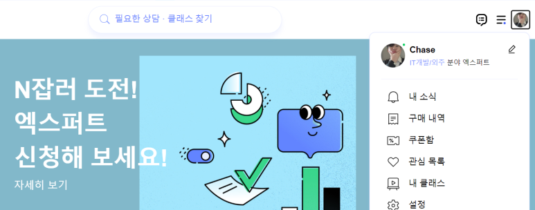

## 20+N번째 생일, 그리고 다음 목표

1) 올해 목표였던, "네이버 엑스퍼트"는 결국 선정되었습니다.

이거로 반도체 강의 + 스크립트 언어 + 상담을 할 것 같습니다. 2024년에 시작 할 것 같아요. 컨텐츠는 다 생각해놨습니다.

내년 목표는 "네이버 인플루언서" 선정이에요.

​

2) 제가 회사에서 대표님께 기술 도서관을 지어달라고 요청했는데, 정말 지어주셨어요! 지금은 기술도서를 채워놓고 있습니다. 여기에 제가 채워놓는 책은 "제가 이미 다 봐서 남들이랑 같이 보고싶은 문서"입니다.

작년에 세웠던 올해 목표가 "VLSI관련 IEEE 문서들 훑어라도 보기" 였는데, 결국 거의 다 훑어라도 보긴 봤습니다. 그래서 정말 IEEE 문서를 다 보긴 했다??? 할 수 있을 것 같습니다. UPF, JTAG, IJTAG, SPEF는 처음부터 끝까지 봤고, Wrapper랑 STIL문서를 출력만 해두고 아직 다 못봤네요.

올해 가기 전에, 이것들도 다 보고... USB, Ethernet, PCIe 등 범용 IP에 대한 Standard 문서를 스터디 할 계획입니다.

​

올해 동안 IEEE Standard 문서들을 뇌에 새기고싶어요.

​

사진은 오늘 회사 점심에 먹은 장어덮밥인데 맛있더라구요.

팀장님과 소그룹장님 감사합니다…

​

요즘 하고싶은거???

외국에서 일하면서 살아보고싶고, 그래서 제2외국어 좀 공부하고싶고,

한국이나 미국 기술사 자격증도 다고싶고,

운영체제, 컴파일러, ARM/RISC-V Core 제대로 파해쳐보고 싶고,

PnR Tool userguide 처음부터 끝까지 다 보고싶고,

지금 하고있는 과제가 다 잘 되었으면 좋겠습니다.

​

아무튼 이렇게 20+n번째 생일을 맞이합니다.

 해시태그 : 