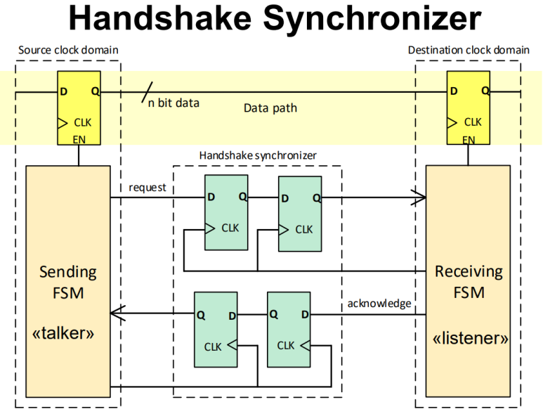
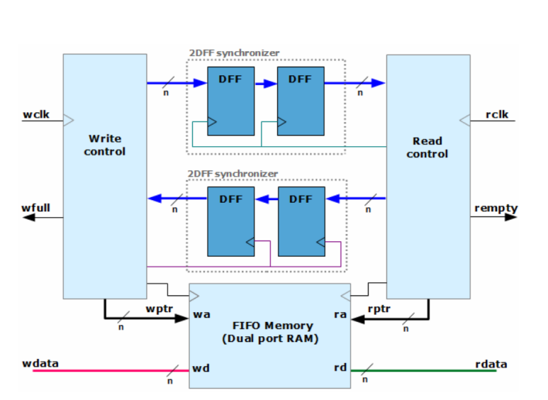

## Metastability와 Clock domain crossing(CDC)란, in vlsi

이 글에서는 Metastability와 Clock Domain Crossing의 개념을 알아보려고 합니다.

여기서 발생 할 수 있는 Timing violation을 피할 수 있는 HDL 설계, 그리고 이 설계에 대해서 어떤식으로 SDC를 작성하고 STA를 하면 되고~~ 어떤식으로 Place&Route 해야하는지 알고는 있지만, 블로그에 이런 코드는 안 올리려고 합니다.

​

Metastability and Clock domain crossing를 아시기 전에,

Digital 회로가 logical하게 physical하게 어떤식으로 동작하는지 알아야합니다.

​

Flip flop의 기본 동작, setup/hold time 같은 것들이요!

​

Metastability는 디지털 회로에서 신호에 신호의 correctness(한국어로 뭐라해야할지 모르겠는데.. 무결성?) 클럭 도메인 사이에서 데이터를 전달할 때 발생할 수 있습니다. 이 현상은 불안정한 상태로의 수렴으로, 데이터 비트가 잘못된 값으로 인식되는 결과로 이어질 수 있습니다. 이렇게되면, 칩이 동작을 할 때도 있고, 동작을 안 할 때도 있겠죠.

​

간단히 얘기하면,

1.setup이나 hold violation이 발생하는 디자인의 경우,

2.active clock edge가 생길 때 data를 받을텐데, 이 입력 데이터가 어떤 값인지 모르는 상태가 되고

3. 그러면 출력에 어떤게 나갈지 모르는 상태가 되고... 

-> 이런걸 metastability에 빠진다고 함

​

​

Clock Domain Crossing은 다른 클럭 도메인에서 생성된 신호를 안전하게 전달하는 과정에서 발생할 수 있는 문제입니다.

다른 클럭 도메인일 때, 뭐 예를 들어... Clock을 생성해주는 PLL이 서로 다른 PLL에서 전파되어 각 Flip flop에 입력되는경우 같은 것을 말하는겁니다.

​

PLL이 다르면 clock 주파수가 똑같고, waveform 모양을 똑같이 만들었다고 한들,

언제부터 clock이 뜨기 시작하고, 안정이 되기 시작하는지.. 이런게 다르기 때문에 다른 PLL간에는 1-cycle로 setup / hold를 만족하기 어렵습니다.

​

2가지 상황 정도 연출 할 수 있겠네요. CDC Error rate을 계산해보면,

(1)

​

(2)

​

​

CDC로 발생할 수 있는 metastability는 알았고, 그래서 이걸 어떻게 피하냐?

​

대부분은 synchronizer라는 것을 넣습니다.

근데 synchrnoizer라는 설계가 한가지만 있는 것도 아니고, 엄청 많아요. 그래서 표를 그려서 어떤건 언제 쓴다... 이렇게 만들고싶긴한데, 시간이 없네요. 근데 구조 그림만 봐도 아실거라, 그림만 올립니다.

​

Multiplexer-based Synchronizer 설계

​

설명 : In this video, I have discussed about mux synchronization,if you have any doubts please feel free to comment. I will respond within 24 hrs.please do subscrib...

Enable synchronizer 설계

Handshake Synchronizer 설계

FIFO Synchronizer 설

​

​

너무 피곤해서 대강 사진만 붙이고.... 시간 날 때 수정하기로.

 해시태그 : 