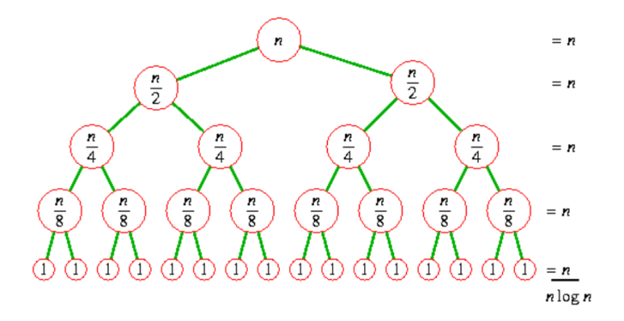

## Static Simulation, Static Analysis. 여기서 말하는 Static이란?, static 뜻 feat. VLSI

복잡한 Simulation, Analysis를 하려면 엄청나게 많은 계산을 해야합니다.

엄청나게 많은 계산이 필요하면.. 엄청나게 많은 자원이 필요해요.

자원라는건, "사람", "하드웨어", "시간" 같은 것들입니다.

계산을 간단하게 만든다면 자원 소모가 줄겠죠.

현실에서 이뤄지는 것이 Dynamic이고.. 그중에 "요소"를 고려 대상에서 제외하여, 계산을 간단하게 만드는 것이 Static analysis라고 보시면 됩니다.

문제를 쪼개서 간단하게 만드는 방법 중 하나입니다.

Divide & Conquer​

​

Static timing Analysis

​

​

요즘 SoC에는 수백 수천억개의 트랜지스터가 들어갑니다.

엄청나게 많은 트랜지스터들이 엮여있는데, 각 트랜지스터들이 동작하는게 바로 동작되지 않고, 어느정도 "Delay"를 갖고 동작해요.

기본적으로는, Dynamic simulation이라는 것을 하는데요.

Circuit 정보가 담겨있는 Gate Level Netlist file과 Netlist에 사용되는 Cell의 정보가 담긴 Liberty compile하고,

Delay 정보가 있는 SDF File을 Annotation,

Simulation에 사용할 Test bench를 dumping해서 검증을 합니다. 

​

- Dynamic simulation은.. 회로의 Delay, Logic 그런걸 다 이해하면서 Full chip에 대해서 진행합니다.

- Design의 Input port를 transition하고.. 내부 signal transition을 통해 Output port까지 모두 도달 할 때까지 기다려야하는데, 그러려면 Design 전체에 대한 Logic 관계를 Tool이 계속 신경써야합니다.

- 그리고 어떤 Input 값을 넣어야 Chip 내 모든 Gate들을 검증 할 수 있을지? 에 대한 패턴 생성하는 것도 쉽지 않습니다.

​

그래서 이 Dynamic simulation이.. Flip flop count 100,000개 정도만 되어도 런타임이 몇 일이 걸립니다. 몇 주가 걸릴 수도 있구요.

그래서, 반도체 검증에는 Static Timing Analysis라는 것이 있습니다.

STA에는 Timing 검증을 하지만, "Functional simulation"을 하지 않아요. 그리고 큰 회로를 한번에 다 보지 않습니다.

​

​

Static Timing Analysis는 Dynamic simulation에서 두가지 요소를 제거한다고 보시면 됩니다.

1. 여기서는 Logic이라는 개념을 보지 않고 + Time axis라는 축을 제거합니다.

2. Rule을 지켰는지 안 지켰는지 체크할 Candidate를 "Timing paths"라는 개념 안에서만 봅니다.

​

그러면 훨씬 단순해지죠.

1.Startpoint와 Endpoint만 각각 나눕니다.

2.Startpoint-Endpoint 중 관계가 있는 Timing 관계를 Timing path list로 묶어 보관합니다.

update_timing 실행

3.Timing path list에서 Timing path를 하나씩 갖고 와서, 해당 Timing paths의 Startpoint의 값을 0->1, 1->0으로 transition해보면서

clock latency값와 Data의 delay 값을 계산하여 Setup과 Hold time 값들을 계산하며 각 Timing path의 Worst Negative Slack을 계산합니다.

4.모든 Timing paths를 계산하고나면, STA는 끝이 납니다.

여기서 pt_shell> report_timing 하면, 모든 timing path 중 WNS가 나오게 되는 것이죠.

​

이렇게 쪼개서 각각 Timing만 체크하고,

마지막에 이 Timing 결과를 Summary 하니까 시간도 빠르고 사용자 입장에서도 보기 편합니다.

Power나 Signal Integrity, noise 분석도 다 Liberty 정보로 하기 때문에 Timing Check와 비슷한 알고리즘으로 진행합니다.

​

이런 STA Tool이 Synopsys의 Prime Time이 1위로.. Foundry golden reference tool이고, Cadence의 Tempus가 2위로 그 다음을 잇고 있습니다.

​

​

Logical Equivalences Check

LEC, EC, EQ라고 불리는 Logical Equivalences Check도 Static이라는 개념이 붙습니다.

LEC는 회로의 기능 동등성 평가라고 보시면 되는데요. 이것도 이후 포스팅 예정입니다.

Verilog code를 Liberty 정보로 mapping하여 Netlist로 만드는 Synthesis 후에,

Verilog code가 Netlist와 기능적으로 같은지?

Synthesis된 Netlist와 P&R 후 Netlist와 같은지?

Netlist와 SCAN Insertion 된 Netlist와 같은지?

등등 많은 ASIC 구현 과정이 필요합니다. 이 구현 과정 사이에, "기능"이 수정되면 안 되니까 각 데이터를 비교합니다.

Original인 Design을 Reference design(혹은 Golden design)이라고 부릅니다.

Implemetation과정을 거친 Design을 Implementation design

​

이것도 Dynamic Simulation으로

Verilog code에 A pattern을 입력했을 때 출력

vs

Netlist에 A pattern을 입력했을 때 출력

이런식으로 비교 할 수도 있겠지만.... Resource가 문제입니다.

​

그래서, LEC에서 Boolean Logic Equivalence 방법을 사용한다면, STA의 Timing path처럼 Logic cone이라는 개념을 쓰는데요.

1. Reference design, Implementation design을 각각 읽고,

2. 각 디자인의 Logic cone을 찾아 Logic cone list에 담습니다.

Logic cone이라는 것을 Synopsys 사이트에서 찾아보면, 아래처럼 설명이 되어있네요.

그림으로 그리면 아래와 같습니다.

Design에 있는 Flip flop A의 input pin -> Logic cone의 Output

Design에 있는 Flip flop A의 값에 영향을 주는 것 (sequential cell의 Output pin, Input port, Blackbox의 output pin 등) -> Logic cone의 Input pin

​

​

3. Logic cone List에서 Logic cone을 하나씩 꺼내면서,

Logic cone Reference design의 Logic cone

+

Implementation design의 Logic cone

이 관계로 Matching을 시킵니다. Implementation 과정 중에 이름은 안 바뀌거나, 규칙에 따라서 바뀌니까 매칭이 됩니다. 매칭을 못 했으면 user가 찾아서 match 해줘야하구요.

​

4. 매칭 한 Logic cone의 Input의 값을 0, 1 transition 해보면서,

Ref design의 Iogic cone의 output value

VS

Imp design의 Iogic cone의 output value

이렇게 비교하는겁니다.

다른 것 없이 function만 고려하면 되고, input을 switching하고 금방 output까지 signal들이 propagation 되니까 런타임도 짧아지죠.

​

​

​

VLSI에서 대부분 Static은, "범위를 축소시키고 간단하게" 하기 위해 사용합니다.

​

 해시태그 : 