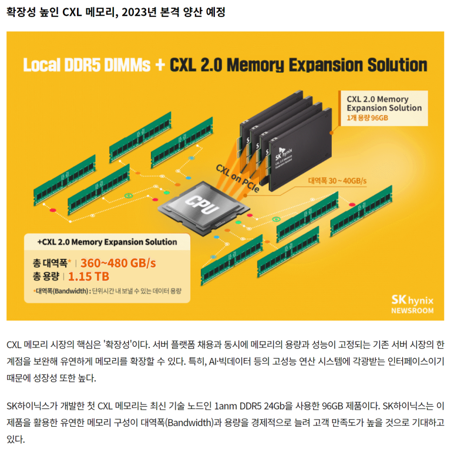

## CXL이란, Computer express link DRAM : HPC 시대의 새로운 메모리 패러다임.

현재 DIMM 기술을 기반으로 한 메모리 대역폭 확장은 몇 년 안에 한계에 도달할 것으로 예상됩니다.

클라우드 서버에서 메모리 비용은 약 50%를 차지하지만, Over-provisioning으로 인한 비효율성은 너무 높습니다.

​

이게 왜 한계에 왔고, 왜 이게 중요한걸까요? 일단 HPC에 대해 알아야 합니다.

​

​

HPC란? High Performance Computing

HPC는 간단히 소개하면, 기업의 데이터센터 등에서 사용되는 최고 성능 컴퓨터라고 보시면 됩니다.

​

좀 더 자세히 들여다보면, HPC는 동시에 작동하는 강력한 프로세서 클러스터를 사용하여 방대한 다차원 데이터 세트(Big-data)를 처리하고 복잡한 문제를 빠르게 해결하는 기술입니다.

수십 년 동안 HPC 시스템 패러다임은 수백만 개의 프로세서 또는 프로세서 코어를 구현하는 특수 목적의 컴퓨터인 슈퍼컴퓨터였습니다.

이런 HPC로 인해, Chat GPT 등 시스템이 나오는것이죠.

​

데이터센터에 책장처럼 꽂혀있는 이것들이 핵심 하드웨어(GPU, ASIC 등)입니다.

​

​

HPC 분야에서는 시간당 데이터 처리량을 지속적으로 향상시키기 위한 다양한 연구가 수반되고 있는데요.

높은 대역폭을 갖게 하는 메모리의 핵심은 "얼마나 짧은 지연시간 + 얼마나 많은 한번에 데이터 + 얼마나 안정적으로?"입니다.

PIM(Processing In Memory),HBM(High Bandwidth Memory), CXL(Compute Express Link) 등이 그 기술 실현의 방법의 예입니다. HBM은 이전에 다룬적이 있고, 이번 글에서 CXL에 대해서 알아보고자 합니다.

CXL에선, CXL Inteligent memory와 CXL memory expander에 대해 더 자세히 알아보겠습니다.

​

CXL은 지연시간을 줄이고 큰 확장성을 가진 방법론이라, 핫한 기술입니다.

CXL Inteligent memory란? (이하 CXL-IM)

CXL-IM는 CXL interconnect를 통해 연결된 메모리에 Cache coherence를 도입하는 기술입니다.

​

즉, 컴퓨팅 시스템 내의 여러 프로세서가 명시적인 데이터 동기화 없이도 CXL-IM 모듈에 저장된 데이터에 액세스 가능

->  Memory Access의 지연시간을 줄일 수 있다.

​

그리고 이 CXL 개념이 하나의 국제 프로토콜(? standard rule은 아니긴한데, 많이 쓰고 있는)이 되었습니다. 기존의 I/O, 네트워크 프로토콜 대신, 차세대 연결망 프로토콜 개발을 위한 산업계 표준 수요가 증가하여, 2019년에는 인텔을 중심으로 한 CXL(https://www.computeexpresslink.org/)컨소시엄이 발족되었습니다.

​

​

CXL-IM은 Near Data Process(NDP)라는 개념이 있는데요. PIM개념처럼, 메모리병목을 없애기위해서 메모리 병목을 최소화 할 수 있는 위치에서 Processing을 하겠다는거에요.

다시 설명하면, "Near Data Processing"의 약자로, 데이터 처리를 메모리 근처에서 수행하는 것을 의미합니다. 기존의 컴퓨팅 시스템에서는 데이터 처리가 주로 프로세서에서 이루어졌습니다. 하지만 프로세서는 메모리에서 데이터를 읽어오고 처리하는 과정에서 지연이 발생할 수 있습니다. 특히 대규모 데이터를 처리하는 경우 이러한 지연이 시스템 성능에 큰 영향을 미칠 수 있습니다.

​

이러한 성능 이점 외에도 CXL-IM은 워크로드 인식 캐싱 메커니즘을 제공하여 자주 액세스하는 데이터를 캐시에 저장하여 더 빠르게 검색할 수 있도록 합니다. 또한 CXL-IM은 지연 시간 및 용량 계층화를 지원하여 시스템이 애플리케이션 요구사항에 따라 메모리 리소스를 동적으로 할당할 수 있도록 합니다.

​

CXL Memory Expander(이하 CXL-MX)

​

Panmnesia, MetisX 등 국내 CXL 스타트업도 출연하고 있습니다.

요즘 블로그에 반도체 산업 주식 이야기를 해볼까 말까 생각중입니다.

​

네오셈도 CXL 관련주로 나오고 있는데요. 이 회사는 CXL을 직접 설계하는건 아니고, 국내 메모리반도체 회사의 협력사입니다.

CXL 검사장비 개발 및 납품을 하는 회사입니다. 이 회사도 앞으로 기대가 됩니다. CXL은 앞으로 잘 나갈거고, 이 회사도 그 대세에 힘입어 성장할 것으로 기대가 됩니다.

 해시태그 : -> DIMM의 시대는 저물고, PIM과 CXL의 시대가 옵니다. (#CXL관련주 -> 메모리반도체 회사인 삼성, 하이닉스, 마이크론 + 반도체 지적재산권 회사 + CXL 스타트업)