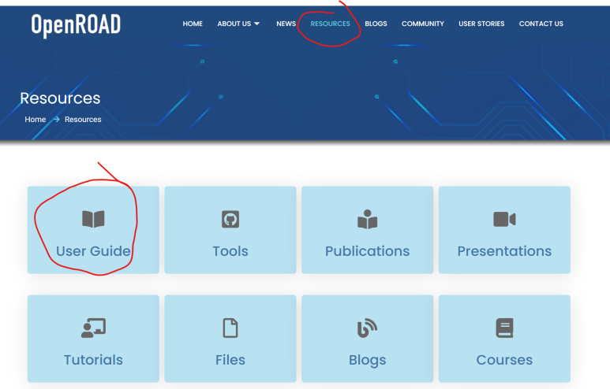

## Open source EDA Tool: OpenROAD 설치 방법 #openroad #무료EDA

OpenROAD EDA Tool: RTL2GDS

VLSI 사이드 프로젝트 하셔야죠? 아니면 VLSI Design 공부하고싶은데, 요즘 뜨는 기술도 접하면서 EDA 라이센스 없이 연구해보실 수 있는 툴입니다. RTL부터 GDS까지 가능합니다. 굳이 비교하자면 Synopsys사의 Fusion compiler 같은 느낌입니다.

산업현장에서는 Synopsys 등 EDA 3사가 자리잡은 이유들이 있지만... 그래도 무료인 것치고 훌륭합니다.

​

​

​

OpenROAD를 작년에 맥북에 설치했었는데, 컴퓨터 사고나서 여기에서 다시 하려니 새롭네요;;;; 그래서 글로 정리해서 올립니다.

잘 안되면 댓글 달아주세요. 도와드리겠습니다. 제가 IT Team 직원은 아니지만.. Synopsys tool이랑 OpenROAD Tool, Yosys, SIEMENS, Cadence 등등 진짜 엄청 많이 삽질해봐서 감이 잡혔습니다.

​

이 분야 공부하시는 분들은 제가 했던 삽질을 반복하지 않길 바라고 있어서... 잘 안되면 댓글 남겨주세요!

일단, 제가 글을 작성하는 시기는 2024년 2월 12일 설날입니다. 분명 몇년 후에는 이 글과 좀 달라질거라고 생각하기 때문에, 이 아래 공식 링크에서 User Gude를 기준으로 설치하세요.

https://theopenroadproject.org/resources/

[Resources – The OpenROAD Project](https://theopenroadproject.org/resources/) : User Guide Tools Publications Presentations Tutorials Files Blogs Courses Videos Papers We are creating new base technologies that enable 24-hour autonomous design, bringing down barriers and democratizing hardware design.



​

​

STEPS TO INSTALL OPENROAD TOOLS

1. 윈도우 환경이라면, download virtualbox box. MAC이나 Linux환경이면 설치 안해도 될텐데, 일단 CentOS7가 권장 환경.

https://www.virtualbox.org/wiki/Downloads


[Downloads – Oracle VM VirtualBox](https://www.virtualbox.org/wiki/Downloads) : Download VirtualBox Here you will find links to VirtualBox binaries and its source code. VirtualBox binaries By downloading, you agree to the terms and conditions of the respective license. VirtualBox 7.0.14 platform packages ​ Windows hosts ​ macOS / Intel hosts Linux distributions ​ Solaris hosts ...

2. virtual box에서 create a new machine. 


​

3.Choose desired name and location

- Type-Linux

- Version-Redhat (32/64 bit)

- Based on your computer RAM, assign half of the RAM to the virtual machine. At least 4 GB must be allotted.

- Keep everything default and go forward.

- Allot dynamic memory based on your computer memory. At least 40 GB is preferred.

근데 나중에 GDS 파일 만들거 생각하면, 최대한 널널하게 주세요. 이 값들은 정말 간단한 디자인들입니당.

​

4. CentOS7를 설치할겁니다! .iso 파일이 필요합니다.

https://www.centos.org/download/

[Download](https://www.centos.org/download/) : End dates are coming in 2024 for CentOS Stream 8 and CentOS Linux 7. Check the blog post for information on upgrade and migration options. CentOS Linux CentOS Stream 7-2009 Architectures Packages Others x86_64 RPMs Cloud | Containers | Vagrant ARM64 (aarch64) RPMs Cloud...

ctrl + F로 "iso" 검색하면 다운로드 링크 나옵니다.

KAIST에서 설치 링크가 있어, 여기서 다운로드 받았습니다.

https://ftp.kaist.ac.kr/CentOS/7.9.2009/isos/x86_64/


​

5. In your newly created virtual machine, in the storage section, click on empty optical drive and insert the downloaded ISO. Finally, start the virtual machine. 

그다음 VirtualBox에서 만들어놨던 RedHat을 실행하면됩니다.

넘기다보면 iso 파일 넣으라고 하는 부분이 있는데, 거기서 아까 다운로드 받은 iso를 열어줍니다.


​

6. Installing CentOS:

- Language 설정: English-US 추천

- In software selection, select server with GUI.로 하세요. PnR 할 때 GUI 있어야 편합니다.

- Network 설정에서 인터넷도 On으로 해주세요. Git에서 OpenROAD 땡겨 받을겁니다.

- In System, for installation destination 골라주세요. 편하신 곳으로.

그리고 비밀번호 설정 하고 accept accept accept 하시면 됩니다.


설치 잘 되고 reboot 하시면 이런 화면이 뜰겁니다.

gna는 제 계정명입니다. 짧은 이름이 편하실거에요.... 하다보면 느낌. (제 성과 이름에서 따온겁니당.)


​

그리고 git 설치

​

> root 계정일 경우 yum install git 

> 관리자 권한을 가진 사용자 계정일 경우 sudo yum install git 

> root로 전환후 설치 sudo su yum install git

​

https://phodobit.kr/53

[CentOS 7에 Git을 설치해보자!](https://phodobit.kr/53) : # 부제목 CentOS 7 Git 설치 방법 [1] 빠르게 Git 설치하기 (1.x 버전) 2.x 버전의 Git을 설치하려면 아래쪽(2번 항목)으로 넘어가세요! 먼저, CentOS 7에서의 Git 설치는 매우 간편하다. 패키지 매니저인 yum을 통해 바로 설치할 수 있는데, 터미널을 열고 아래의 명령어를 입력하여 Git을 설치해보자! > root 계정일 경우 yum install git > 관리자 권한을 가진 사용자 계정일 경우 sudo yum install git > root로 전환후 설치 sudo su yum install gi...

​

Linux Root 권한이 필요한 명령이 있습니다. Root 모드로 들어가시려면

CTRL+ALT+F5

하시면 됩니다. 돌아오실때는 CTRL+ALT+F1 혹은 CTRL+ALT+F7

​

7. Installing OpenROAD from terminal:

- Cloning repository:

git clone --recursive https://github.com/The-OpenROAD-Project/OpenROAD-flow.git

​

그리고 나서, 아래 있는 공식 가이드 문서를 따라 Build를 해줍니다.

보통 Docker를 많이 쓰던데, 제가 아직 잘 Docker를 잘 몰라서, 제가 잘 알고 있는 "Build locally"로 하였습니다.

https://openroad-flow-scripts.readthedocs.io/en/latest/user/BuildLocally.html

[Build from sources locally — OpenROAD Flow documentation](https://openroad-flow-scripts.readthedocs.io/en/latest/user/BuildLocally.html) : Build ./build_openroad.sh --local Note There is a build_openroad.log file that is generated with every build in the main directory. In case of filing issues, it can be uploaded in the “Relevant log output” section of OpenROAD-flow-scripts repo issue form . Verify Installation The binaries should be ...

요약하면,

(1) git clone: Git이 뭐인지 모르시는 분이 있을 것 같아 설명드리는데, Git은 Source code를 공유하는 사이트라고 보시면 됩니다. git clone은 해당 URL에 있는 Source code를 내 디렉토리에 갖고 오는거구요.

clone 하시고 sudo로 setup을 해주세요. 

```
git clone --recursive https://github.com/The-OpenROAD-Project/OpenROAD-flow.git
cd OpenROAD-flow-scripts
sudo ./setup.sh
```

(2) Setup 하시고, Build로 이제 EDA Tool 구성을 합니다.

```
./build_openroad.sh --local
```

(3) 이제 설치가 잘 되었는지 확인하기 위해서, 아래처럼 적용합니다.

에러 없이 잘 나온다면 문제 없습니다.

```
source ./env.sh
yosys -help
openroad -help
cd flow
```

(4) RTL2GDS Flow 실행

```
make
```

그러면 이제 터미널 환경에서 RTL2GDS Flow가 진행됩니다.

​

(5) GUI로 GDS 확인

```
make gui_final
```


그러면 이제 이렇게 Metal routing까지 잘 되어있는 것을 볼 수 있습니다.

​

Makefile을 보시면 아시겠지만,

./flow/scripts/*에 있는 script로 RTL2GDS가 됩니다. 


Makefile에서 이 부분이 input / output 파일 정의하는 부분인데요.

DESIGN_DIR에서 RTL과 SDC 정의, OBJECTS_DIR에서 library 파일을 정의합니다.


​

 DESIGN_CONFIG 설정에 따라 RTL과 SDC를 결정 할 수 있게 되어있고..


​

아래는 참고용으로 올려놓은 Yosys manual입니다.

https://yosyshq.net/yosys/files/yosys_manual.pdf

​

​

 해시태그 : 