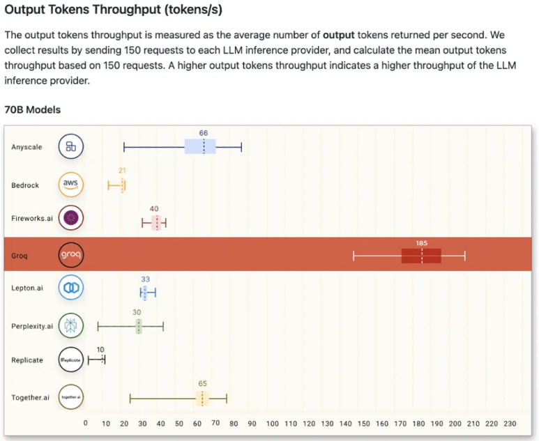

## 반도체 회사소개: Groq ChatGPT보다 18배 빠르다? 반도체 엔지니어 시점에서

최근 인공지능 반도체 씬에서 가장 핫한 회사가 있습니다.

Groq입니다.

​

아래 영상 먼저 보시죠.

설명 : How fast is the Groq® LPU™ Inference Engine? Don't blink...See how it compares to OpenAI.

어떤 사람들은 이거 그냥 어그로다 / 실제 성능 이렇지 않다 / 양산 불가능한 설계구조다... 말이 많습니다.

아키텍쳐를 대강 보긴 했는데, 이거 일단 가장 핵심 부분은 HBM이 아니고 SRAM을 이용한 캐시메모리 구조이며, 여러개의 칩을 연결하여 확장하는 구조로 만들어져있습니다.

​

Groq 회사 및 창립자 소개

Groq는 2021년 Google AI의 핵심 인공지능 기술을 기반으로 설립된 인공지능 칩 스타트업입니다.

Groq의 설립자는 Jonathan Ross입니다.

주요 경력은 구글에서 SW, HW 엔지니어 경력입니다.

​

SW 기술의 발전 속도가 HW의 발전 속도를 훨씬 앞지르고 있다는 문제점을 인지했고,

이러한 불균형은 인공지능 기술의 잠재력을 제한하고 미래의 혁신을 저해할 수 있다는 우려를 낳았습니다. 이러한 문제를 해결하기 위해 인공지능 칩 개발에 특화된 회사를 설립하게 되었습니다.

​

Groq의 주요 사업 분야 및 서비스

AI 전용 반도체 Chip 개발

AI SW

Groq의 차별점 및 경쟁사와의 비교

최첨단 기술: Groq는 Google AI의 핵심 기술을 기반으로 설립, 인공지능 칩 개발 분야에서 최첨단 기술을 보유.

뛰어난 성능: Groq의 칩은 기존 GPU에 비해 뛰어난 효율성

파트너십: Groq는 MAGA 급의 미국 빅테크 회사들과 파트너십

​

​

Groq의 제품

현재 제일 잘나가는건 NVIDIA의 제품군이고, 미래의 대세는 "맞춤형 반도체"이죠. Google은 Tensor를 Processing하는 TPU를, 어떤 회사는 Neural 학습을 위한 NPU를.. 어떤 회사는 DPU를 만듭니다.

Groq은 LPU를 만듭니다. LPU 추론 엔진은 Language Processing Unit의 약자로, AI 언어 애플리케이션인 LLM과 같이 "순차적인 구성 요소"가 있는 계산 집약적인 애플리케이션에 가장 빠른 추론을 제공하는 새로운 유형의 엔드투엔드 처리 장치 시스템입니다.

​

LPU는 Compute density&Memory Bandwidth라는 두 가지 LLM 병목 현상을 극복하기 위해 맞춤형으로 설계된 하드웨어 칩입니다.

LPU는 LLM과 관련하여 GPU와 CPU보다 더 큰 연산 능력을 가지고 있습니다. 따라서 단어당 계산되는 시간이 줄어들어 텍스트 시퀀스를 훨씬 빠르게 생성할 수 있습니다. 또한 외부 메모리 병목 현상을 제거함으로써 LPU 추론 엔진은 GPU에 비해 LLM에서 훨씬 더 나은 성능을 제공할 수 있습니다.

​

그래서, 가장 중요한건.. "기술력이 좋은가?"인데요.

Groq에서 벤치마크한 바로는, 현재 LLM 응용 분야에서 가장 대역폭이 높은 반도체입니다.

​

제가 Groq의 반도체 설계를 자세히 본건 아니라 잘은 모르겠지만, 소개 글을 읽어보면 아래와 같습니다.

SRAM 기반의 반도체입니다. 최근 반도체들이 대부분 HBM 기반으로 가는데...

첨단 패키징이나 HBM을 사용하지도 않아도 현존하는 다른 반도체를 성능과 가성비 모두 이길 수 있다고 마케팅을 하니... 빠와 까가 생기는 반도체 회사입니다.

​

개인적인 의견으로는, 일단 이번에 삼성 4nm 공정 반도체 fab-out 되고 실제 칩을 보고 판단해도 안 늦을 것 같아요.

관련주.. 삼성전자, 구글

​

​

1. Each Groq card has a memory of 230MB. For the LLaMA 70b model, assuming int8 quantization and completely disregarding the memory consumption for inference, the minimum number of cards needed is 305. In reality, more are needed, with reports indicating 572 cards, so we will calculate based on 572 cards.

2. The price of each Groq card is $20,000, therefore, the cost for purchasing 572 cards is $11.44 million. Of course, due to sales strategies and benefit of scale, the price per card might be much lower, but let's calculate using the list price for now.

3. For 572 cards, and the average power consumption per card of 185W, the total power consumption is 105.8kW excluding peripherals. (Note, actual consumption will be higher)

4. Currently, the average price per kW per month in data centers is about $200, meaning the annual electricity cost is 105.8 * 200 * 12 = $254,000.

5. Basically, using 4 H100 cards can achieve half the performance of Groq, meaning an 8-card H100 box is roughly equivalent in capability to the above. The nominal maximum power of an 8-card H100 is 10kW (actually about 8-9 kW), so the annual electricity cost is $24,000 or slightly lower.

6. Today, the price for an 8-card H100 box is about $300,000.

7. Therefore, if operated for three years, Groq's hardware purchase cost is $11.44 million, and operational cost is $762,000. For an 8-card H100 box, the hardware purchase cost is $300,000, and operational cost is $72,000 or slightly lower.

These are all rough numbers. Please kindly point out any outrageous errors I made above.

​

https://www.nextplatform.com/2023/11/27/groq-says-it-can-deploy-1-million-ai-inference-chips-in-two-years/

[Groq Says It Can Deploy 1 Million AI Inference Chips In Two Years](https://www.nextplatform.com/2023/11/27/groq-says-it-can-deploy-1-million-ai-inference-chips-in-two-years/) : If you are looking for an alternative to Nvidia GPUs for AI inference – and who isn’t these days with generative AI being the hottest thing since a

​

https://www.youtube.com/watch?v=pRUddK6sxDg&ab_channel=Groq

설명 : Groq CEO Jonathan Ross explains how his company’s human-like AI chip operates, as CNN’s Becky Anderson converses with the incredible technology, in an interv...

​

​

https://www.youtube.com/watch?v=NzYpoPhckCk&ab_channel=AnastasiInTech

설명 : Discussing how it works, benchmarks, how it compares to other AI accelerators and the future outlook!Support me at Patreon ➜ https://www.patreon.com/Anastasi...

​

​

 해시태그 : 