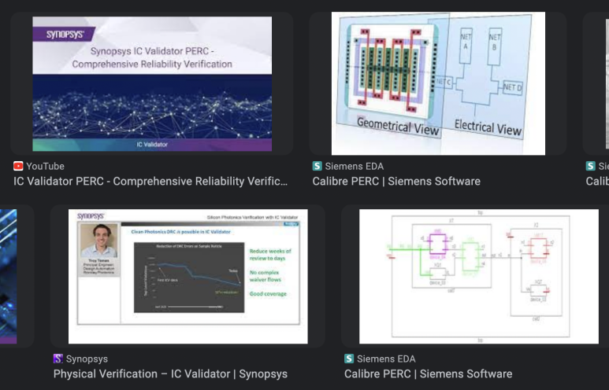

## VLSI에서 Programmable Electrical Rule Check(PERC)  개념 이해하기

반도체 ASIC 설계 과정을 보면 아래 4단계로 이루어진 것을 볼 수 있습니다.

1. 스케매틱 설계

2. Physical Layout 설계

3. Photo mask 설계

4. 반도체 제조 공정

​

Physical Verification은 2번에서 3번 넘어가기 전에 진행합니다.

Physical Design Rule Check(DRC)

Layout Versus Schematic(LVS)

Design For Manufactoring(DFM)

ElectroStatic discharge(ESD) Rule Check (ERC)

이 정도가 대표적이고, 지금 최고 선진 공정인 1.8nm, 2nm공정라인의 EDA를 보면 더 복잡하고 많은 PV Solution이 개발되고 있습니다.

​

이 글에서 볼 내용은 ERC입니다. 우리는 Programmable ERC 즉 PERC를 볼 것입니다.

어떤 Rule이 있는지 자세히 볼 것은 아니고, PERC가 뭐냐~ 간단히 기억해두려고 씁니다.

​

​

PERC란?

Programmable Electrical Rule Checker.

양산 수율을 위해서 지켜야 할 Electrical Rule들이 있는데(P2P, CD), 이걸 자동적으로 체크 해주는 EDA Tool이라고 보시면 됩니다.

​

PERC는 회로 및 전기 검증 프로세스 중에 발생하는 신뢰성 문제를 해결할 수 있습니다. PERC는 ElectroStatic discharge (ESD) 및 Multi Domain Check를 중심으로 "검증"합니다.

아래 두가지 EDA를 많이 사용합니다.

Synopsys ICV

SIEMENS Calibre

이하, PERC, ERC, LVS 등 줄임말로 쓰겠습니다..

​

미세공정에서 물리적 회로 설계는 점점 더 복잡해지고 있습니다.

공정이 너무 미세해지다보니 공정에서 발생한 아주 작은 오차도 회로 동작에는 매우 큰 영향을 주게 됩니다.

살짝 도핑이 더 되거나, 공정 중 웨이퍼가 조금만 두껍게 만들어져도 실제 물리적인 공식에는 큰 영향을 주고... 이렇게 되면 칩 동작속도에 영향이 가고....이 칩으로 소프트웨어를 돌렸을 때 되었다가 안 되었다가 하고... 이런 문제들이 있겠죠?

​

공정을 완벽하게 할 수 있으면 좋겠지만, 현실적으로 불가능해요. 너무 비싸기도 하구요.

그래서 EDA 업계에서는 Foundry와 함께 이런 "공정 오차를 고려하여 설계 및 검증 할" 수 있도록 연구를 하고 있습니다. 뒷단에 발생 할 공정 오차를 미리 고려하여 마진을 주고 설계하는거죠.

​

"어떤 파라미터 요소들이 얼마나 영향을 주고, 이 파라미터 값들을 어떻게 수식화할지?? 어떻게 런타임을 줄일지??" 이런 것들을 고려해서

파라미터들을 수식화하고

양산 수율을 위해 지켜져야 할 룰을 만드는겁니다.

이런 것을 확인할 수 있고, 고객사들이 알 수 있도록 Foundry Sign-off Guide를 만들고,

이런 것들을 자동으로 검증 할 수 있는 EDA Tool을 만들어서,

최종적으로는 공정오차가 있더라도 이런 것들을 다 커버하면서 설계와 검증이 가능하도록 만드는 DTCO 협업을 하는겁니다.

​

그래서 PERC는 EDA 회사가 만듭니다.

공정사마다 Rule이 각자 조금씩 다르고, PERC에 EDS랑 직접적으로 관련이 없는 Rule들도 있으니, EDA Tool 가이드를 보셔야 감 잡히실겁니다.

​

0.8Volt domain으로 동작하는 Cell에서 직접적으로 0.7Volt domain으로 동작하는 Cell에 연결된다?

이런 경우 ESD로 인한 Chip defect가 발생 될 가능성이 있습니다. 그래서 이런것들 사이에는 Voltage Level shifter라는 추가 로직을 사이에 연결해줘야합니다.

-> VLSI처럼 수천억개의 트랜지스터가 있는 Layout에서 사람이 일일이 보는게 아니라, PERC에 Script랑 Design 같은 input file만 넣어서 확인하는거죠.

​

ESD 검증에서는 Point to Point (P2P)와  Current Density (CD) 분석, Netlist Check, Netlist Driven Layout Check 등이 있습니다.

​

누가 PERC가 뭔지 간단히 설명해달라고 하면 "P2P, CD를 포함한 EDS Analysis EDA Tool 입니다~" 하시면 됩니다.

​

Mentor사의 변선수 차장(지금은 부장님!)님이 한국어로 설명 잘 해주셔서, 이거 보시면 도움 될 것 같습니다.

https://youtu.be/-mQ6HfWGtoA?si=0CklgZpKoZ2Mt1_q

설명 : calibre perc

EDA 산업을 아시는 분들은 이 영상만 보시고 감을 잡으셨을텐데,

FEOL과 BEOL 간 긴밀하게 연관되어있습니다.

그래서 CD 검증 같은 경우, BEOL의 METAL에 대한 Parasitic RC값 추출이 필요한데요. SIEMENS에선 Calibre PEX를, Synopsys에선 Star RC를 활용합니다.

​

 해시태그 : 