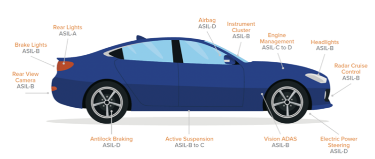

## SLM, Silicon Lifecycle Management: 반도체 수명 관리를 최적화하는 방법론

제가 자주 보는 채널 중 하나인 "Semiconductor Engineering"에 SLM이라는 주제의 동영상을 찾았습니다.

정리 겸 작성해봅니다.

​

SLM이란?

Silicon Lifecycle Management(SLM)는 반도체의 "최종 사용자의 시스템"에 설계, 제조, 테스트부터 배포되는 반도체 디바이스까지 모두 모니터링, 분석을 하여 통해 실리콘 수명을 개선하는 방법론입니다.

설명 : How do you track, measure and ensure reliability over the lifetime of a chip, regardless of how or where it is use? Steve Pateras, senior director of marketi...

오늘날 반도체 산업은 인공지능, 의료산업, 자율주행까지 쓰이며

안정성 요구사항이라는 큰 도전과제에 직면해 있습니다. 칩이 나간 후에도 사후 관리가 계속 되어야한다는 것이죠.

수명에 문제가 있으면 미리 경고도 줘야하구요.

​

​

SLM에서 수집하는 데이터

SLM은 두 가지 핵심 원칙에 기반하여 구현됩니다.

첫째, 실리콘 설계 내에 모니터링 및 분석이 가능하여야 함.

둘째, 실리콘 수명주기 전반에 걸쳐 데이터를 수집하고 분석이 가능해야 함.

​

주로 아래 세가지 데이터를 설계 / 제조 / 테스트 / 배포 등 전 단계에서 수집.

1. PVT Monitoring

2. Timing Critical path monitoring

3. On-Chip osiloscope

4. 배포 단계: 성능 모니터링, 오류 검출, 예측 유지보수 등

​

DFT와 On chip sensor들을 이용해서 이런 것들을 모니터링 하고, 수명이 다한 칩은 미리 실사용자에게 정보를 보여줄 수 있음.

이뿐만 아니라, 이러한 데이터를 토대로

통계적 분석 -> 기계학습 -> 문제찾고 -> 다음 양산 할 Chip에 반영하여 업그레이드도 가능.

​

그리고, 설계 / 제조 / 테스트 / 배포 전 단계에 진행되니, 고객에게 Aging 불량 칩이 전달되기 전에 잠재적인 문제들을 조기에 파악하고 수정을 할 수 있고,

목표보다 구동이 가능하다는 데이터가 나오면, 좀 더 높은 성능의 제품으로 출시도 가능.

https://www.synopsys.com/solutions/silicon-lifecycle-management.html​

그리고 DFT는 불량칩을 선별하기 좋은 방법이지만, 어떤 부분에서 주로 Fault가 나오는지 정확한 분석이 어려움.

SLM은 Diagnosis의 정확도와 효율성을 높입니다. 칩 내부에 내장된 모니터링 구조와 자체 테스트 기능을 통해 고장 지점을 정확히 파악할 수 있으며, 수집된 데이터를 바탕으로 고장의 근본 원인을 신속하게 분석할 수 있습니다. 이를 통해 문제 해결 시간을 단축하고 재발 방지 대책을 수립도 가능.

​

설명 : February 25, 2021 -- Wouldn’t it be great if we could keep on analyzing our IC designs once they are in the field? After all, simulation and lab measurements...

미세공정에서 반도체의 공정 Variation이 계속 커지고 있고, 수율도 떨어지고 있다.

반면에 의료 및 자율주행에서도 쓰이고.. LLM 데이터센터향 반도체도, Chat GPT 등을 이용해 또 새로운 제3의 소프트웨어를 만들고 있다.

​

반도체 가격도 문제지만, 이 반도체 수명이 죽을 것 같으면 미리 알려줘야 하고, 반도체 칩 내에서 어떤 부분에서 취약점이 있는지 분석도 되어야 개선이 가능함.

Synopsys가 관련 자료가 가장 많고, SIEMENS도 많은 자료를 갖고 있다.

​

인공지능 시대로 들어서서 반도체가 중요해지고,

미세공정으로 들어서면서 수율은 떨어지고.

이렇다보니 SLM이 점점 더 중요해질 것 같다. 특히 DFT쪽에 계속 일이 많아질 것 같음.

 해시태그 : 