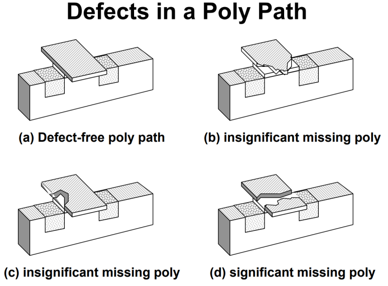

## IDDQ 테스팅: 정적 상태에서 흐르는 전류를 갖고 공정 결함을 검증하는 방법론

IDDQ란?

대기상태(Quiescent state)에서 공급전류(Idd)를 측정하는 회로 테스팅 방법론입니다.

"회로의 신호 전환이 이뤄졌을 때, 순간 Static Current가 뜨겠지만, 그 이후엔 Static current가 0에 가까운 값이 나오는게 기본적인 CMOS입니다." 그런데 공정상에서 결함이 발생하면, 정적상태에서도 매우 큰 Static Current가 흐르게되고, 결국 칩이 정상작동하지 않게 됩니다.

​

기능 자체는 정상작동 할 수도 있는데, 전력 소비가 커지겠죠.

전력 소비가 만약 너무 크다 하면 기능도 정상 작동 안할 것이구요.

Defect 예시입니다.

Credit: https://eecs.ceas.uc.edu/~jonewb/iddq.pdf

​

용어 설명 :

IDD: Current flow through VDD

Q: Quiescent state

IDDQ Testing: Detecting faults by monitoring IDDQ

회로의 신호를 전환시키지 않고 일정하게 유지 시켰을 때는 거의 Zero에 가까운 정적 전류가 흐르는걸 설계자들은 예상합니다.

​

아래 것들 검증을 할 수 있고, Test coverage를 추가적으로 더 올리기 위해 SCAN, BIST까지 넣은 디자인에 대해서 합니다. 보통은 SCAN과 BIST를 우선으로 넣고, Coverage를 더 높이기 위해 IDDQ도 넣는 정도.

Bridging Faults

Punch-through

Resistive Shorts

Line and Gate Break Faults

Source or Drain Break Faults

Even some Delay Faults

Latch-Up

Stuck-open Faults

​

IDDQ Testing이란?

이러한 테스트의 목적은 제품이 소비자들의 요구사항인 주어진 전성비로 더 오랜 시간 동안 작동할 수 있고, 동시에 우수한 작동 품질을 유지할 수 있도록 보장하는 것입니다.

DFT Engineer들이 Physical Design 중간 단계에서 IDDQ Testing을 고려하여 설계를 진행합니다.

​

IDDQ 테스팅은 CMOS 회로의 Static Current의 특성을 이용하여 Defect를 검출하는 방법입니다.

이상적인 CMOS 트랜지스터는 스위칭이 일어나지 않을 때 전류 소모가 매우 적습니다.

(물론 현대 VLSI Design 같은 경우엔, Static 상태로 유지되는 Gate들이 엄청 많아서 Chip 자체의 Static Power 비중은 커졌고, 회로 미세화 되면서 트랜지스터의 Static Power도 커지긴했지만, 어쨌든 Dynamic Power에 비하면 작음)

Credit: Texas Instruments이는 CMOS 회로가 스위칭 상태가 아닐 때, PMOS와 NMOS 트랜지스터 중 하나는 항상 OFF 상태이기 때문입니다.

따라서 결함이 없는 CMOS 회로는 정적 상태에서 매우 낮은 전류를 소모합니다.

하지만 결함이 존재하는 경우, OFF 상태여야 하는 트랜지스터에 비정상적인 전류 경로가 생성되어 정적 전류가 증가하게 됩니다.

​

Credit: VLSI testing, National Taiwan University, 李建模

Credit: VLSI testing, National Taiwan University, 李建模​

IDDQ 테스팅에서는 특정 입력 벡터를 회로에 인가하여 다양한 정적 상태를 만들고, 각 상태에서 공급 전류(IDD)를 측정합니다. 측정된 전류가 미리 설정된 임계값을 초과하면 결함이 존재함을 나타냅니다.

마찬가지로 ATE에 꽂아서 하는 방법이 있고, 칩 내부에 Built In Current Sensor를 추가하는 방법이 있습니다.

​

IDDQ 설계 흐름은 이후 포스팅에서 살펴보겠습니다~!

​

​

​

​

 해시태그 : 