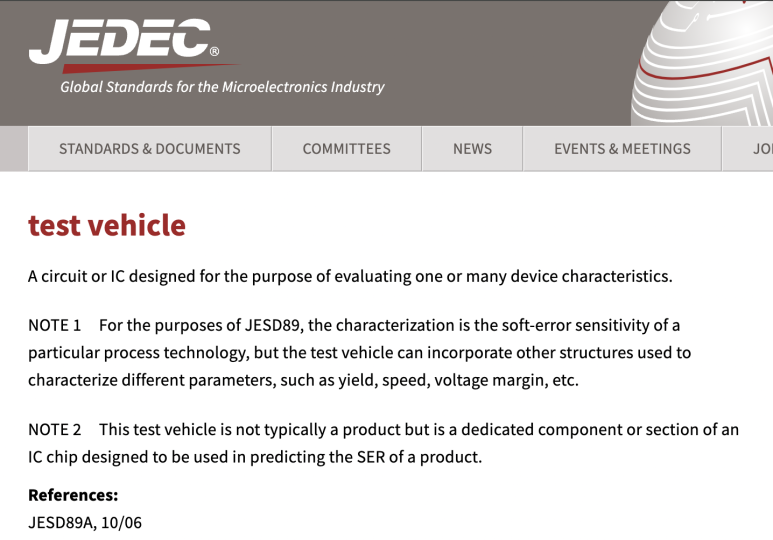

## Test vehicle이란? 반도체 칩 특성 모니터링 및 평가

​

Test Vehicle란?

반도체 회로 설계 및 반도체 제조 분야에서 'Test Vehicle'은 다양한 디바이스 특성을 평가하고 특성화하는 데 사용되는 중요한 반도체 회로입니다.

(1) 처음부터 설계도 넣고 바로 양산 나가는 것이 아니라, 처음에는 일단 제조공정 해보고, 여기서 나온 특성을 분석하고,

(2) 설계 <-> 공정 간 물리적 변수들의 차이를 고려하여

(3) 재설계하고 양산 나가는겁니다.

​

평가 항목

Test Vehicle 주요 용도 중 하나는 특히 JEDEC 표준 JESD89의 맥락에서 반도체 공정의 Software Error Rate(SER)를 평가하는 것입니다. 예를들어, Single Event Upset(SEU)이라고도 하는 Soft는 우주방사선과 같은 외부 방사선으로 인해 전자 회로에 일시적으로 발생하는 오작동입니다. 이러한 오류에 대한 공정 기술의 민감도를 이해하는 것은 특히 항공우주, 자동차 및 중요 인프라 분야의 애플리케이션에서 신뢰할 수 있는 IC를 설계하는 데 매우 중요합니다.

​

수율 특성화

Test Vehicle은 반도체 공정의 수율 특성을 이해하는 데 도움이 됩니다. 수율은 웨이퍼에서 생산되는 양호한 칩의 수를 의미하며, 반도체 미세공정의 핵심 지표입니다.

제조업체는 Test Vehicle을 사용하여 공정의 결함을 파악하고 완화하여 수율을 높이고 비용 효율적으로 생산할 수 있습니다.

​

칩의 속도, 성능, Variation, 전압마진 등을 분석합니다.

​

아무튼 그래서.. 이런 Test Vehicle도 IP입니다.

이런 IP를 갖고 특성 모니터링 + Calibration하면서 어느정도.. SPICE랑 PDK랑 특성 상관관계가 맞으면 PDK Version 1.0이 나오는거죠.

​

https://news.uchicago.edu/story/new-lab-chip-can-test-thousands-stem-cells-simultaneously​

참고자료:

https://www.pdf.com/wp-content/uploads/2020/02/Scribe_Characterization_Vehicle_Test_Chip_for_Ultra_Fast_Product_Wafer_Yield_Monitoring.pdf

https://ieeexplore.ieee.org/document/5551474

[Stackable short flow Characterization Vehicle test chip to reduce test chip designs, mask cost and engineering wafers](https://ieeexplore.ieee.org/document/5551474) : Being successful in semiconductor manufacturing is increasingly challenging for sub 100 nm technology nodes. Typically, 10+ test chips have been used to develop and ramp a new technology, which cannot be sustained considering that mask cost alone are up to 10 times higher today than in pre-OPC days....

https://ieeexplore.ieee.org/document/9764609

[A Ring-Oscillator-Based Degradation Monitor Concept with Tamper Detection Capability](https://ieeexplore.ieee.org/document/9764609) : Refurbished chips (i.e., chips re-used legally in circular economy) and counterfeited chips (i.e., used chips fraudulently sold as new) are a growing concern for the industry because of their poor reliability. In this context, various solutions for the detection of such chips have been presented in ...

​

 해시태그 : 