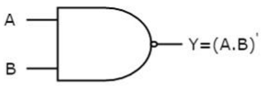
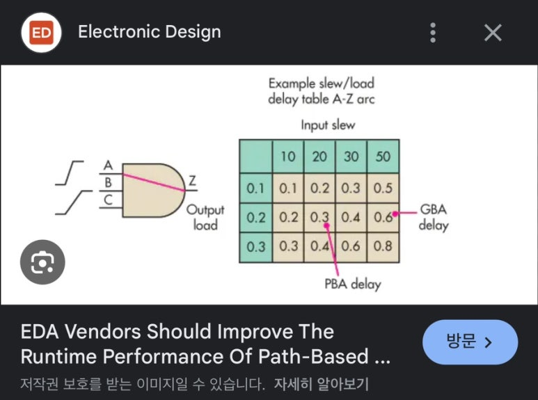
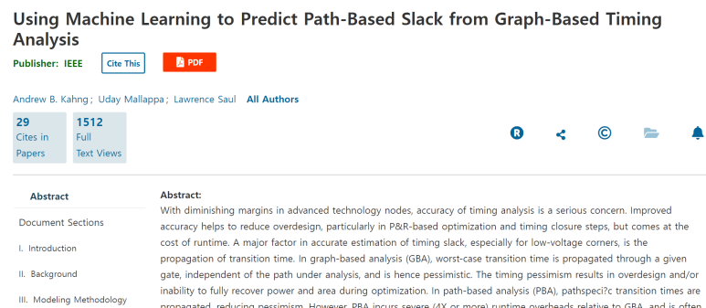

## PBA vs GBA in Static Timing Analysis

Static Timing Analysis, STA에서 Path Base Analysis, PBA와 Graph Base Analysis, GBA는 디지털 회로의 타이밍을 분석하는 데 사용되는 두 가지 방법입니다.

​

(1) 가장 정확하게 실리콘의 Timing Analysis를 하려면, SPICE Level에서 시뮬레이션 하는 것입니다.

(2) 그러나 SPICE Simulation은 너무 무겁고 느립니다. 결국 SPICE Simulation에서 GBA 방식의 STA로 발전하게 되었습니다.

(3) GBA는 계산이 단순합니다. 대신에 좀 더 비관적인 결과를 보입니다. 그래서 런타임이 좀 늘어나더라도, 좀 더 정확한 방법론이 필요해졌습니다.

-> PBA가 나왔습니다.

​

PBA, GBA 비교하는 논문들을 보면 여러 디자인에서 Trade-off를 볼 수 있습니다.

​

간단히 요약하면,

GBA는 계산이 간단 + 현실보다 더 비관적인 결과 값(결과 매우 나쁨)

PBA는  계산이 복잡(Runtime 김) + 현실에 가까운 덜 비관적인 결과 값

​

예를들어 아래와 같은 2-input NAND Gate가 있다고합시다.

Static Timing Analysis는 기본컨셉으로는 Single Input Switching을 가정합니다.

(현실 세계에서는 Multi Input Switching이 발생하지만, 기본 STA는 MIS를 고려하지 않습니다. 관련 내용도 이후에 다뤄보겠습니다.)

1. A to Y,

2. B to Y,

2 개의 Timing Arc가 기본입니다.

그리고 A to Y, B to Y 모두 다른 물리적 특성을 갖고 있습니다.

​

예를들어 Path 별 Min delay | Max delay가 아래와 같다고 합시다.

1. A to Y, 1ns 10ns

2. B to Y, 2ns 20ns

GBA는 이 Cell의 Delay가 1ns, 20ns의 특성을 갖는다고 합니다.

PBA는 Swiching이

(1) A input을 통하는 경우 1ns, 10ns 특성을 갖도록 하고,

(2) B input을 통하는 경우 2ns, 20ns 특성을 갖게 합니다.

위 그림에서 예를 들면,

input1 to Flipflop/D까지

GBA:

min: 3ns+1ns = 4ns

max: 4ns+20ns = 24ns

​

PBA:

min: 3ns+1ns = 4ns

max: 4ns+10ns = 14ns

이런 경우에는 maximum delay가 실제적으로는 14ns만 발생함에도, GBA는 24ns로 보게됩니다.

​

​

​

GBA는 Cell 전체 Timing arc를 보고 min delay와 max delay를 갖고, 이 cell을 거치는 경우 이 값을 적용하도록 합니다.

PBA는 Signal을 Activation시키는 Path를 기반으로 min delay와 max delay를 갖고 Timing을 분석합니다.

3-input NAND, AOI Gate 같은 경우 많은 input pin을 갖고, 그 뜻은 많은 Library Look up table을 갖는다는 뜻입니다. 데이터를 갖고 올 때 순회하는 시간이 길어집니다.

​

좀 더 이론적인 내용은 UC Sandiago의 Andrew Kahng 교수님의 자료를 참고하시죠.

https://vlsicad.ucsd.edu/Publications/Conferences/361/c361.pptx

​

Machine Learning PBA 이런것들은 위 GBA와 PBA 사이에서 Runtime과 결과를 어느정도 Trade-off를 맞춘 방법론들이라고 보시면 됩니다.

https://ieeexplore.ieee.org/document/8615746

[Using Machine Learning to Predict Path-Based Slack from Graph-Based Timing Analysis](https://ieeexplore.ieee.org/document/8615746) : With diminishing margins in advanced technology nodes, accuracy of timing analysis is a serious concern. Improved accuracy helps to reduce overdesign, particularly in P&R-based optimization and timing closure steps, but comes at the cost of runtime. A major factor in accurate estimation of timing sl...

​

 해시태그 : 