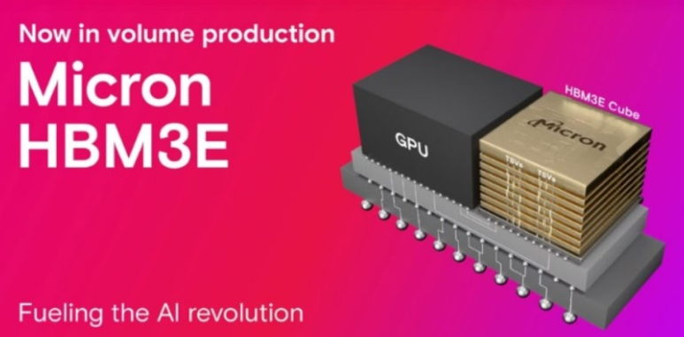
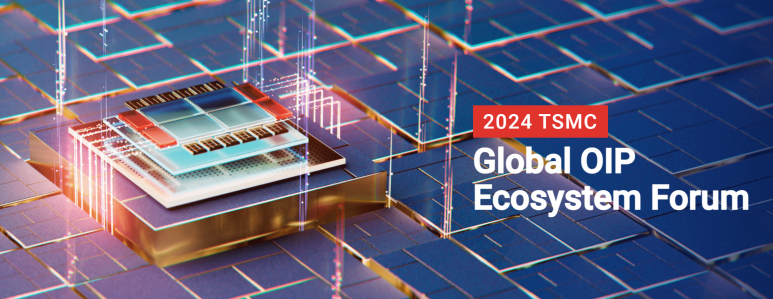
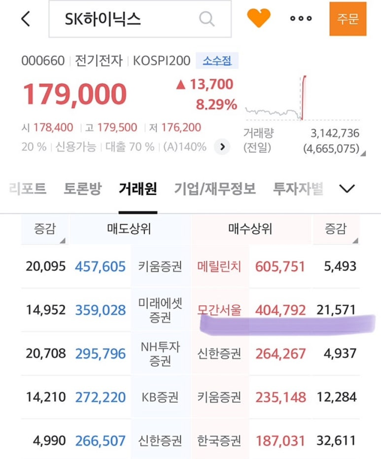

## 2024년 9월 27일 반도체 뉴스: 마이크론 깜작 실적 발표, HBM 수요 급증, 하이닉스 HBM3E 12단 양산, TSMC OIP 포럼, 3나노 AP Chip 수주

​

​

마이크론 깜짝 실적 발표, HBM 수요 급증

Source: Micron마이크론이 2024 회계연도 4분기(6~8월) 실적을 발표했습니다. 매출은 77억5000만달러로 전년 동기 대비 93% 증가했고, 시장 예상을 상회했습니다[1]. 이는 HBM을 포함한 고성능 메모리 수요 증가와 스마트폰 신제품 출시 등 계절성 수요의 영향으로 분석됩니다[1].

​

마이크론은 AI 서버 시장의 강한 수요와 점유율 증가로 데이터센터향 SSD 매출이 전년 대비 3배 증가했다고 밝혔습니다[1]. 또한 2025년까지 HBM 매출 점유율이 D램 시장 점유율(20%) 수준으로 높아질 것이라는 전망을 유지했습니다[1].

https://investors.micron.com/static-files/00f97426-650b-49e5-93e5-7574e43ca9be

​

SK하이닉스 HBM3E 12단 양산 발표

Source: SK HynixSK하이닉스가 36GB 용량의 HBM3E 12단 신제품을 세계 최초로 양산하기 시작했다고 발표했습니다[6]. 이 제품은 엔비디아의 최신 AI 칩 H200에 탑재될 예정입니다[6].

https://zdnet.co.kr/view/?no=20240926090401

[SK하이닉스, 12단 HBM3E 세계 첫 양산…엔비디아 공략 속도](https://zdnet.co.kr/view/?no=20240926090401) : SK하이닉스가 현존 HBM(고대역폭메모리) 최대 용량인 36GB(기가바이트)를 구현한 HBM3E 12단 신제품을 세계 최초로 양산하기 시작했다고 26일 밝혔다.HBM은 여러 개의 D램을 수직으로 연결해 기존 D램보다 데이터 처리 속도를 크게 끌어올린 메모리다. HBM3E는 5세대 제품에 해...

​

TSMC OIP 포럼 개최

Source; tsmcTSMC가 'OIP 에코시스템 포럼 2024'를 개최했습니다[5]. SK하이닉스를 비롯한 주요 반도체 기업들이 참가해 최신 기술과 제품을 소개했습니다[5].

https://www.tsmc.com/static/english/campaign/oip2024/index.html

​

원문:

Opportunity to gain insight into

Emerging advanced node design challenges and corresponding design flows and methodologies for A16, N2, and N3 processes.

Latest updates on TSMC 3DFabric™ chip stacking and advanced packaging processes, InFO, CoWoS®, and SoIC, 3DFabric Alliance, and 3Dblox standard, plus innovative 3Dblox-based design enablement technologies and solutions, targeting HPC, AI/ML, and mobile applications.

Comprehensive design solutions for specialty technologies enabling ultra-low power, ultra-low voltage, analog migration, RF, mmWave, and automotive designs targeting 5G, automotive, and IoT designs.

Ecosystem-specific AI-assisted design flow implementations for 2D and 3DIC design productivity and optimization.

Successful, real-life applications of design technologies, IP solutions, and cloud-based designs from TSMC's Open Innovation Platform® Ecosystem members and TSMC customers to speed up time-to-design and time-to-market.

​

​

반도체 핵심 원자재의 중국 의존도 상승, 미국 정부의 대중 관세 인상

미국 정부가 중국산 수입품에 대한 관세 인상을 순차적으로 시행할 예정입니다[8]. 반도체 관련 품목은 2025년부터 50% 관세가 적용될 예정입니다[8].

https://www.yna.co.kr/view/AKR20240923141600002?section=search

[공급망 재편 속 반도체 핵심 원자재 中 의존도는 더 높아졌다 | 연합뉴스](https://www.yna.co.kr/view/AKR20240923141600002?section=search) : (서울=연합뉴스) 한지훈 기자 = 지난해 반도체 핵심 원자재의 중국 수입 의존도가 전년보다 높아졌다는 조사 결과가 나왔다.

​

반도체 업계 실적 전망 엇갈림

​

일부 증권사에서 주요 메모리 기업들의 실적이 예상을 밑돌 것이라는 전망을 내놓았습니다[9]. 그러나 마이크론의 호실적 발표로 업계 전망이 다시 긍정적으로 바뀌고 있습니다.

​

모건스탠리에서 반도체 대량 매도 -> "반도체 겨울론" 리포트 -> 주가 하락 -> 반도체 대량 매수 -> 주가 상승

https://www.chosun.com/economy/tech_it/2024/09/26/GIMIFLD2CVH6RJ3IFXCX3BVQ4A/

[‘반도체 겨울론’ 뒤집은 마이크론 깜짝 실적... 하이닉스 9%, 삼성전자 4% 올라](https://www.chosun.com/economy/tech_it/2024/09/26/GIMIFLD2CVH6RJ3IFXCX3BVQ4A/) : 반도체 겨울론 뒤집은 마이크론 깜짝 실적... 하이닉스 9%, 삼성전자 4% 올라

​

​

TSMC의 연속 3나노 AP Chip 수주

​

https://zdnet.co.kr/view/?no=20240926114600

[3나노 모바일 AP 잇따라 출격…TSMC 수주 독식](https://zdnet.co.kr/view/?no=20240926114600) : 올해 하반기 3나노미터(nm) 공정을 적용한 모바일 애플리케이션 프로세서(AP) 경쟁이 본격화된다.지난해 애플에 이어 다음달 10월 미디어텍과 퀄컴이 나란히 3나노 공정을 적용한 AP를 처음으로 공개할 예정이다. 삼성전자와 구글 또한 3나노 공정의 신규 AP 출시를 앞두고 있다. 이 가운데...

애플, 퀄컴, 미디어텍, 구글의 3나노 AP를 수주.

삼성 Foundry는 3나노 2세대 공정에서 삼성 System LSI의 엑시노스 2500 출시 준비.

​

Citations:

[1] https://www.newsis.com/view/NISX20240926_0002899703

[2] https://www.hankyung.com/article/202409268325i

[3] https://www.g-enews.com/article/Global-Biz/2024/09/2024092605035364604a01bf698f_1

[4] https://www.kimchang.com/ko/insights/detail.kc?idx=28872&sch_section=4

[5] https://www.yna.co.kr/view/AKR20240920037400003

[6] https://www.yna.co.kr/view/AKR20240926133000003

[7] https://contents.premium.naver.com/noblesstock/noblesschedule/contents/240926153718222hx

[8] https://www.yna.co.kr/view/AKR20240913170400009

[9] https://zdnet.co.kr/view/?no=20240922132439

[10] https://www.hankyung.com/article/2024092073176

 해시태그 : 