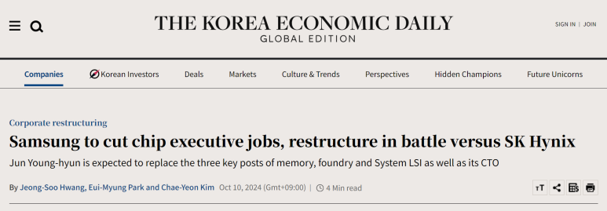

## 2024년 10월 11일 반도체 뉴스 정리

​

엔비디아 젠승황의 인텔 인수설

개인적으로 가능성 낮아보임.

https://www.trendforce.com/news/2024/10/11/news-amid-buzz-over-jensen-huang-buying-intel-here-are-the-highlights-of-the-11-biggest-tech-mergers-ever/

[[News] Amid Buzz over Jensen Huang Buying Intel, Here Are the Highlights of the 11 Biggest Tech Mergers Ever | TrendForce News](https://www.trendforce.com/news/2024/10/11/news-amid-buzz-over-jensen-huang-buying-intel-here-are-the-highlights-of-the-11-biggest-tech-mergers-ever/) : Nvidia CEO Jensen Huang’s net worth has now reached USD 109.2 billion, surpassing Intel’s total market value of USD 96.595 billion. This development h...

삼성 DS 부문 내 메모리 분서 감사 진행 중.

시장에서는 임원 재편, 연구센터 재편을 예상

https://www.kedglobal.com/corporate-restructuring/newsView/ked202410100005

[Samsung to cut chip executive jobs, restructure in battle versus SK Hynix - KED Global](https://www.kedglobal.com/corporate-restructuring/newsView/ked202410100005) : Samsung Electronics Co. plans to drastically cut its chip executive jobs and restructure semiconductor-related operations as it struggles to compete with rival

삼성전자 LED 사업 철수

imec의 STAR 론칭

여기서 Automotive 반도체 쪽으로 유럽에 인력 모으고 프로젝트 진행 예정

인텔, AMD 둘 다 새로운 칩의 시장 반응이 아쉬움

한쪽은 전력에,

한쪽은 성능에 집중함.

​

이전 칩은 세대가 발전하면서 성능과 전력효율 모두 2~40%는 좋아졌는데, 최근세대들은 두마리 토끼 중 한마리만 개선 된 프레진테이션이 보임

https://youtu.be/S-I-LRWHnOg?si=kIB44wCcBhn_i1Gr

설명 : 아니 대체 이게 무슨일이야?TSMC 3나노로 이게 말이됨???#Intel #CPU #285K뉴스 출처https://quasarzone.com/bbs/qn_hardware/views/1733104https://quasarzone.com/bbs/qn_hardware/views/1733...

​

Citations:

[1] https://www.india-briefing.com/news/setting-up-a-semiconductor-fabrication-plant-in-india-what-foreign-investors-should-know-22009.html/

[2] https://www.computerworld.com/article/3541875/intel-and-the-us-set-to-seal-8-5b-chips-act-funding.html

[3] https://itif.org/publications/2024/08/19/how-innovative-is-china-in-semiconductors/

[4] https://www.weforum.org/agenda/2024/10/new-building-chips-in-america-act-what-does-it-mean-for-the-semiconductor-industry/

[5] https://www.csis.org/analysis/collateral-damage-domestic-impact-us-semiconductor-export-controls

[6] https://www.semiconductors.org/chips-rd-programs/

[7] https://technode.global/2024/10/11/singapores-meridian-innovation-secures-12-5m-to-scale-operations/

[8] https://www.accesswire.com/930355/elevate-semiconductor-and-polar-semiconductor-sign-long-term-strategic-manufacturing-agreement

[9] https://www.hindustantimes.com/cities/lucknow-news/up-set-to-showcase-its-policies-at-semicon-india-2024-101725995651798.html

[10] https://www.einnews.com/pr_news/750674122/global-semiconductor-glass-market-overview-and-statistics-for-2024-2033

[11] https://www.einnews.com/pr_news/750914539/global-wafer-dicing-services-market-to-reach-usd-838-9-million-by-2032-growing-at-a-cagr-of-4-21-astute-analytica

 해시태그 : 