## 싱가포르 여행기: 뉴턴, 맥스웰 호커 푸드 센터

이집트 여행 가려고 티케팅까지 했으나…

비행기가 무려 8시간이나 일정 변경에 있었고, 취소하였다.

​

급하게 찾아봤는데, 싱가폴 왕복 27만원 있길래 지름.

​

> Singapore🇸🇬: 23th-27th December

출처 : No Site

사용중인 프리미엄 신용카드만 3장이라 당연히 라운지 가야겠다~ 했는데, 전부다 실적미달ㅋㅋㅋ

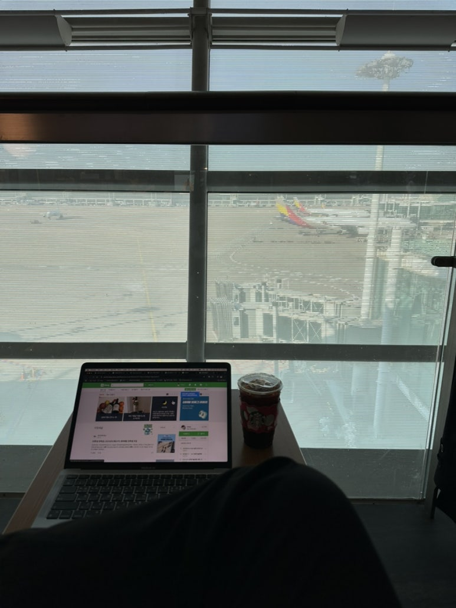

11월 바빠서 친구 볼 시간이나 돈 쓸 시간이 없었다.

그래서 스타벅스에서 메일 답장 좀 하고, 강의도 좀 듣고 비행기 기다렸다.

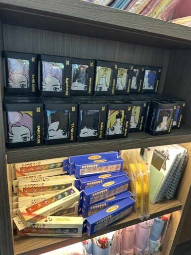

BTS 굿즈 많더라

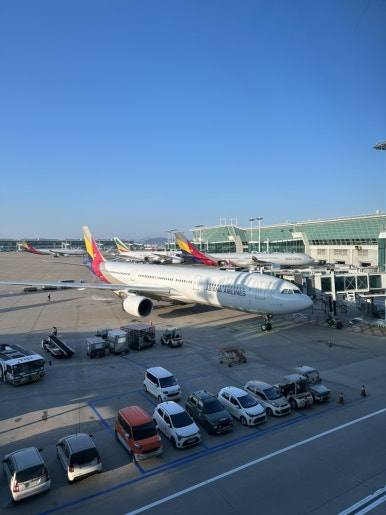

공항 1년만에 와서 면세점이랑 여기저기 구경하는데 기분이 뭔가 들떴다.

다음부터 출국 할 때에는 공항에 일찍 와서 이 기분을 일찍부터 누려야겠다.

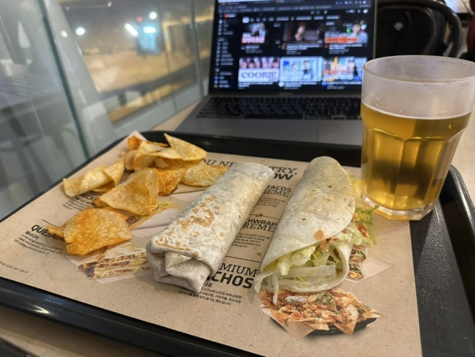

비행기 지연 3시간 되면서 왔던 Tacobell

생맥주 마시려고 왔다.

살면서 LCC 처음 타봐서, 비행기 내내 ‘밥은 언제 주지?? 음료는 언제 주지??‘ 생각하고 있었음ㅋㅋㅋ

싱가포르 창이 공항 도착 🛬

이용자 만족도 세계 1위 공항이다.

​

카타르의 도하 하마드 공항과 라이벌인데, 개인적으로는 도하 공항이 더 좋았다.

창이공항은 쇼핑몰 좋아하시는 분들께 정말 좋을듯.

수속하고 짐 챙기고🧳 

​

새벽 4시 도착해서, 오픈한 것도 없고 지하철도 아직 운행을 안했다.

제목 : 싱가포르 여행기: Newton, maxwell hawker (1), 설명 : None

해시태그 : 

사진엔 안 찍었는데, 바닥에 누워서 주무시는 분들이 정말 많다.

공항에 오픈한 식당이 말레이시아 음식(?) 🍱만 있어서 이거 도전함.

맛은 그냥 보이는대로 ㅋㅋㅋ 밥+치킨+ 오이+후라이+ 매콤한 소스

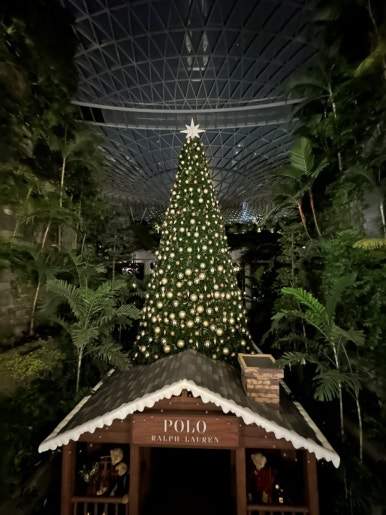

여기엔 세계에서 가장 큰(?) 분수대가 있는 곳인데 여기도 오픈을 안 함.

편의점도 그렇고 죄다 한국 과자, 한국음식. 진짜 한류구나;

지하철에서 찍은 🇸🇬

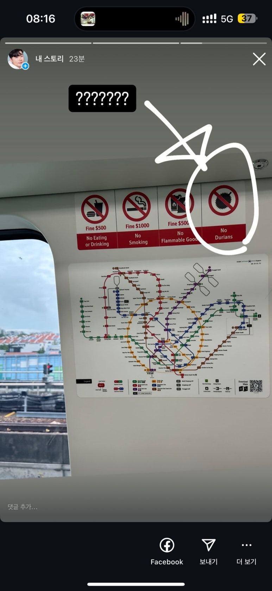

싱가폴 지하철에선 뭐 마시거나 먹거나 해선 안되고 두리안도 금지 🚫

두리안을 들고 타는 사람이 있었나? 했는데, 시장 가보면 두리안 정말 많았다.

사진으로는 안 느껴지는데 “33도 + 습한 날씨”

근데 이게 1년 내내 이렇대.

​

이것 때문에 나는 싱가폴에 살 수 없겠다고 느꼈다.

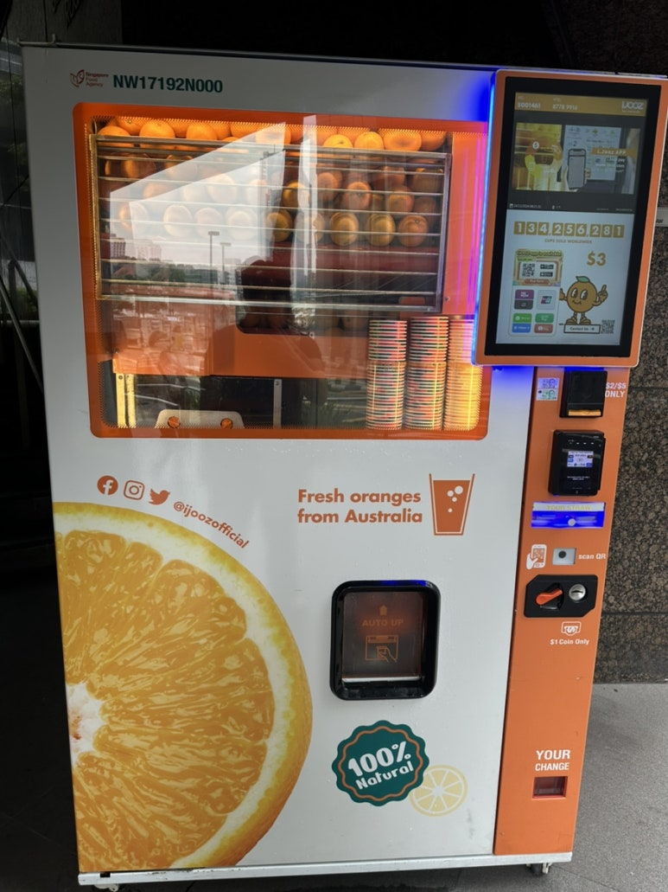

길 여기저기에 있는 오렌지 착즙기. 동네마다 가격이 다른데, 2~3달러.

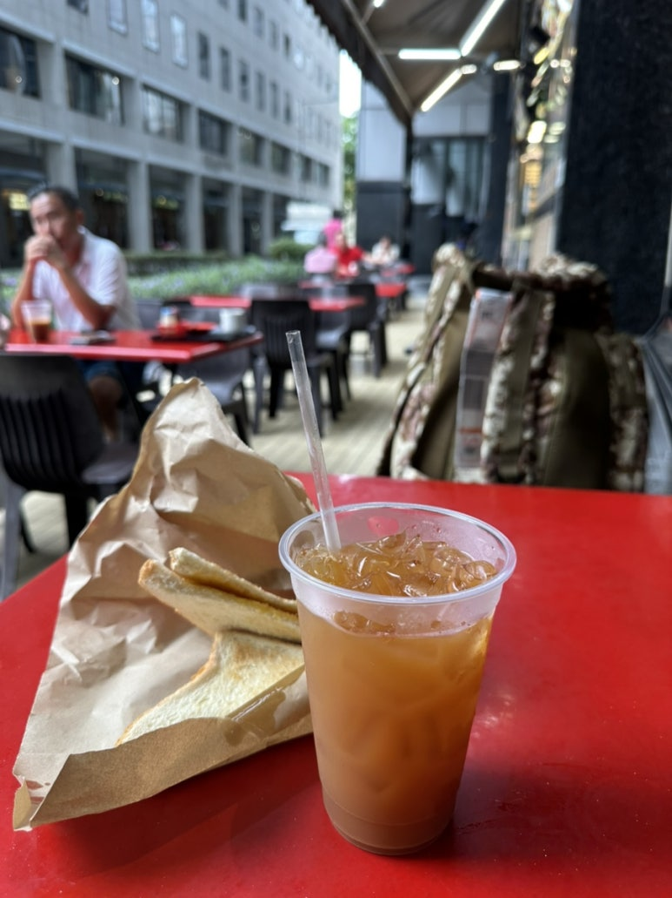

카야토스트 + 레몬차

현지 카야잼 맛있는데, 사실 한국에도 이미 수입이 되다보니 맛 똑같음 🙂🙂

지하철 갔는데 안내도가 친절히 붙어있더라

Gardens the bay 라는 곳. 나는 여기가 싱가폴에서 제일 좋았다.

다 돌려면 5시간은 잡아야 할 것 같은 식물원.

유리온실이 있는데, 세계에서 가장 크다고 하더군요.

마리나베이 샌즈.

사진으로 볼 때는 별 생각 없었는데, 실제로 보니 와 ㅎㅎㅎ 이거 어떻게 세운거지?

저거 어떻게 올렸지? 저 무게 어떻게 감당하지? ㅋㅋㅋ

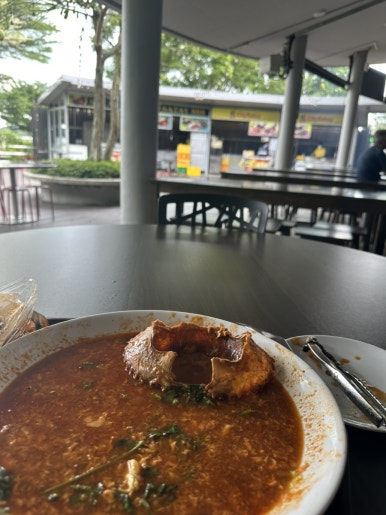

칠리크랩이 유명하니까 먹어봤는데, 흐음…

먹을만은 한데, 그돈씨

과일은 맛있었음 😋

싱가폴 주요 도심은 진짜 이렇게 생겼음.

제목 : 싱가포르 여행기: Newton, maxwell hawker (2), 설명 : None

해시태그 : 

Boad Quay라는 곳

제목 : 싱가포르 여행기: Newton, maxwell hawker (3), 설명 : None

해시태그 : 

제목 : 싱가포르 여행기: Newton, maxwell hawker (4), 설명 : None

해시태그 : 

크리스마스에는 Orchard Road 라는 곳에 왔다.

쇼핑몰들 많고… 사람 엄청 많다.

로드샵 많고 명동 같은 곳인가 싶음. 사람 너무 많나서 도망침.

시장 여기저기서 파는 두리안.

냄새 진짜 지독하구나 💣

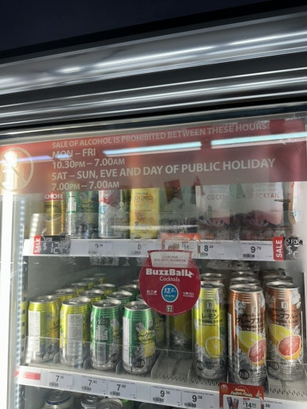

맥주나 한잔 하려고 했는데 밤 열시 반 이후로 술 안팜;;;;;

신기한 법이다.

제목 : 싱가포르 여행기: Newton, maxwell hawker (5), 설명 : None

해시태그 : 

Maxwell 이라는 곳 왔음. 엄청 유명한 치킨라이스 가게 있길래.

웨이팅 한 20분 했고, 1/3은 한국인 같음.

현지인들은 여기 안가는 듯.

여 앞에 생과일 쥬스 집 있는데 깔라만시 맛있었음.

30분만에 치킨라이스 받았다. 코코넛도 맛봄.

​

치킨라이스 평:

진짜 맛 없게 생겼는데,

생각보다 맛있어서, 오?? 하게 됨.

​

그리고 hawker는 전체적으로 위생 + 더움 문제가 있으므로, 이런거 싫으면 쇼핑몰 푸드코트 가서 드세요.

이름 모르겠는 빙수 같은건데,

물에 설탕 섞어서 얼린다음 가루 낸 느낌. 거기에 팥이랑 이것저것.

차이나타운 구경 왔다.

싱가폴 대부분 사람들은 다 중국어와 영어를 한다.

그리고 중국인이 엄청 많다.

차이나타운 근처에 중국 스타일 식당이 많다. 딤섬도 많다.

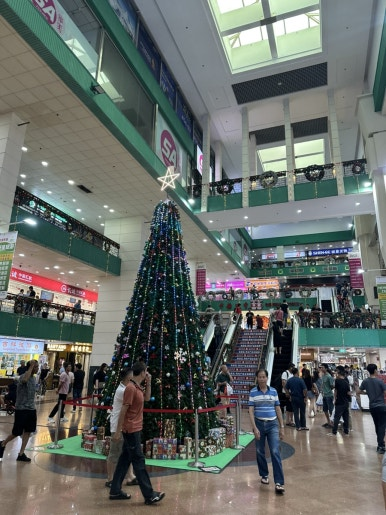

마사지타운이라고 불리는 곳

타운 대부분이 마사지 샵이다.

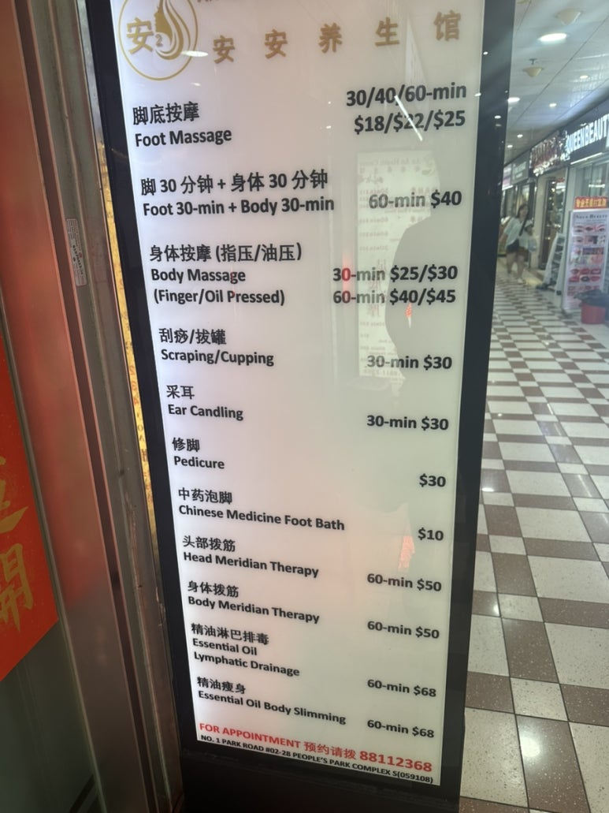

발 마사지가 1시간 25불이다.

압이 엄청 시원했음. 하루에 4~5만 걸음 걸었는데, 마사지 한번으로 다 풀렸다.

​

25불짜리도 가보고 38불도 가봤는데,

25불 -> 이것저것 기본적인 옵션 붙이면 30불. 그리고 영어 소통 안됨. 중국인 사장+미얀마 마사지사+마사지 하면서 계속 틱톡 보고 있음

38불 -> 이미 옵션이 붙어있음. 영어 가능+중국인 마사지사+마사지만 집중하고, 이것저것 건강 발 조언(?) 해줌.

마사지 받고 맥주를 또 한잔 하러 왔다.

타이거 맥주는 싱가포르 맥주라서, 여기 기본 생맥주가 이거다.

개인적으로 쓴 맥주를 좋아해서 단 맥주는 불호인 사람인데, 싱가폴 날씨에는 이러한 단 맥주가 잘 넘어가더라.

안주는 타코. 🌮

원래 싱가폴/말레이시아 음식 먹으려 했는데,

여기 사장님이 호객해서 가격 흥정 하고 들어옴

타코+생맥주 = 13불

싱가포르의 역 이름은 아주 직관적이다.

리틀 인디아는 인도 사람들 있는 곳.

아랍 스트리트는 아랍 사람들 있는 곳.

​

이번에는 아랍 스트리트에 왔다.

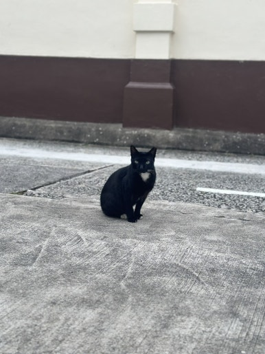

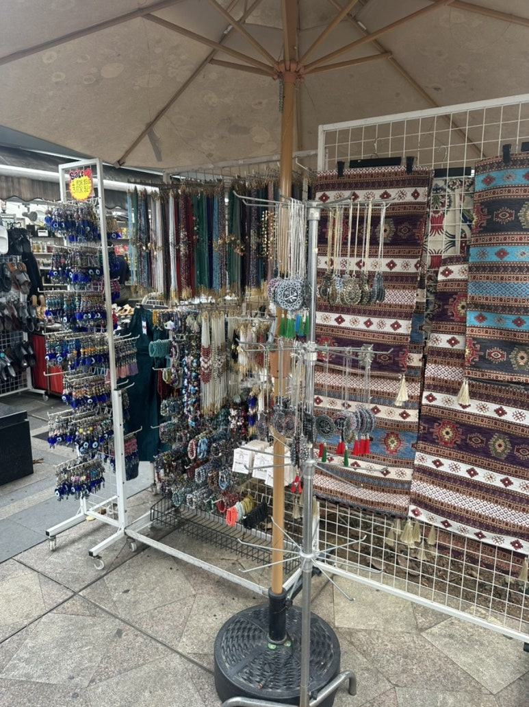

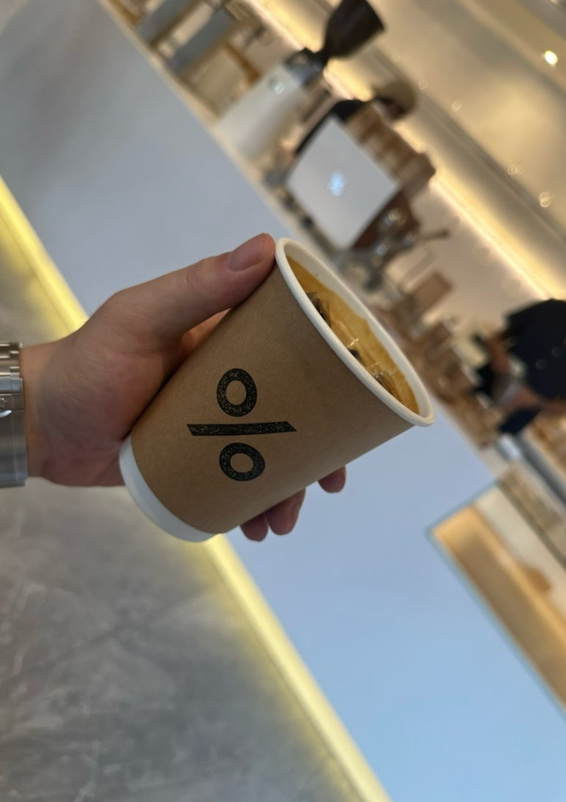

뭔 음식인지 모르겠는데 말레이시아 누들 먹었다.

고기랑 당면 볶은 잡채 느낌?

싱가폴에도 자전거 도둑이 있구나

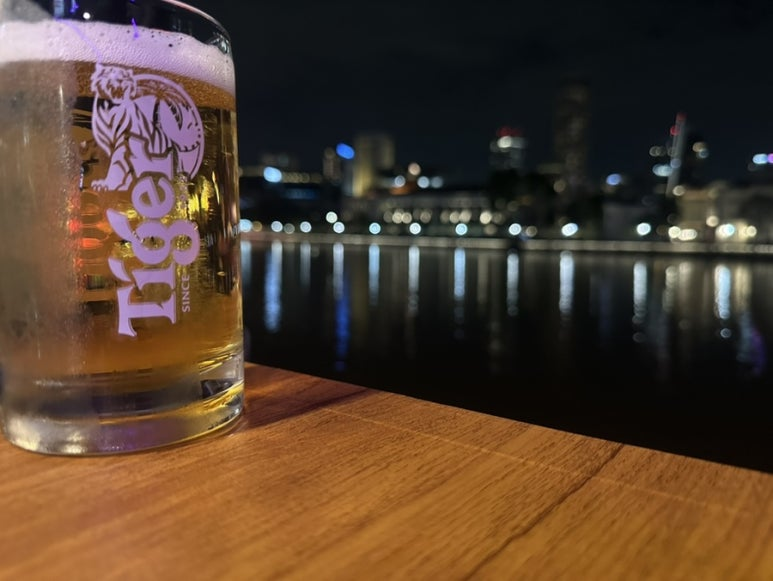

돌아와서… 강가에서 또 타이거 생맥주.

다음날은 Newton hawker 왔다.

용안 쥬스라는거 시켰는데, 양동이 🪣 사이즈의 음료가 나와서 시계랑 비교샷 찍어봄. 5불.

용안 알갱이가 들어있다. 처음 먹어봤는데 맛있었다.

돼지꼬리 우동?이랑 양고기 사태 먹었다.

돼지꼬리 맛이 이런거군 음음

​

사태는 진짜 맛있었다. 또 생맥주 마시려다가 아침이라 참음;

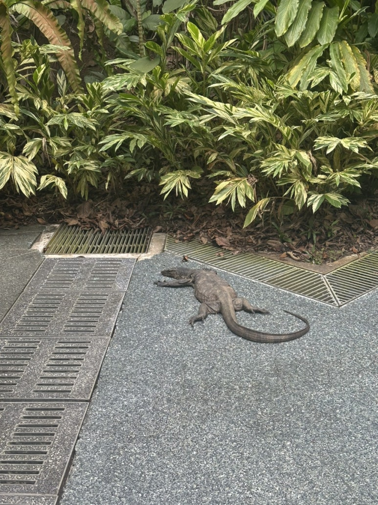

여긴 뭔 식물원이었는데. 짐 보관소 없으니 가방 매지 마쇼.

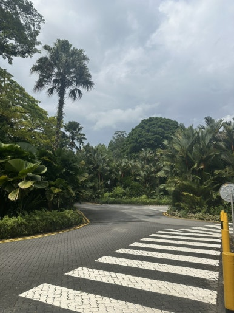

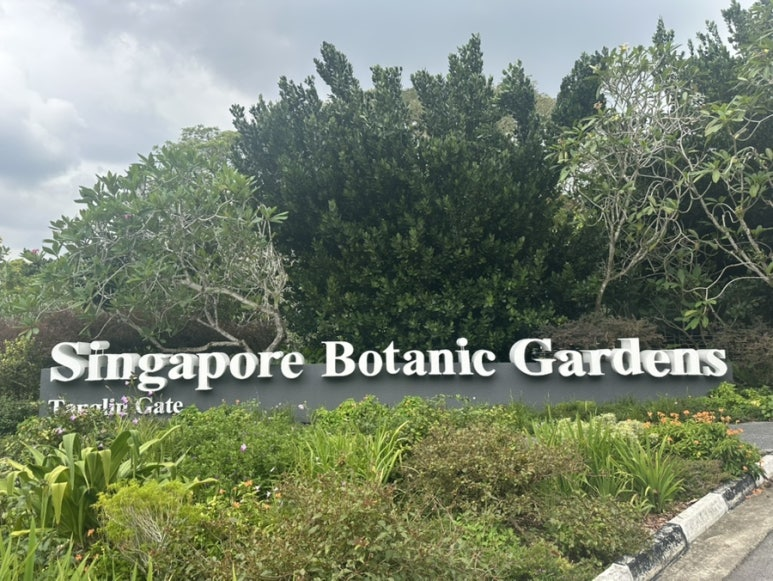

싱가폴 도시는 다 이렇게 생겼더라.

진짜 개덥다.

​

자동차 번호판 가격이 약 1억원 정도이고, 주차할 땅도 갖고 있어야해서 어지간한 사람들은 차 안 사더라.

​

아시아 1위 대학인 NUS 가보고…

센토사도 가보고 여기저기 신기한곳 이상한 곳 가봤는데 좋았음.

​

날씨 빼고.

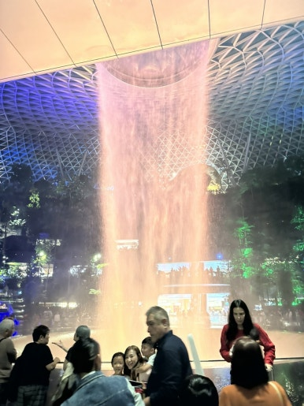

다시 돌아온 창이 공항. 분수대를 드디어 봤다.

싱가폴 사는 친구 만나서 몰 구경 좀 하고~ 밥 먹고~ 스타벅스 가서 수다 좀 떨고~ 

이것도 싱가폴 음식이다. 바쿠테라고 불리는 보양식

갈비탕 같은 맛인데 갈비탕보다 맛있던데? 

팔팔 끓는 육수를 종업원이 계속 옆에서 부워준다.

김치가 당기는데 김치가 없다 😭

​

싱가폴에 다시 가면 가장 먼저 먹을 음식은 이거다.

그 다음은 코코넛 음료.

설레임 아이스크림에 코코넛 맛이 있다면 딱 이거다 🥥

제목 : 싱가포르 여행기: Newton, maxwell hawker (6), 설명 : 

해시태그 : 

그리고 이제 공항 도착.

근데 공항에서 체크인하고 출국장까지 가는 전체 소요시간이 10분 컷.

나 이것도 모르고 공항에 2시간 일찍 감.

주머니에 있는 싱가폴 동전 털어 마지막 식사 하고

말레이시아 누들이랑 음료인데 기억 안 남

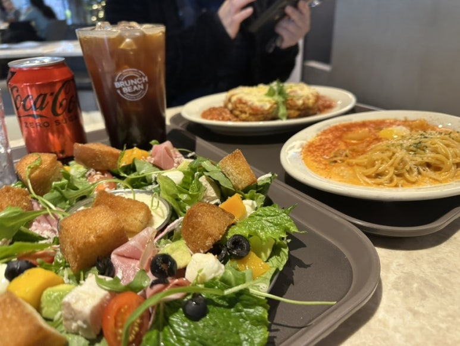

귀국 후 집에 오니 브런치가 땡겨서 브런치 노래 🎶부르다가 먹으러감.

​

싱가폴 깨끗하고, 음식 괜찮고, 좋은데… 나한테 너무 더워서 ㅠㅠ

다음 여행 어디 가볼까 생각 중

​

인도

네팔

이집트

모로코

요르단

캄보디아

아랍에미리트

호주

🎲

​

 해시태그 : 