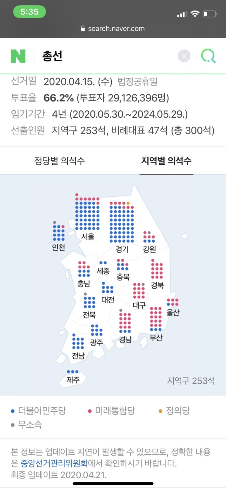

## 인천국제공항 비정규직 정규직 전환, 공정한가?

2017년 5월, 대통령께서 취임하자마자 가장 먼저 달려간 곳이 인천공항이었다. 인천국제공항(이하 인국공) 노조를 만난 후, ‘공공부문 비정규직 제로’를 약속했다.

17년 9월~19년3월, 시설관리, 보안, 서비스 등 직무에서 정규직 전환을 위한 자회사를 설립했다. (원래는 인국공 소속이 아닌, 타회사의 정규직이 되고 인국공에서 일하는 것이었음)

20년 6월, 보안요원을 청원경찰로 신분 전환, 인국공 직접 채용.

​

인국공 평균 연봉. 2017년 기준 약 8,800만원.

​

논란이 되는 부분은 공정성.

​

1.

17년 이전 인국공에 정규직으로 근무하시던 분들은 입사하기 위해서 자격증, 학과, 학력, 경력 등을 갖추고 필기 및 서류전형부터 면접까지 치르고 150:1 경쟁률을 뚫고 입사한 반면에, 비정규직은 이에 해당하지 않음. 결과적으로 다양한 학력에서 정규직으로 되었지만, 과연 이 과정이 공정한 것인가?

​

2.

20년 6월 기준 인국공은 공기업이고, 1400명 정도의 정규직이 있는데, 앞으로 비정규직 1902명을 인국공 청원경찰로 직접고용, 앞으로 7600명이 정규직으로 전환될 예정임.

이미 외국에서 우리나라는 노동시장 유연화가 필요하다고 수차례 경고했음. 우리나라는 외국에 비해 고용안정도가 높은 편임. 우리나라 일부 대기업에서도 정규직이 되고 노조 들어가면 구조조정하기 어려워서 제 살 갉아 먹는 회사가 있는데, 공기업은 어련할까. 결국 여기서 손해나는 것은 세금으로 매워질듯.

돈이 없으면 결국 세금을 더 걷어야 함. 돈이 없으니 새로운 젊은 인재도 뽑을 수 없음.

​

3.

어쨌든 다양한 나이, 학력, 점수, 경력 등에서 정규직이 전환되었음. 그런데 인국공 채용은 시작으로 보여짐. 공기업 비정규직 제로를 외쳤던 현 대통령인데, 인국공으로 끝이 날까. 공기업 전체로 뻗어나가고, 사기업에도 영향을 크게 끼칠듯. 인국공에만 끝나는 문제가 아님.

​

포퓰리즘에 휘둘리는 유권자들 끌어오고, 감투 하나 씌워주면 다음 대선이나 총선 결과에 긍정적일테니까. 공정함이 중요한 시대지만, 과정이 중요한 시대가 아니다.

지금 우리나라는 다수에게 부든 명예든 재분배하고, 다같이 같은 자리에서 같은 것을 들고있는 것이 공정한 것이다.

​

​

이것이 한번도 경험하지 못한 나라구나. 대단하다 대한민국~!

 해시태그 : 