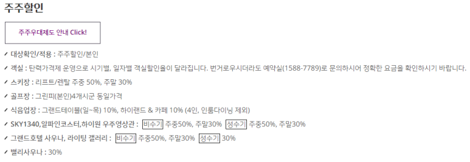
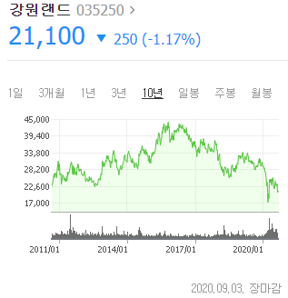
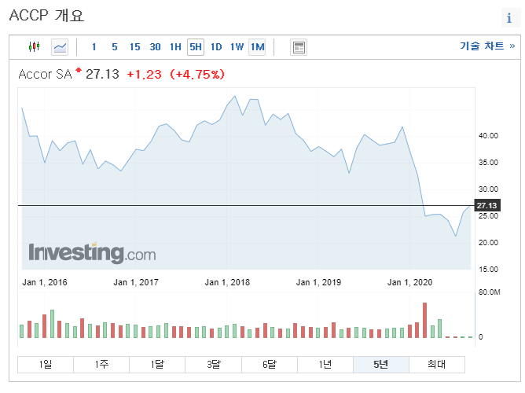
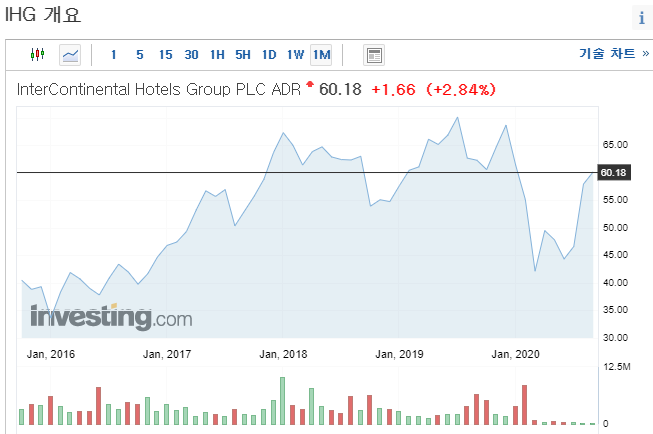
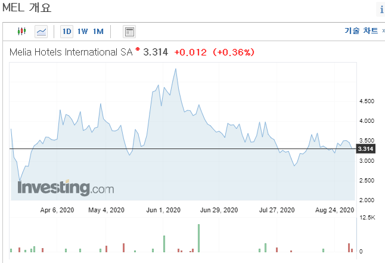

## [호텔편] 폭락한 주식 사서 호텔 골드, 플래티넘 멤버십 받기1탄 !

몇몇 기업들은 투자 유치를 위해 주주할인 프로모션을 진행하고 있습니다.

특히 크루즈, 호텔, 항공 같은 성수기와 비성수기가 명확하게 나뉘는 관광 분야에서 활발히 사용되고 있습니다.

이 글을 작성한 이유는 현재 관광 분야의 주식 가격이 역사적 저점을 나타내고 있어, 그냥 주주할인 혜택만 뽑아먹어도 본전 찾을 수 있지 않을까~ 싶어서 글을 올립니다.

저는 호텔 다니는 것도 좋아하고, 5성급 호텔 근무 경력도 있는데 딱히 호텔 분야가 밝은 전망이라고 생각하진 않습니다. 지금 평가 가치가 너무 낮기 때문에 코로나 끝나기 전에 망하는거 아니면 몇 주 사놓는 것도 괜찮겠다 싶어서 포스팅합니다.

투자 권유를 하고싶은게 아니라, 그냥 이런 꿀 혜택이 있다는거 알려드리고 싶은거에요!!

---

1. 강원랜드 - 하이원 할인

강원랜드입니다. 1주만 있어도 혜택 받을 수 있어요~ 혜택이 매년 변경되니 확인 바랍니다.

​

2.아코르- 라마다 앙코르 아님. 아코르에요 아코르라는 프랑스 주식입니다. 50주 보유시 혜택을 받을 수 있습니다.

아코르 호텔 위치:

[대한민국 호텔. ALL - Accor Live Limitless](https://all.accor.com/ssr/app/accor/hotels/korea-korea/index.ko.shtml?compositions=1&stayplus=false) : 오류 레이어 모달 닫기 이런! 죄송합니다. 귀하의 혜택을 제대로 표시할 수 없습니다. 다시 시도해 주시길 바랍니다. 다시 시도해 주시길 바랍니다. 페이지 새로고침 하기 혜택이 아직도 표시되지 않는다면 나중에 다시 검색해주시길 바랍니다. 홈페이지로 돌아가기 15분이 지나면 계속하기 전에 가격을 업데이트해야 합니다. 제안해드릴 때 "가격 활성화" 옵션을 선택하십시오. 이런! 죄송합니다. 기술적인 문제가 발생해 귀하의 요청에 응답할 수 없습니다. 다시 검색하시겠습니까? 새로운 검색

-추가할인 10%

-아코르 프라이빗 세일에 일반 회원보다 먼저 가입 접속 가능

-온라인 체크인 체크아웃 가능

-얼리 체크인, 레이트 체크아웃 요청시 상황에따라 제공.

-웰컴드링크, 웰컴어매니티 제공

-우선 체크인 데스크 이용 가능

-가능할 경우 업그레이드룸 제공, 업그레이드 불가능시 같은 급에서 가장 좋은 룸(고층이나 뷰) 제공

-도착 3일 전 객실 보장

유로화입니다. 1200원~1400원 정도라고 보시면 됩니다!3.IHG- IHG 웹사이트에 구체적인 할인 혜택 같은게 적혀있지 않고, 인터넷 리뷰에만 주주혜택을 받았다는 사람이 있더라구요. 이는 IHG에 제가 문의를 했고, 회신 오는 즉시 글을 올리겠습니다. 문의 결과 갖고 있는 주식 수에대한 제한은 없고, 주주혜택에 관해서는 주주 약관에 기록되어 있다고하네요.

문의 결과 답장 :

Many thanks for your enquiry.  The Shareholder discount is available to shareholders who hold their shares directly with the Company's Registrar, Equiniti.  There is no minimum number of shares required. 

 

Shareholders are sent information about how to access the rate directly, along with the terms and conditions. They are also welcome to compare the rate with other rates available on our website www.ihg.com before making their booking.

 

For more information about holding shares with Equiniti:

 

Telephone: 0371 384 2132 (UK calls) or +44 121 415 7034 (non UK calls);  or

 

Webstite: https://www.shareview.co.uk/4/Info/Portfolio/default/en/home/Pages/Home.aspx

​

호텔 위치:

[호텔 선택](https://www.ihg.com/hotels/kr/ko/find-hotels/hotel/list?fromRedirect=true&qAms=null&qSrt=sAV&qDest=Korea&setPMCookies=true&srb_u=1) : You are using an unsupported browser. Please switch to FireFox , Safari , Chrome , Microsoft Edge or Internet Explorer Thanks! 닫기 호텔 선택 Korea 09/03/2020 - 09/04/2020 1 고객 1 객실 검색 변경

​

4.IHI-corinthiagroup으로 이름이 바뀐듯. 보니까 주주 혜택이 엄청 많다. 필요 주식은 1000주.

호텔 혜택 정리 : http://www.corinthiagroup.com/investors/privilege-card/

[Privilege Card | Corinthia Group - Owners, Developers & Operators of the Corinthia Hotels and Real Estate Brand](http://www.corinthiagroup.com/investors/privilege-card/) : Privilege Card Dining Accommodation in Malta Hairdressing Salons by Dean Gera Benefits - Overseas Lido Health Centers & Spas Swan Laundry & Dry Cleaning Danish Bakery Hotel Catering & Events Corinthia Caterers Terms & Conditions Dining 20% discoun t  on food and beverage consumption at the following...

호텔 위치 : https://www.corinthiagroup.com/portfolio/owned-hotels/

[Owned Hotels | Categories | Corinthia Group - Owners, Developers & Operators of the Corinthia Hotels and Real Estate Brand](https://www.corinthiagroup.com/portfolio/owned-hotels/) : Corinthia London read more Corinthia Palace Hotel & Spa read more Corinthia Budapest read more Corinthia Lisbon read more Corinthia St Petersburg read more Corinthia Moscow read more Corinthia Grand Hotel Astoria Brussels read more Corinthia St George’s Bay, Malta read more Corinthia Prague read mor...

​

5.Melia Hotels International - 1000주는 골드 10000주는 플레티넘 멤버십

[MeliáRewards](https://www.melia.com/ko/meliarewards/elprograma/home.htm#elPrograma) : 온라인 체크인 세션 시작 808-234-1953 ko 프로그램 내 혜택 내 포인트 계정 만들기 멤버가 되시면 귀하가 최우선이 됩니다  우선적으로 체크인하실 수 있습니다. 대기하지 않고 시간을 아껴 도착시부터 바로 호텔을 이용하세요. 지금 바로 가입하세요! 더 알아보기 1 / 3 MELIÁREWARDS가 무엇인가요? MeliáRewards는 Meliá Hotels International의 이용에 대한 환급 프로그램으로, 여기에 가입하시면 혜택과 전용 특가를 누리실 수 있습니다. MeliáRewards는 멤버십 그 이상의 것입니다...

호텔 위치 : https://www.melia.com/ko/hotels/home.htm

[Listing of Destinations](https://www.melia.com/ko/hotels/home.htm) : MORE THAN 350 HOTELS IN 40 COUNTRIES See hotels See on map 아메리카 아시아 및 오세아니아 아프리카 및 중동 유럽 Hotels in 아시아 및 오세아니아 Hotels in 중국 (6) Hotels in 인도네시아 (8) Hotels in 말레이시아 (2) Hotels in 미얀마 (1) Hotels in 태국 (1) Hotels in 베트남 (9) Home Hotels 뉴스레터 등록 뉴스레터에 등록하시면 특별 프로모션과 할인 정보를 직접 이메일로 받으실 수 있습니다 등록 When you...

6.NHH - 갖고 있는 주식의 가치가 3000유로 이상이면 플래티넘이고, 그 미만으론 골드 멤버십이 부여됩니다. ( 골

호텔 혜택 정리 : https://www.nh-hotels.com/nhrewards/advantages

[Advantages & Categories: discover the benefits of NH Rewards](https://www.nh-hotels.com/nhrewards/advantages) : Discover the exclusive advantages for registered users of NH Rewards • Free hotel nights• Special deals • Exclusive offers only with NH Rewards!

호텔 위치 : https://www.nh-hotels.com/hotels

[Hotel Directory: discover NH Hotel Group and book today](https://www.nh-hotels.com/hotels) : With more than 370 hotels across Europe, America and Africa, book now and stay at the best hotels in the best locations with NH Hotel Group!

​

​

1탄으로 호텔 멤버십 혜택 받는 꿀팁 포스팅 했는데, 이런 글 처음 써봤더니 생각보다 오래 걸리네요.

국내 호텔 잘 다니는 제게 강원랜드와 아코르 혜택이 너무 달달하네요.

2탄은 항공사, 3탄은 명품+크루즈 쓰겠습니다.

​

​

 해시태그 : 호텔 혜택 정리 : https://www.melia.com/ko/meliarewards/elprograma/home.htm#elPrograma