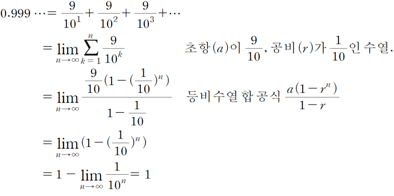

## 국가자격시험 59.999…점은 합격? 불합격? feat. 0.999…=1인 이유를 수학적으로 증명하자.

첫번째, 0.999…9와 0.999…는 다른 값입니다. 끝의 값이 정의되지 않고 한없이 이어나가는, 1과 0.999사이의 간격이 없는 값입니다.

두번째, 연속인 함수 값은 좌극한 값과 우극한의 값이 다르지 않습니다. '59.999…는 60으로 수렴한다'가 아니라, 59.999…=60=60.000… 모두 같은 값입니다.

"그러므로 같은 값입니다." 라고 말하고 끝내도 되지만, 그래도 이해가 가지 않는 분들을 위해서 풀어서 설명하겠습니다.

​

Q : "그래서 -0.000000…1이라는 값이 있으면 59.999…9라는거 아니야?"

A : "네가 말하는 숫자 0.000…1를 'X'라고 해보자. 우선 0.000…이라는 숫자는 물론 그 X의 값보다 작고 모든 양의 숫자보다 작은 숫자야. 0 이상인데, 모든 양의 숫자보다 작은 수! 그러므로 0보다 큰 X라는 숫자는 존재하지 않다는 거야. 그러므로 60 - 0.000…는 59.999…이고, 60과 59.999 사이에 간격이 존재하지 않기 때문에 59.999는 60이야."

​

a=0.999…일때,

10a-a=9.999… - 0.999…=9,

9a=9

a= 1

이렇게 쉽게 설명할 수 있지만, 처음엔 엄밀하게 증명하기 위해 엡실론-델타 논법+고교수학 난이도로 설명했습니다~ 사회에서 논란되는거랑 수학이랑 연관 지으니까 재밌네요,,,,,, 지적

​

추석 때 가족들이랑 TV 보면서 뉴스에서 "59.999…는 합격? 불합격"이란 뉴스 나오면, "59.999…는 60입니다."라고 말해주세요!

 해시태그 : 