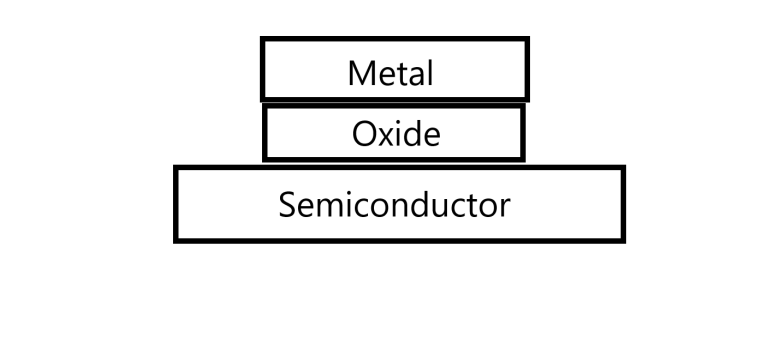
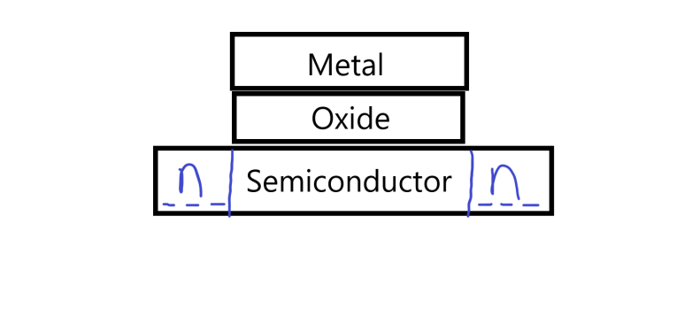
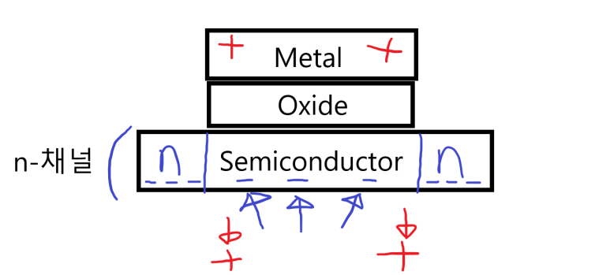

## 반도체 나노 공정 뜻 의미, CMOS MOSFET 개념 半导体纳米工艺意义，CMOS MOSFET 概念

반도체의 5나노 공정 뜻은 채널 길이가 5nm라는 것입니다.

채널 길이가 무엇인지를 소개하기 위해, 현재 가장 많이 사용하는 MOS가 무엇인지 설명하겠습니다. 

​

CMOS는 Complementary Metal-Oxide Semiconductor입니다. MOS라는 소자에 극성이 두가지가 있는데, 이를 상보적으로(Complemetary) 쓴 소자입니다. 여기서 말하는 MOS는 Metal(금속) - Oxide(산소) - Semiconductor(반도체) 형태가 됩니다.

위 사진이 기본 MOS형태이고, 이것을 소자로써 사용하기위해서 Semiconductor 양 끝 부분에 음극성(Negative) 혹은 양극성(Postive)으로 만들어서 씁니다. 양 끝이 음극이면 nMOS, 양극이면 pMOS입니다.

예를 들어, 양 끝을 음극으로 만들면, 이 극성 사이에 양극이 모이게 됩니다. 그렇게되면, 왼쪽 음극과 오른쪽 음극 전하들은 서로 전하를 교환할 수가 없는 상태가 됩니다.

위와 같이 외부에서 Metal 부분에 양극의 전하를 보내준다면, Metal에 인접한 Semiconductor부분에 음극의 전하가 모입니다. 이렇게 되면 왼쪽 음극과 오른쪽 음극은 서로 전하를 교환할 수 있는 상태가 됩니다.

이 그림에서 메탈의 극성 변화에 따라 Semiconductor부분의 극성이 바뀌는 부분을 채널이라고 합니다.

채널 길이가 짧을 수록, 빠르게 전하 전달이 일어날 수 있겠죠?

SAMSUNG, tsmc 같은 회사는 5나노, 3나노, 1나노 공정 연구개발에 투자하고 있습니다.

​

한 종류의 MOS를 쓰다보면, MOS내부에서 손실되는 힘 때문에 입력보다 낮은 출력이 나오는데, 동작 방법이 반대인 pMOS와 nMOS를 같이 쓴 CMOS를 사용하면 이 손실을 줄일 수 있습니다.

​

채널 길이가 짧아지면 반도체의 성능이 커지기 때문에 공정회사는 반도체 집적도를 2년에 2배씩 집적해오며 성장해왔습니다. (무어의 법칙, 데나드 스케일링)

그런데… 우리가 반도체 재료로 쓰는 실리콘 원자의 폭은 0.5nm를 약간 넘습니다. 2020년에 출시한 M1 맥북의 공정은 5nm공정이구요. 크기가 너무 작아지다보니, 더 이상 크기를 줄이는게 어렵고, 이쯤 오니까 크기를 줄여도 성능 향상이 이전보다 줄어들게 되었습니다.

​

그래서 삼성전자는 새로운 공정 방법(어떻게든 크기를 줄이자!)도 개발하고, 시스템 반도체 투자(공정으로는 이제 한계에 도달했으니… 설계를 잘해 보자.)로 돌아서는거죠.

 해시태그 : 