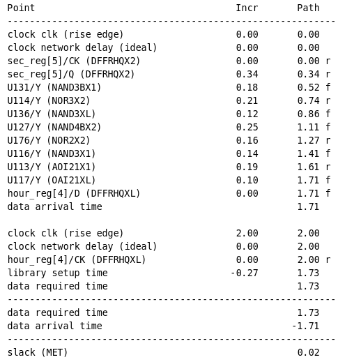
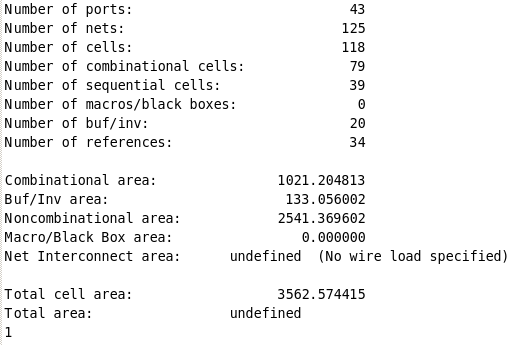

## Stopwatch Verilog RTL code에 DC(Designe Compiler)로 Constraint file 만들고 적용하기!

지난번에 만든 Stopwatch RTL code에 이어, 그 파일에 constraint file을 적용시켜보는 실습을 하겠습니다.

​

1. 정확한 Specification은 없고, 아래와 같은 2줄의 코드로 test.con 파일을 만들어주세요.

​

reset_design

​

create_clock -period 2 [get_ports clk]

​

2. Design Compiler를 실행해주세요.

​

3. $read_verilog 코드를 사용해서, 이전에 만든 .v파일을 읽어주세요.

​

4. File - Setup에서 자신이 사용할 db파일을 넣어주세요.

​

5. $source test.con

​

6. $compile_ultra 혹은 $compile을 실행해주세요.

​

7. $report_timing

​

​

8. $report_area

​

​

 해시태그 : 