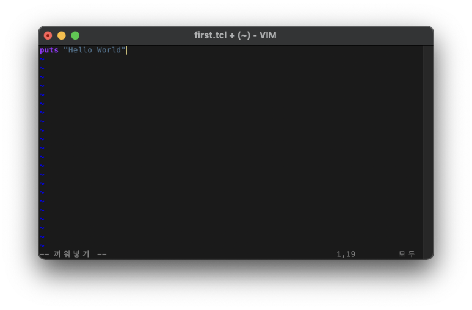
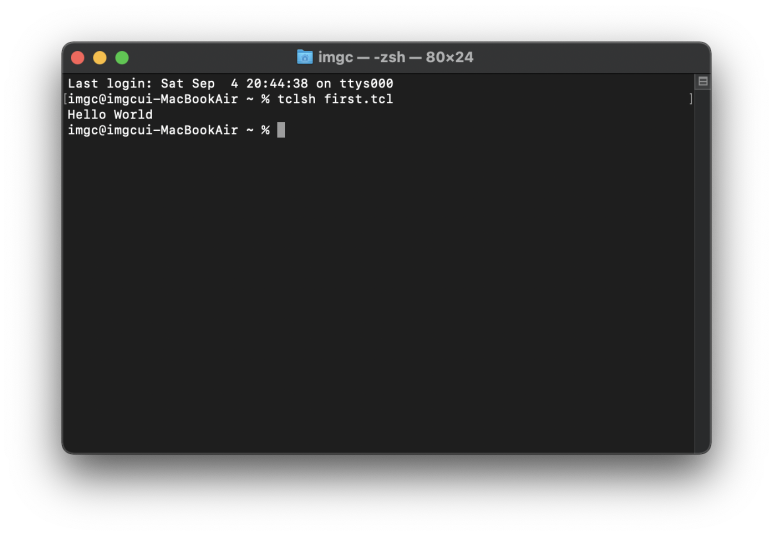

## Tcl Download, How to use Tcl, 티클 사용법 명령어, 티클 다운로드, Tcl tk 使用方法, 下载

Tcl(Tool Command Language)는 '티클'이라고 부르는 스크립트 언어입니다.

프로그래밍 언어보다 사용하기 쉬워서, 프로그래밍 언어로 완성된 프로그램(임베디드 분야에 자주 쓰임)에 대한 '관리'할 때 쓰입니다.

여기서 말하는 관리는, 프로그램의 실행과정을 바꾸거나 프로그램의 코드 이름을 수정하는 것 등의 일입니다.

Tcl의 장점(타 스크립트 언어 대비) - C를 배웠으면 진짜 쉽다. OS에서 자유롭다. 컴파일러가 안정적이다. GUI 모드를 제공한다. 무료이다.

사실 이 장점들은 과거의 장점이고, 현재는 다른 스크립트 언어도 많이 발전해서 Perl나 다른 언어를 공부해도 되지만, Tcl이 표준처럼 자주 쓰입니다.

​

Tcl Tk (티클) 다운로드는 아래 사이트에서 받을 수 있고, 회원가입 하셔야합니다. 리눅스/윈도우는 최신버전 받으시면 되고, 맥은 이전버전 받으시면 됩니다.

[Download & Install Tcl | ActiveState](https://www.activestate.com/products/tcl/downloads/) : Download and install Tcl with ActiveTcl, the precompiled, supported Tcl distribution. ActiveTcl Community Edition is free to use in development.

티클은 스크립트 언어라서, 텍스트 편집기와 인터프리터가 필요합니다. 저는 vim과 python을 쓰고 있습니다. (윈도우의 메모장으로 해도 됩니다. 편한걸로.)

​

위 사진처럼 사용하시는 텍스트편집기에서 위와 같은 코드를 작성하신 후, 터미널에서 위 코드를 tclsh 코드로 실행하시면 됩니다.

​

Tcl은 18가지의 특수변수를 갖고있고, command가 C언어와 비슷합니다.

변수 먼저 나열하겠습니다. 처음엔 이게 뭐지? 하는데, 한번 보고나서 스크립트를 짜다보면 알게됩니다.

1. argc(argument count) - 인자의 개수

​

2. argv(argument value) - 인자값.

C:add 1 + 1 를 실행하면

argc = 4 

argv[0] = C:add.exe

argv[1] = 1

argv[2] = +

argv[3] = 1

​

3. argv0 - 인터프리팅 중인 파일의 이름 또는 스크립트 호출하는데 사용하는 이름입니다.

​

4. env - 환경변수 요소의 배열을 나타낼 때 사용합니다.

​

5. errorCode - 마지막 오류코드 제공

​

6. errorInfo 마지막 오류의 스택을 추적합니다.

​

7. tcl_interactive - 1로 설정하면 interactive mode, 0으로 설정하면 non-interactive mode가 됩니다.

​

8. tcl_librart - standard tTcl library의 경로 설정

​

9. tcl_pkgPath - 패키지가 설치되는 디렉토리 목록 제공

​

10. tcl_patchLevel - Tcl 인터프리터의 현재 패치 레벨을 나타냅니다.

​

11. tcl_platform - byteOrder, machine, osVersion, 플랫폼 및 os를 포함한 개체로 요소 배열을 나타내는 데 사용됩니다.

​

12. tcl_precision - 부동 소수점 숫자를 문자열로 변환할 때 유지할 자릿수를 나타냅니다. 기본값은 12입니다.

​

13. tcl_prompt1 - 기본 프롬프트를 참조합니다.

​

14. tcl_prompt2 - 잘못된 명령이 있는 보조 프롬프트를 참조합니다.

​

15. tcl_rcFileName - 사용자별 시작 파일을 제공합니다.

​

16. tcl_traceCompile - Byte code '컴파일' Trace를 제어하는데 사용됩니다. 출력이 없으면 0, 요약에 1, 세부 정보에 2를 사용합니다.

​

17. tcl_traceExec - Byte code '실행' Trace를 제어하는데 사용됩니다. 출력이 없으면 0, 요약에 1, 세부 정보에 2를 사용합니다.

​

18. tcl_version - Tcl 인터프리터의 현재 버전을 반환합니다.

​

텍스트 에디터로 tcl 파일에 아래처럼 쓰고, 

puts $tcl_version

터미널 등에서 tclsh 파일명.tcl을 입력하면

8.5 이런식으로 현재 버전이 출력됩니다.

​

​

​

자, 이제 명령어입니다. 마찬가지로 텍스트편집기에서 작성하고, 터미널 등에서 실행 가능합니다.

1. puts - 터미널에 글을 표현합니다. puts "Hello, World" 이렇게 쓰면, Hello, World가 출력됩니다.

​

2. expr - 계산식입니다. puts [expr 1 + 2 + 3 ] 이렇게 쓰면, 6이 출력됩니다.

​

3. set - 변수 저장입니다. set a 1 이렇게 쓰면, a에 1이 저장됩니다. 출력할 때는 puts $a 로 출력할 수 있습니다. 숫자든 문자열이든 배열이든 다 저장됩니다.

​

문자열의 경우, 이렇게 쓸 수 있어요.

set myVariable "hello world" 혹은 set myVariable {hello world}

​

수 표현 방식도 C언어와 같습니다.

puts [format "%f" 43.5]

puts [format "%e" 43.5]

puts [format "%d %s" 4 tuts]

puts [format "%s" "Tcl Language"]

puts [format "%x" 40]

​

배열의 경우, 이렇게 쓸 수 있어요. 배열의 첫번째 위치는 0번째입니다.

set myVariable {red green blue}

puts [lindex $myVariable 2]

결과 ➡️ blue

​

나타내는 방법 두번째.

set colorList1 {red green blue}

set colorList2 [list red green blue]

set colorList3 [split "red_green_blue" _]

puts $colorList1

puts $colorList2

puts $colorList3

​

배열의 길이.

llength listName

​

set myVariable "red green blue"

puts [lindex $myVariable 1]

결과 ➡️ green

​

배열에서 현재 인덱스 값 보는법. 그리고 배열의 위치를 쓰는 자리에 문자열이 들어가도 됩니다.

set marks(english) 80

puts $marks(english)

결과 ➡️ 80

​

배열의 인덱스 보는법. 역순으로 출력됩니다.

set personA(Name) "Gyeongchae"

set personA(Age) 24

puts [array names personA]

결과 ➡️ Age Name

​

배열의 크기 보는법.

puts [array size languages]

​

핸들. 어떤 파일을 읽어라, 어떤 네트워크에 연결해라.. 이런거 할 때 쓰입니다. 

set myfile [open "filename" r]

​

4. \ - C처럼 \n을 문자열 내에 쓰면 줄바꿈이 됩니다. \+문자 명령어로 다양한 명령어를 쓸 수 있습니다.

​

5. 연산자는 C언어와 같습니다. +,-,=,!=,<<,>>,?: 등.. 다 같습니다.

​

6. 조건문. if, if else, else문과 switch, ?:문이 있는데, C언어와 같습니다. 중첩 가능합니다.

​

7. 반복문. for, foreach, while, do while과 break, continue가 있는데, C언어와 같습니다. 중첩 가능합니다. 무한루프 마찬가지로 Ctrl + C 등으로 중지 가능합니다.

​

아래 코드처럼 쓰면, 모든 배열의 인덱스를 참조 할 수 있습니다.

set languages(0) Tcl

set languages(1) "C Language"

set languages(2) "gc-na"

for { set index 0 } { $index < [array size languages] } { incr index } {

puts "languages($index) : $languages($index)"

}

​

8. 문자열 비교 함수

string1 string2 compare - string1과 string2를 사전순으로 비교합니다. 같으면 0을 반환하고, string1이 string2보다 앞에 오면 -1을 반환하고, 그렇지 않으면 1을 반환합니다.

​

first string1 string2 - string2에서 string1이 처음 나타나는 인덱스를 반환합니다. 찾을 수 없으면 -1을 반환합니다.

​

index string indexnumber - indexnumber에 있는 문자를 반환합니다.

​

last string1 string2 - string2에서 string1이 마지막으로 나타나는 인덱스를 반환합니다. 찾을 수 없으면 -1을 반환합니다.

​

length string - string의 길이를 반환합니다.

​

match pattern string - string과 패턴이 일치하면, 1을 반환합니다.

​

range string index1 index2 - index1부터 index2까지 string의 문자 범위를 반환합니다.

​

tolower string - string을 소문자 문자열로 반환합니다.

​

totopper string - string을 대문자 문자열을 반환합니다.

​

trim string ?trimcharacters? - 문자열의 양쪽 끝에 있는 트림 문자를 제거합니다. 기본 트림 문자는 공백입니다.

​

trimleft 문자열 ?trimcharacters? - 문자열의 왼쪽 시작 부분에 있는 트림 문자를 제거합니다. 기본 트림 문자는 공백입니다.

​

trimright 문자열?trimcharacters? - 문자열의 왼쪽 끝에 있는 트림 문자를 제거합니다. 기본 트림 문자는 공백입니다.

​

wordend findstring index - index에 있는 문자를 포함하는 단어 뒤의 문자에 대한 findstring의 인덱스를 반환합니다.

​

wordstart findstring index - index에 있는 문자를 포함하는 단어에서 첫 번째 문자의 findstring에 있는 인덱스를 반환합니다.

​

9. 함수. C언어와 형식이 같습니다. 

proc add {a b} {

return [expr $a+$b]

}

puts [add 10 10]

​

​

마무리

Tcl도 파일 열기 닫기, 패키징, 윈도우, 유닉스, 맥의 GUI환경으로 만들 수 있어요. Tcl로 이걸 할 일이 없더라구요. 그래서 제외를 했습니다.

글 기획 할 때는 간단하게 하고싶었으나, 어떤 코드까지만 설명을 해드려야할지 애매하더라구요. 그래서 좀 군더더기가 포함되었습니다.

오타가 있을 수도 있는데, 지적해주시면 수정하겠습니다.

 해시태그 : 