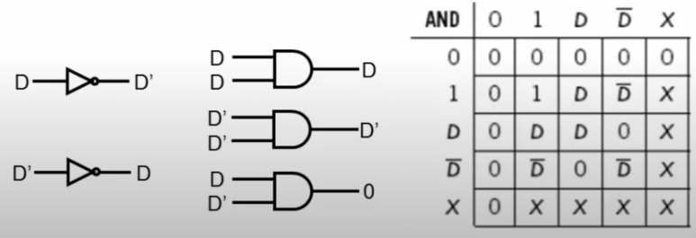
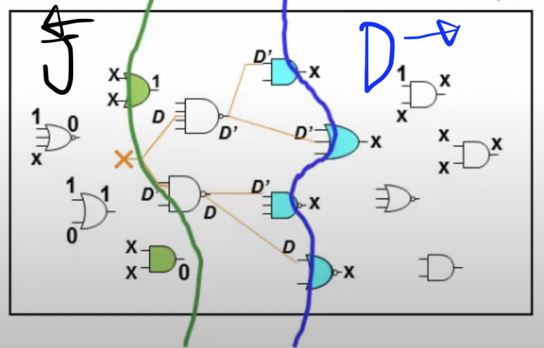
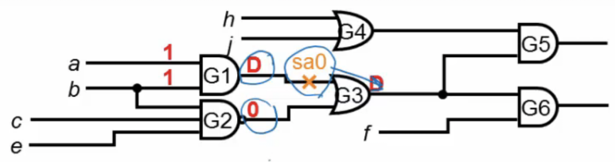
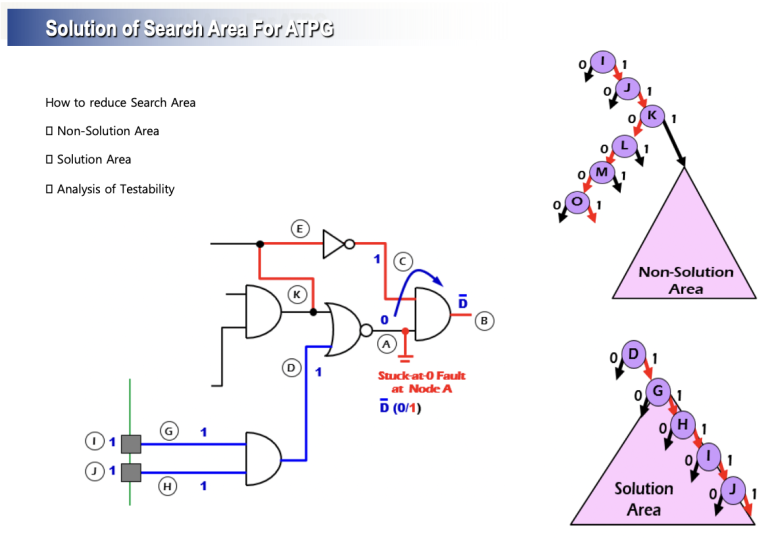
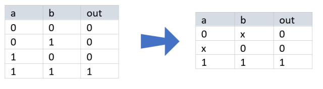

## D-Algorithm이란? PODEM알고리즘이란? DFT&ATPG

​

DFT에 쓰기위해 ATPG에 쓰이는 알고리즘들에 대해 알아보겠습니다.

​

DFT는 칩의 공정상 결함이 있는지 체크하기위해, 설계단계에서 별도로 추가하는 회로입니다.

​

공정을 하면서, 미세한 차이로 노드가 끊어지거나, 다른 곳에 붙어버려서 결함이 생깁니다. 

​

ATPG는 값을 입력해서, 회로에 결함이 있는지 체크할 수 있도록 Test Pattern을 자동 생성하는 것입니다. 그러나 패턴에는 정말 많은 경우의 수가 있고, 이것을 효율적으로 하기위해 알고리즘이 필요합니다.

​

방법은 아래와 같은 단계로 이루어집니다.

​

1. A node에 결함이 있다고 가정 -> 결함이 있(없)다면 '(가) 인풋들'을 넣었을 때, '(나) 출력들'이 나타나야 된다는 것을 확인.

​

2. 칩이 실제로 공정 완료 -> (가) 인풋을 넣어서, (나) 출력이 나오는지 확인하고, 결함 유무를 판별함.

​

알고리즘에 본격적으로 알아보겠습니다.

​

결함이 없는 Fault-Free model과 결함이 있는 Faulty model로 나뉩니다.(Fault model과 같은 뜻인데, 여기선 Faulty)

​

Fault model은 Stuck at Fault(노드가 끊어지거나 GND나 VDD에 붙어버림), Bridge(노드끼리 붙어버림), Transition 등 다양한 Fault model이 있습니다.

​

하지만, cost문제로 stuck at fault만 체크하는 경우가 많고, 아래의 알고리즘들 또한 stuck at fault의 알고리즘입니다.

​

D-Algorithm

​

​

셀들에 1, 0, D, D', X가 올 수 있습니다.(D-Algebra라고 불러요.)

​

X는 아직 정의 되지 않은 값이고, D와 D'는 결함이 있는지 체크하기 위한 값이고, 이 관계들을 통해서 셀들에게 1과 0을 인풋으로 넣어줄 것입니다.

​

D=1/0에선 값이 1이 온다면, fault free, 0이 온다면 faulty model입니다.

​

D'=0/1에선 값이 0이 온다면 fault free, 1이 온다면 faulty model입니다.

​

​

J(justify)-frontier란, X가 셀의 인풋으로 들어오고, 아웃풋에 1 혹은 0이 출력되는 것입니다.

​

D(drive)-frontier란, 셀의 아웃풋의 현재값이 x이고, 인풋에 D 혹은 D'가 들어오고 있는 것입니다.

​

​

그림의 위치에 Stuck at 0의 결함이 있다고 체크 할 수 있는 테스트벤치를 만들어봅시다.

​

​

1. Stuck at 0 결함이 있는지 확인하려면, 여기에 D(1)을 보내서 D(1)이 드라이브 되는지 확인해야합니다.그러므로, a,b(1,1)을 입력합니다.

​

​

2. G2의 아웃풋에서 1이 나오면, G3의 아웃풋이 D(1)가 나오는 이유가 G1 때문인지 G2 때문인지 확인할 수 없습니다. 그러므로, G2의 아웃풋이 0이 나오도록, b,c,e(1,1,1)을 입력합니다.

​

3. 이제 G5나 G6의 출력에서 D가 나오는지 확인하면 됩니다.

(1) G5에서 D 출력 : G4의 값이 1이 나와야 하는데, h,i(1,x) 혹은 h,i(x,1)이 나와야 G4의 아웃풋에서 1이 출력되고, G5에서 D가 출력됩니다.(G6는 확인할 필요 없으므로, f는 don't care)

(2) G6에서 D 출력 : G6에 D가 나오려면, f에 1이 들어가면 됩니다.(h, i는 don't care)

​

4. 3(1)보다 (2) 중 하나를 선택합니다. (2)를 선택하겠습니다.

​

5. 위 사진의 노드의 stuck at 0를 확인하려면, a,b,c,e,f,h,i(1,1,1,1,1,x,x)의 테스트 패턴을 사용하면됩니다.

​

이와 같은 방법으로 D-Algorithm을 사용합니다.

​

​

알고리즘을 수행할 때, 어떤 노드에는 특정 값이 반드시 와야하고, 어떤 노드에는 아무 값이나 올 수 있는 경우가 있습니다.

​

특정 값이 반드시 와야하는 노드를 non-solution area, 아무 값이나 와도 되는 노드는 solution area라고 합니다. EDA tool에서는 이 값들을 가장 먼저 찾고, solution area는 특정 값으로 고정한 후, 나머지 알 수 없는 node들에 search를 진행합니다.

​

​

이전과 같은 방법 + 위의 그림을 참고해서, 어떤 입력이 오면 어떤 출력, 어떤 출력이 오면 어떤 입력이 나올지 예측할 수 있습니다.

​

공정 후 실제 칩이 나왔을 때, 이 예측 값이랑 다르게 나오면 결함인 것입니다!

​

​

​

D알고리즘은 크게, Singular Cover (SC), Primitive D-cube of a Fault (PDCF), Propagation D-cubes (PDCs)로 나뉩니다.

​

SC - 정상 상태. 한 진리표로 나타냅니다.

​

​

PDCF - 정상 상태와 결함 상태. 두 진리표로 나타냅니다.

​

​

PDCs - 게이트의 출력이 지정된 입력의 최소 수에 의존하도록 합니다.

​

​

​

이상으로 D-Algorithm의 설명을 마칩니다.

​

D-Algorithm은 내부 노드에서 값을 결정시키고, 셀에서 인풋으로 나아가는데(Backtrace하면서), 이렇게 하면 매~우 많은 경우의 수를 확인해야합니다.

​

그래서 그 다음으로 나온 것이 PODEM(Path oriented Deceison Making) 알고리즘 입니다. PODEM은 Primary Input만 값을 바꿔서 확인을 합니다.

 해시태그 : 