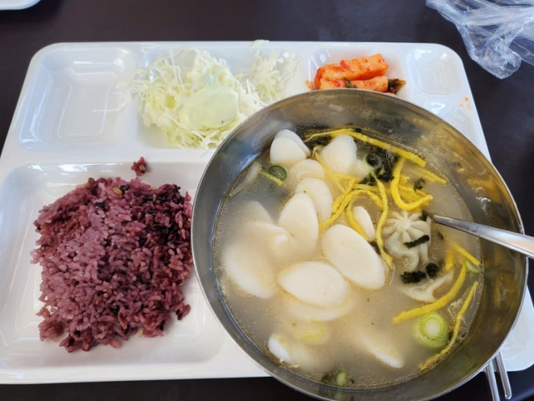
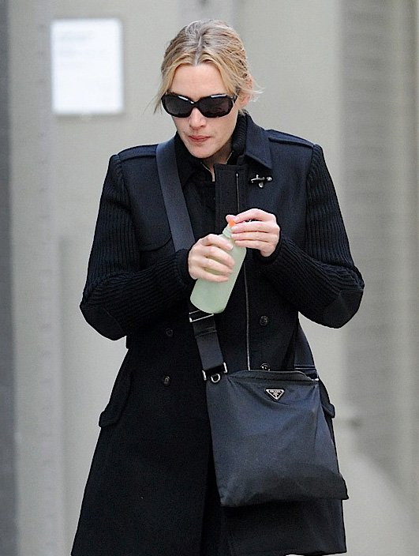

## 나는 내 일을 좋아해 나는 내일을 좋아해

1. 오늘의 점심

거의 머슴밥 수준;; 회사식당 주방장이 현재 공석이라 음식이 이렇게 나왔다. 점심도 시켜먹을걸;;

회사에서 식사비 지원이 15,000원씩이라 저녁엔 목살도시락 시켜 먹었다.

물론 회사에 구내식당 있으므로 거기서 무료로 먹어도 됨.

​

2.오늘의 운동

아침에 벤치프레스랑 인클라인 위주로 5x5 1시간했다.

​

3.오늘의 업무

회사에서 나는 Design Kit와 SoC flow 세미나를 준비중이다. 기본의 중요함을 느낀다. SoC Flow에서도 Rtl과 스펙에 대한 Feasibility가 제일 중요하다.

​

4. 오늘의 배운점

1. 남이 쓴 정보는 내 눈에 쉽게 들어오지 않는다.

2. 배운 것도 금방 까먹는다. 헷갈렸던 이유와 새로 배운걸 스스로 정리하자.

3. 남이 보기 쉽게 정보를 정리해두는 사람이 그 섹션에 대해 마스터한 사람.

4. 혼자하는 일을 하는게 아니라면, 협업에서 가장 중요한건 인성

5. 공부에는 때가 있고, 끝이 없다.

6. 배울건 배우고, 나머진 흘리기.

​

이런 스타일이 좋다. 안녕 프란체스카 같다고하면 요즘 애들은 모르겠지....

 해시태그 : 