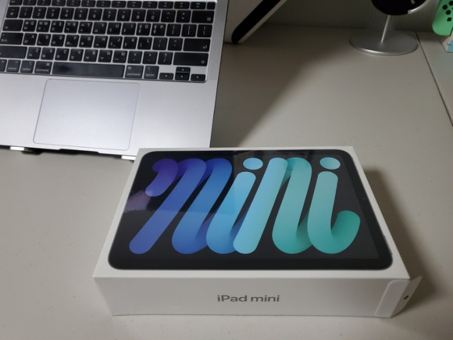
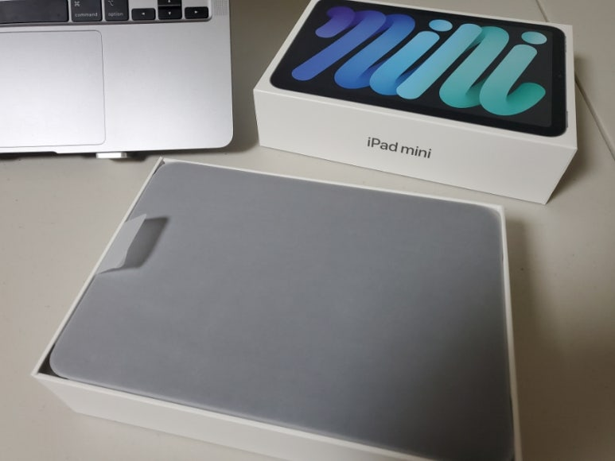
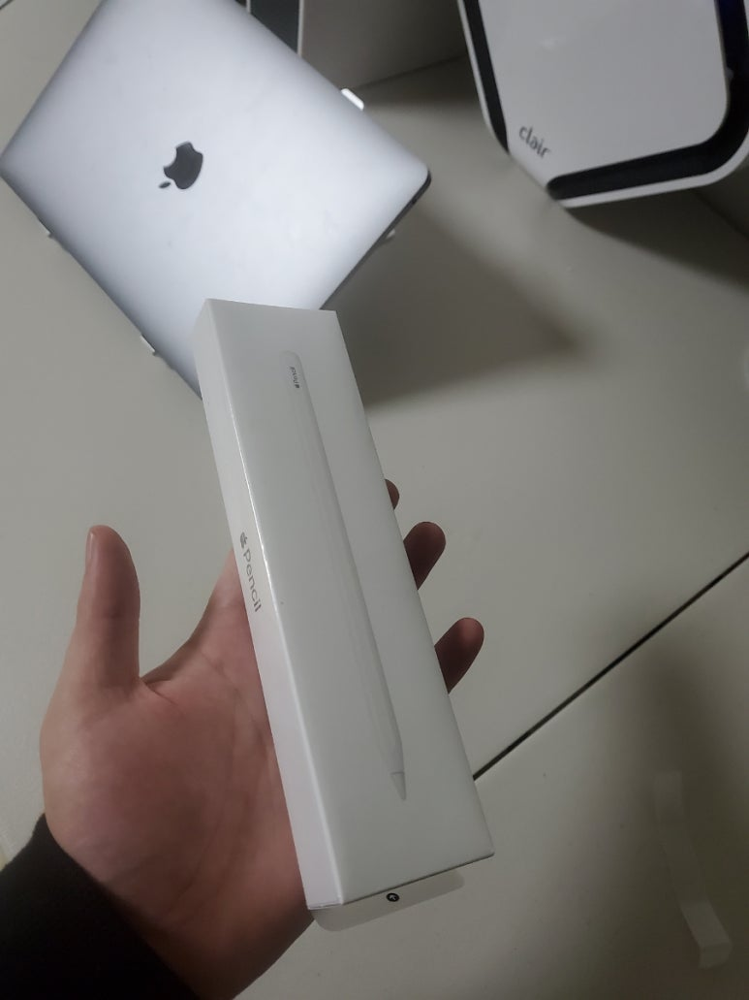
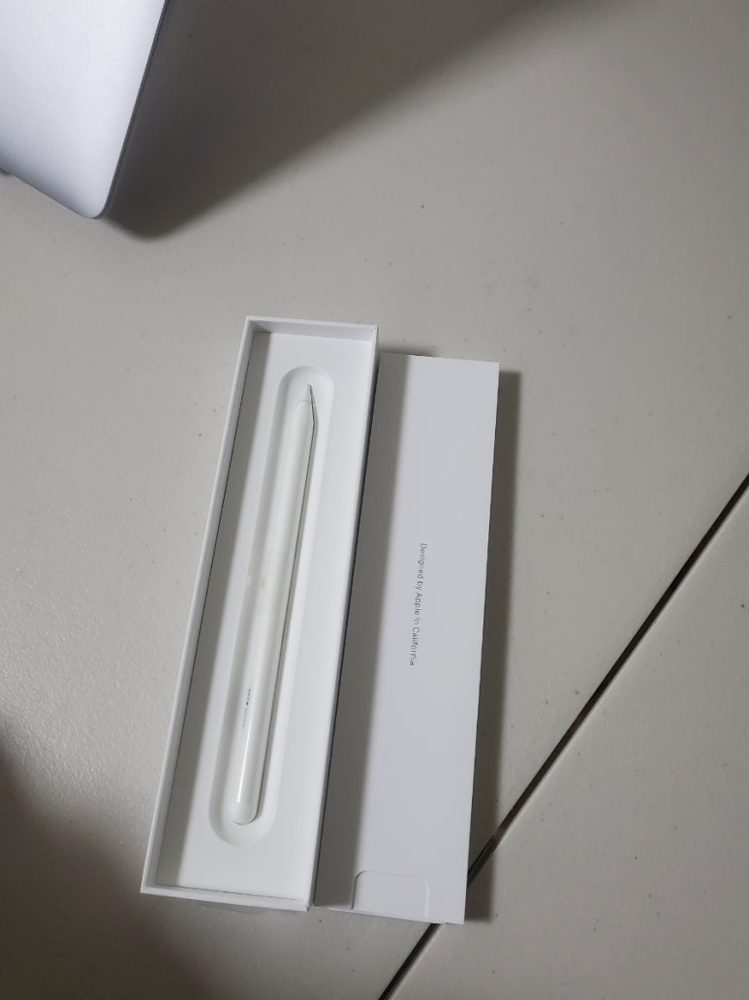

## 아이패드+펜슬을 샀다

당근마켓 구경하는데 누가 아이패드 미니 6세대 미개봉을 55만원에 올려주셔서 채팅 보냈는데,

​

저녁 11시였음에도 집앞까지 바로 와주신다+카드결제 가능하다고 해서 바로 사버렸다. ㅋㅋ

​

친구 : 펜슬도 샀어?

나 : 펜도 사야 돼?

친구 : 왜 펜을 사야하냐면....

나 : 펜 사버림.

친구 : 종이질감 필름 샀어?

친구 : 굿노트 샀어?

친구 : 노트쉘프 샀어?

친구 : 펜슬 스킨 안사면 철가루가....

​

사람이 무섭다 애플이 무섭다

​

아이패드 산 이유

1. 유튜브에 반도체 강의 올리고싶었는데... 태블릿 없으면 그림 그리고 공식 쓰기 너무 힘들었음.

​

2. 회의, 세미나, 강의 할 때 녹음하면서 노트 작성 할 필요가 생김

​

3. 대학원 다닐때 전공서적 3권+노트북만으로도 가방이 10kg가되버린다.

​

근데 이렇게 주머니가 큰 바지 or 후디를 입으면 미니6세대 정도는 쏙 들어간다!

​

가방 안들고 출근하고~학교가고~ 이게 가능!

​

아이패드1 샀을때처럼의 감동은 없지만, 불편함이 없다.ㅎㅎ

​

필기감 아주 좋고, 고용량 pdf 수정도 쉽고, 짧은 영상 작업, 주머니에 들어가는 사이즈라 너무 마음에 든다.

​

근데 태블릿에 후면카메라 왜 넣는지 모르겠다.

​

맥북, 아이패드 쓰다보니... 아이폰 사고싶다 아이폰도 미니로! 근데 삼성페이 없고 자동통화녹음 없어서 안땡겨

​

​

아이패드 지르니 한 주가 행복하네 헤헤

 해시태그 : 