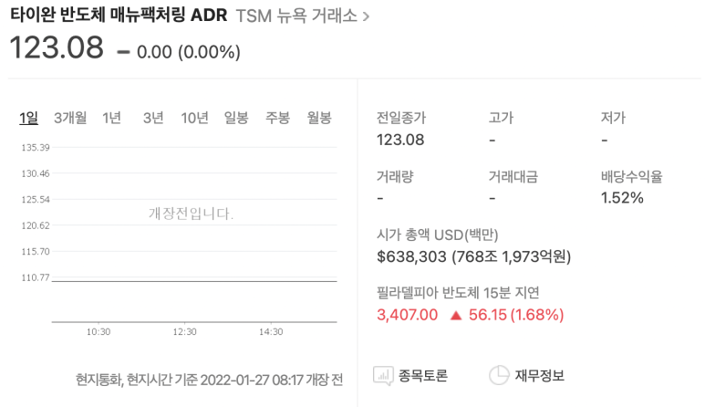
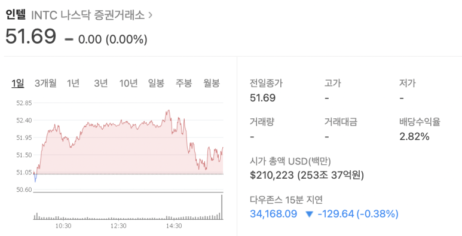
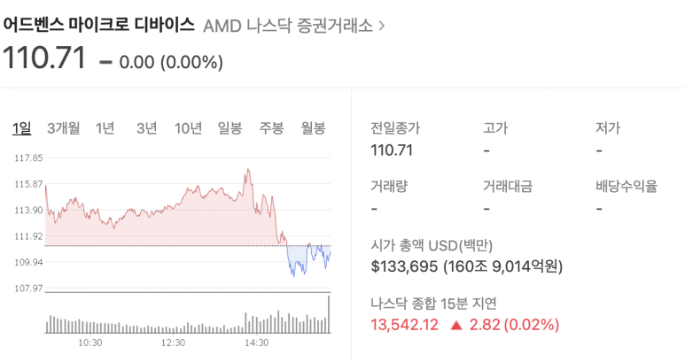

## Design Kit이란? DK란?

Intel, AMD, Qualcomm, tsmc중 어떤 회사의 시가총액이 가장 높을까요?

​

tsmc 혼자 3사를 합친 시가총액보다 높다는 것을 아시나요?

​

​

​

1. Fabless에서 Verilog를 통해 RTL code를 코드를 작성합니다.

​

2. Foundry에서는 and logic cell만해도 수백 수천개라서, 어떤 cell을 써야하는지 모릅니다.

​

3. 각 cell마다 아주 다양한 물성을 갖고, A 위치에는 B cell을 못쓰고.. C라는 사용처에서 쓸 것이라면 D cell을 써야하고,, 이런 복잡한 상관관계가 있습니다. 그리고 동작 속도를 너무 빠르게/느리게 요하면, B에서 D까지 데이터 전달이 잘 안 일어날 수 있고, 온도/전압 환경에 따라 칩이 구동이 되지 않을 수도 있습니다.

​

4. 디자인 하우스/디자인 팀에서는, Foundry에게서 실제 어떤 cell을 쓸 수 있는지 정보가 담긴 DK를 통해, 공정 가능한 수준의 회로도 파일(GDS)를 만듭니다.

​

​

​

그러면, 10nm공정에서 쓰려고 설계했던 A라는 칩을, 5nm공정에서 쓸 수 있을까요? 크기만 줄인거니까 될까요?

​

-> 10nm에서 썼던 RTL을 5nm에서도 같은 RTL을 쓰는건 가능합니다. 허나, 같은 GDS를 사용 할 수 없습니다. RTL을 각 공정에 맞게 다시 GDS를 만들어야 합니다.

​

​

​

DK란? Design KIT에는 다음과 같은 정보를 갖습니다.

​

1. STDCELL

2. IO

3. IP (Hard는 GDS, Soft는 .v 형태입니다.)

4. MEM (MEM도 IP에 들어있는 경우가 있습니다.)

5. PDK

6. Design manual

​

Physical cell도 있는데, 각 공정사에서 결함률을 줄이기 위해 넣는 logic과는 무관한 셀들이 있습니다.

​

1. Tie cell : VDD나 VSS의 값이 정전기 같은 효과에도 값이 흔들리지 않도록 합니다.

2. Endcap cell : 칩의 가장자리를 채워주는 셀입니다. 충격에서 보호해줍니다.

3. Filler cell : 칩의 빈공간을 채워 전압/전류가 예상치 못하게 새어나가는 것을 방지합니다.

4. Antenna cell : 반도체 공정 중 Ion implementation 과정이 있는데, 이온이 과하게 들어오면 Antenna effect로 칩의 물성이 파괴되는 현상이 있는데, 이 cell을 통해 ion이 일정 이상 쌓이지 않도록 합니다.

​

​

이 외에도 공정사마다 다양한 셀들을 DK에 담습니다.

​

STDCELL library에는 cell 이름, 동작 특성들이 들어있습니다. 이를 통해 Design Compiler는 timing / area / PVT를 고려해 로직을 합성합니다.

​

​

STDCELL은 Voltage Threshold를 기준으로 4가지 정도로 나눕니다. SLVT (super low)/ LVT / RVT (regular) / HVT (high)

​

voltage threshold가 낮을수록, 임계값이 낮기 때문에 더 빠르게 스위칭됩니다. 미세 공정에서는 낮은 threshold가 높은 Static power consume을 가져서 전력 효율이 낮습니다.(절대적인 것은 아니고,, 대부분이 그렇습니다. 자세하게 보고싶으면 하나 하나 계산하기.)

​

근데 공정사에선 LVT, RVT 셀들을 같은 area로 만듭니다. 그래서, 나중에 설계를 하다가 timing이 안맞으면, 규격이 같은 lvt로 바로 바꿔줄 수 있습니다.

​

 해시태그 : 