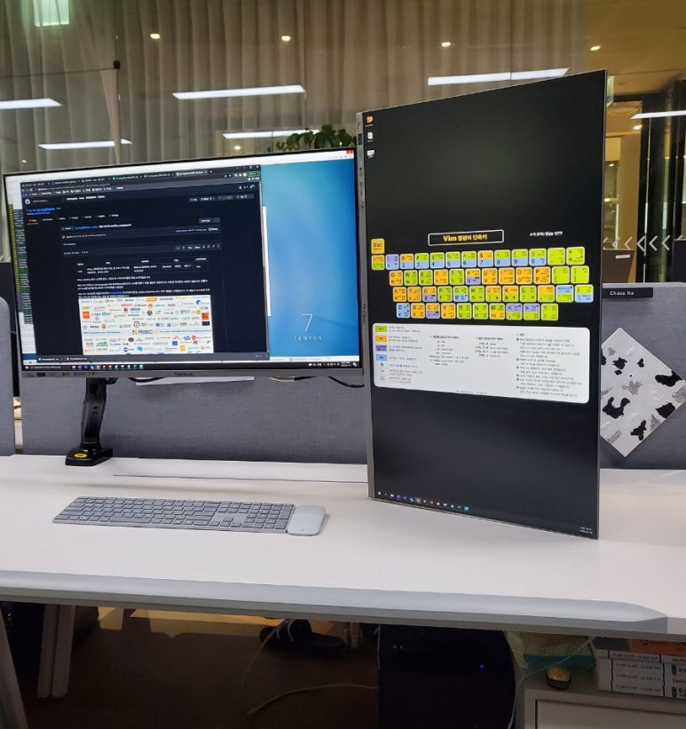

## 이번달 한달동안 생활비로 5만원 썼다.

몰랐는데, 전기 진짜 조금 쓰면 전기료 면제된다.

​

1. 전기세 1원도 안냈다.

2  원래 추위 안타서 손님 올때만 보일러키고.. 샤워도 체육관에서 하다보니, 이번달 가스비는 6000원 나왔다.

3. 밥을 잘 안먹어서 회사에서 먹고... 집에선 그냥 대충 냉장고 긁어 먹었더니 식비로 5만원이 전부.

​

​

치과 치료 받고, 키보드 마우스 고장나서 새로 사고, 친구들 밥 두세번 사준거로 한 100만원 썼다.

​

근데 졸업 우수 장학금으로 한 100만원 받았더니 다 매꿔짐 ㅎㅎ

​

올해 시작이 좋다.

 해시태그 : 