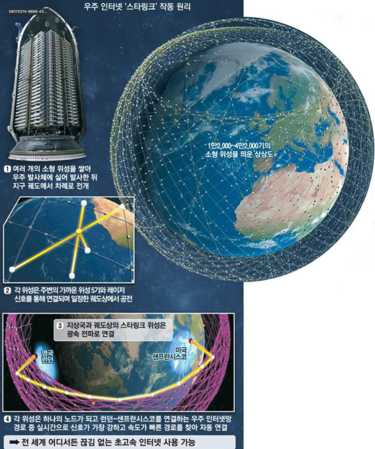

## WPAN, FWA, WLAN, IEEE802.11 15  16 Zigbee, Cellular란

인터넷 통신은 보통, 공기를 매질로 사용한다. 주파수 대역을 조정하면 통신을 할 수 있다.

​

​

현재 이동통신은 1G를 시작으로 5G까지 왔다.

​

5G의 목표는 20GHz대의 대역이지만, 현재는 3.5GHz를 간신히 넘고 있다.

​

파장이 작을 수록 주파수는 빨라지고, 주파수가 빨라지면 통신 속도가 빨라진다.

문제는, 파장이 작아지면 벽 통과를 하기가 힘들어진다. 그리고 데이터 통신을 넓게 멀리까지 할 수 없다. 근대 통신 기술부터 차세대 통신 기술까지 알아보겠습니다.

​

​

Wirless Mobile Network의 종류.

​

이동통신

3G(IMT-2000), WCDMA, cdma2000, 4G... 5G.... 등이 있고,

​

무선 통신

Wireless LAN. IEEE802.11b/a/g 등이 있다.

정부에서 밀어주다가 없어진 와이브로 등도 설명을 하면 좋긴한데, 이건 거의 우리나라만 밀어줬기 때문에 전세계적으로 썼던 것들만 짚어보겠습니다.

​

WPAN (Wireless Personal Area Network)

Bluetooth

​

FWA (Fixed Wireless Access)

옛날엔 WLL(Wireless Local Loop)라고도 불렸는데, 5G로 들어오면서  새롭게 다시 사용되고 있다.

IEEE 802.16이 대표적인 예인데, 가입자의 단말기와 망 접속점인 기지국을 무선으로 연결하여 초고속 인터넷 서비스를 제공하는 무선 통신 기술이다. 유선 구간 일부를 광대역 무선 통신으로 대체하여 초고속 인터넷 환경을 제공한다. 시 수준 통신이다.

​

위성통신 (Satellites)

인공위성 띄워서 통신을 하는 것인데, 대륙간 전화 연결이 되는 이유도 이 인공위성 덕분이다.

과거엔 인공위성을 띄워서 TV 방송 중계하고.. 전화하는 정도 수준이었는데, 일론머스크는 Space X를 통해 인공위성 4만개를 띄우고, 스타링크라는 회사를 통해  전세계 초고속 인터넷 + 지구, 화성간 인터넷 통신이 가능하게 시도하고 있다.

​

IEEE 802.11 

이름이 참 처음엔 안 와닿는데, 나중엔 익숙해진다.

802.11은 대표적인 Wireless LAN이고, 802.3은 대표적인 Wired LAN이다. 802.3은 Ethernet이라고 불리는 wired LAN이다.

802.11은 Ethernet의 Protocoldls CSMA/CA(Carrier Sense Multiple Access with Collision Avoidance)를 MAC에서 같이 쓴다.

​

Wireless LAN은 PHY(Physical)와 MAC(Medium Access Control)으로 구성된다. 참고로 반도체 칩으로 설계 구현 할 때는 PHY와 Controller로 구분된다. 

​

802.11 Family

http://www.ktword.co.kr/test/view/view.php?m_temp1=2034

[802.11](http://www.ktword.co.kr/test/view/view.php?m_temp1=2034) : 1. IEEE 802.11 ㅇ 무선 LAN 에 대해 IEEE 802 위원회 에서 작성하는 일련의 표준 규격 - 표준 대상 범위 : 물리계층 ( PHY ), MAC 부계층 , MAC 관련 서비스 및 프로토콜 2. 주요 표준 ㅇ 802.11 (1997) : 최초의 무선LAN 표준 - 2.4 GHz 대역에서, 1~2 Mbps급 전송속도 ㅇ 802.11a (1999) - 5 GHz 대역에서, 802.11(1997)의 속도 를 최대 54 Mbps까지 동작하는 확장 표준 . OFDM 기술 사용 ...

802.11b : 11Mbps, 2.4GHz ISM band (OFDM이 사용된다.)

802.11a : ~54Mbps, 5GHz ISM band

802.11g : ~54Mbps, 2.4GHz ISM band (OFDM이 사용된다.)

802.11n : 100Mbps

ISM band는 Industry, Science, Medical의 약자인데, 이 대역에선 전세계 누구나 공짜로 전파를 사용 할 수 있다. (나머지는 정부 허가도 받고 돈도 내야한다.)

​

앞으로 802.11을 위주로 설명 할 것인데, 이 802.11 전파 보내는 법은 아래와 같은 방법들이 있다.

- IR (자외선)

- FHSS (Frequency Hopping Spread Spectrum)

- DSSS (Direct Sequence Spread Spectrum)

​

IR은 벽 투과성이 나쁘고, 눈에 해로워서 FHSS와 DSSS 위주로 사용한다. FHSS와 DSSS는 현재까지도 많이 사용하고 있으니 기억하면 써먹을 일이 한번은 올 것이다.

​

​

통신 기술의 발전 양상은 아래와 같다.

1. 최대한 멀리까지.

2. 최대한 많은 사용자가 쓸 수 있게

3. 최대한 빠르게.

순서로 발전했다.

​

​

IEEE 802.15 Wireless Personal Area Networks

http://www.ktword.co.kr/test/view/view.php?nav=2&no=818&sh=802.15

[802.15](http://www.ktword.co.kr/test/view/view.php?nav=2&no=818&sh=802.15) : 1. IEEE 802.15 ㅇ 10m 정도 이내의 초근거리 통신 인 ` WPAN `에 대한 표준화 ㅇ 1999년3월에 구성된 표준화 기관 2. 산하 작업그룹 ㅇ 802.15.1 : ` Bluetooth `를 기반으로 WPAN 규격 제안 - 이미 표준이 완료된 상태 (1999년11월) ㅇ 802.15.2 : WPAN 및 WLAN 을 동시에 사용, 상호 간섭 해소 등 공존 (Co-existence) - 예를들면, 2.4GHz대에서 802.11b 기기 및 Bluetooth 기기와의 공존. - 표준 :...

Bluetooth처럼 근거리에서 쓸 수 있다. 집 안에서 대인용으로 쓸만한 수준 범위.

​

​

​

MAC 대표적 2계층 통신

http://www.ktword.co.kr/test/view/view.php?nav=2&no=400&sh=MAC

[MAC](http://www.ktword.co.kr/test/view/view.php?nav=2&no=400&sh=MAC) : 1. 매체 접근 제어 ( Medium Access Control , MAC) 이란? ㅇ 여러 단말들의 `공유 매체 (Shared Medium )` 사용에 대한, 단말 간 충돌 (경합) 발생을 제어 (경감)하는 방식을 총칭 ※ 한편, 매체 자원 관점의 보다 일반화된 기술 용어로는, ☞ Multiple Access ( 다원접속 ) 참조 - 한정된 전송 자원을 다수의 노드 들이 효율적 으로 공평하게 공유 ( 통신 자원의 공유) 2. 공유 매체 (Shared Medium ) 이란? ㅇ 여러 호스트 ( 노드 )들이 동일 ...

ZigBee

https://itinformation.tistory.com/151

[지그비(Zigbee) 통신이란?](https://itinformation.tistory.com/151) : 2001년 MIT 학생이었던 엔드류 휠러(Andrew Wheeler) 와 로버트 풀(Robert Poor) 두 사람이 엠버(Ember)라는 회사를 세우게 되고, 2005년에 EM260 지그비 네트워크 프로세서,EM250, ZigBee 시스템 칩(SoC), 엠버넷..

​

​

​

IEEE 802.16 for WMAN

WMAN은 시 수준으로 쓸 수 있는 네트워크 망이다.

옛날에 우리나라에서 와이브로 라고 불리면서 엄청 밀었다가 철수한 사업이다.

원래는 고정식 네트워크인데, 우리나라는 개량해서 이동식으로 사용했다.

http://www.ktword.co.kr/test/view/view.php?nav=2&no=2396&sh=802.16

[IEEE 802.16](http://www.ktword.co.kr/test/view/view.php?nav=2&no=2396&sh=802.16) : 1. 802.16 ㅇ 고정 점대다점(Fixed Point-to-Multipoint ) 연결중심의 광대역 무선 네크워크를 위한 Wireless MAN ( WMAN ) 관련표준을 진행중인 IEEE 802 산하 표준화 그룹으 로써 1998년도에 결성된 그룹을 말한다. 2. 주요 특징 ㅇ 점 대 다중점 구조 ( Point-to-Multipoint , PMP ) - 802.16은 BWA ( Broadband Wireless Access, 광대역 무선 접속)를 지향함 ㅇ 서비스 영역 - 주로 실외(Out...

​

​

​

Cellualr

우리나라에서 와이브로를 망하게 한 Cellular. 모든 와이브로의 단점을 커버한다.

http://www.ktword.co.kr/test/view/view.php?nav=2&no=472&sh=%EC%85%80%EB%A3%B0%EB%9F%AC

[셀룰러 시스템](http://www.ktword.co.kr/test/view/view.php?nav=2&no=472&sh=%EC%85%80%EB%A3%B0%EB%9F%AC) : 1. 셀룰러 시스템 (Cellular System ) ㅇ 주파수 자원을 효율적 으로 활용하며 기지국 을 공간 적으로 확장시키는 이동통신 시스템 2. 셀룰러 시스템 의 목적 ㅇ 주로, 주파수 의 효율적 인 재사용을 위함 - 전체 서비스 영역을 `셀`(Cell ☞ 이동통신 셀 )이라 부르는 영역으로 잘게 나누고, - 각 영역 마다 고정 기지국 을 두어 그 해당 셀 영역 만을 담당하도록 하여, - 멀리 떨어진 셀( 기지국 ) 마다 반복 사용토록 주파수 채널 을 할당( 주파수 재사용 )하며, - 기지국 ...

​

​

이상으로 무선통신을 마칩니다. 양이 너무 많아서 간략하게 링크로 정리하였습니다. 

​

다음 장에선 이동통신에 대해 정리하겠습니다.

​

​

 해시태그 : 