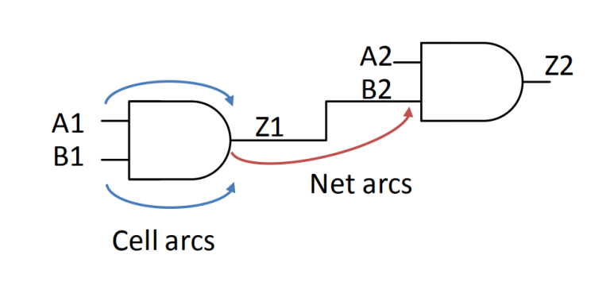
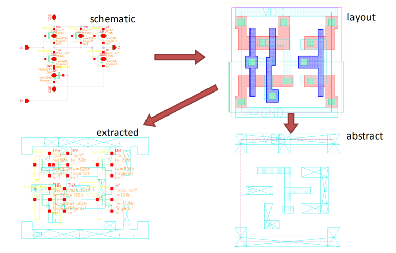
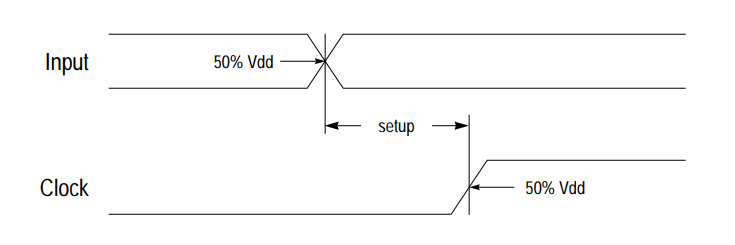
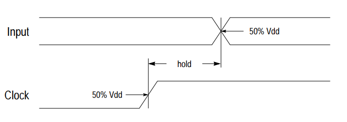
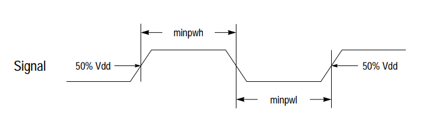

## STA Engineer (Static Timing Analysis) 엔지니어가 타이밍을 볼 때. 라이브러리 캐릭부터 DTA까지

설계검증을 하려면 Function과 Physical을 봐야할 줄 알아야합니다. Physical에서 가장(?) 중요한게 Function 동작을 위한 Timing 제약 조건을 맞춰야 하는 것입니다.

​

Timing 분석으로 대표적인건 Dynamic Timing Analysis, Static Timing Analysis, Monte Carlo simulation등이 있습니다.

DTA는 너~무 많은 시간을 소요하구요. Monte carlo sim은 일반적인 경우에선 chip level에선 사용되지 않습니다. 처음에 PDK certification 할 때면 모를까.

결국 STA로 Timing 검증을 합니다.

​

STA Engineer라면 공정 라이브러리 분석, SDC clean, Timing path 분석, Timing Close를 할 줄 알아야하는데요. 펀더멘탈부터 시작해보겠습니다.

​

디지털논리회로에 timing이 뭐냐?

Circuit level에서 Timing = Cell delay + Net delay

각 Delay를 input transition과 output cap으로 값을 구합니다.



위 그림처럼 circuit의 delay를 구합니다. cell delay는 Library에 기재하고, Net delay는 Clock Tree Synthesis 이후, NET parasitic extraction tool을 통해 spef 파일에서 뽑습니다.

STA Tool에서 Cell arc + Net arc를 모두 계산한 sdf를 뽑으면, 한 파일에서 cell arc와 Net arc를 뽑을 수 있고, 그러면 이제 Dynamic timing analysis를 할 수 있습니다. DTA는 Sim&debug tool들을 사용하구요.

​

이 transition과 cap을 어떻게 구하냐?

디지털 논리 게이트는 Transistor가 구성됩니다.

Transistor의 대표적인 예로 MOSFET이라는게 있구요


MOSFET은 위 그림처럼 생겼습니다.

폴리실리콘이 원래는 Metal이었고,

Metal 아래의 게이트 산화막은 Oxygen

산화막 아래 기판은 Substrate인 Silicon입니다. 그래서 MOS라는 소자 Field에 Effect를 주는 Transistor다~ 해서 MOSFET입니다.

​

기판을 보면 반도체하는 분들이 자주 언급하는 PN Junction 구조를 갖고있습니다.

N형 기판은 Negative 전하를 띄고, P형 기판은 Positive 전하를 띕니다.

​

Polysilicon에 충분한 +전압을 걸어주면, 산화막 밑에 -전하들이 몰리게됩니다. 

그러면 그러면 좌우 N+가 이동 할 수 있는 길이 생깁니다.

​

Foundry 회사들이 경쟁하고 있는 반도체의 미세공정 x nm 공정이 여기에 나오는 채널길이를 얘기합니다. 이 길이 짧을 수록, 전하들이 drift하는 시간도 짧아지고, 걸어줘야 하는 전압도 줄어들게됩니다.

반도체인이라면 다 들어봤을 "무어의 법칙. n년마다 n배씩 집적도가 늘어난다"는 얘기도 이 얘기구요.

​

채널 형성이 되려면 "충분한 전압"을 걸어줘야한다고 했는데요. 이 충분한 전압을 Vth (Threshold voltage)라고 부릅니다.


이 Vth를 작게 하면, 0->1, 1->0 등 신호 스위칭이 더 빠르게 됩니다. 대신에 Leakage power이 커지는 단점이 있습니다.

​


​

Foundry에서는 High Vth, Regular Vth, Low Vth 등을 Process Design Kit에 담아 설계자에게 전달합니다.

설계자는 논리 회로를 Physical logic으로 변환하는 과정에 이 Vth cell을 사용합니다.

​

처음엔 RVT로 변환을 했다가.. Timing이 빨라야하는 곳은 LVT로 바꾸고... 

LVT로 바꿨는데 이번엔 Power 담당자가 Power가 너무 크다고하면, 야근하면서 디자인 수정하고...

​

​

​

그래서 PDK의 Library 안에는 어떤게 들어있냐?


This VLSI tools need:

– Analog simulator (Hspice, Spectre,…)

– Netlist of the cells (schematic, parasitic extracted…)

– Timing arcs definitions

• Many vendors provide today packages (bunch of scripts) which automatizes the process:

– Kronos (Mentor Graphics)

– Synopsys SiliconSmart

– Silvaco

– ELC

– ALTOS

– Liberate (Cadence)

​

아래 과정으로 진행됩니다.



근데 gui로 drag&drop으로 하나하나 다 만드는건 아니고, 이것도 코드를 작성하는거고, 코드를 직접 작성하는게 아니라 코드 generation script로 사용합니다.

​

​

```
// View name: av_extracted
subckt AND2_B_XL_TSMC_HVTN A B GND VDD Z
c1 (VDD GND) capacitor c=2.00781e-16
c2 (A GND) capacitor c=1.72585e-16
c3 (B GND) capacitor c=1.40005e-16
c4 (Z GND) capacitor c=5.9908e-17
c5 (net58 GND) capacitor c=2.56284e-17
c6 (net09 GND) capacitor c=9.28723e-17
c7 (\1\:A GND) capacitor c=1.16705e-16
c8 (\1\:B GND) capacitor c=6.54007e-17
c9 (\5\:net09 GND) capacitor c=6.22271e-17
....
rj10 (net09 \3\:net09) resistor r=31.2646 c=0
rj12 (\3\:net09 \5\:net09) resistor r=22.4521 c=0
rj11 (\3\:net09 \4\:net09) resistor r=19.2893 c=0
TPB (\8\:net09 \1\:B \5\:VDD VDD) pch l=1.3e-07 w=3.2e-07 ad=0.0608p \
as=0.22828p pd=0.7u ps=2.37u nrd=0.59375 nrs=2.22925 sa=2.95e-07 sb=8.8e-07 m=1
TPA (\6\:VDD \1\:A \8\:net09 VDD) pch l=1.3e-07 w=3.2e-07 ad=0.2669p \
as=0.0608p pd=2.37u ps=0.7u nrd=2.60645 nrs=0.59375 sa=8.05e-07 sb=3.7e-07 m=1
M0 (\1\:VDD net09 \2\:Z VDD) pch l=1.3e-07 w=6.5e-07 ad=0.3715p \
as=0.28275p pd=2.57u ps=2.17u nrd=0.87929 nrs=0.669231 sa=4.35e-07 sb=1.22989e-06 m=1
TNB (net58 \4\:B \4\:GND GND) nch_hvt l=1.3e-07 w=3e-07 ad=0.057p \
as=0.22687p pd=0.68u ps=2.37u nrd=0.633333 nrs=2.52083 sa=2.95e-07 sb=9.85e-07 m=1
TNA (\9\:net09 \3\:A net58 GND) nch_hvt l=1.3e-07 w=3e-07 ad=0.1425p \
as=0.057p pd=1.55u ps=0.68u nrd=1.58333 nrs=0.633333 sa=8.05e-07 sb=4.75e-07 m=1
M1 (\1\:GND \5\:net09 \1\:Z GND) nch_hvt l=1.3e-07 w=3e-07 ad=0.347p \
as=0.1215p pd=2.57u ps=1.41u nrd=3.85556 nrs=1.35 sa=4.05e-07 sb=1.05854e-06 m=1
ends AND2_B_XL_TSMC_HVTN

```

​

```
// View name: schematic
subckt AND2_B_XL_TSMC_HVTN A B GND VDD Z
M0 (Z net09 VDD VDD) pch l=130n w=650n ad=221f as=221f pd=1.98u \
ps=1.98u nrd=292.308m nrs=292.308m sa=340n sb=340n m=1
TPA (net09 A VDD VDD) pch l=130n w=320n ad=108.8f as=108.8f pd=1.32u \
ps=1.32u nrd=593.75m nrs=593.75m sa=340n sb=340n m=1
TPB (net09 B VDD VDD) pch l=130n w=320n ad=108.8f as=108.8f pd=1.32u \
ps=1.32u nrd=593.75m nrs=593.75m sa=340n sb=340n m=1
M1 (Z net09 GND GND) nch_hvt l=130n w=300n ad=102f as=102f pd=1.28u \
ps=1.28u nrd=633.333m nrs=633.333m sa=340n sb=340n m=1
TNB (net58 B GND GND) nch_hvt l=130n w=300n ad=102f as=102f pd=1.28u \
ps=1.28u nrd=633.333m nrs=633.333m sa=340n sb=340n m=1
TNA (net09 A net58 GND) nch_hvt l=130n w=300n ad=102f as=102f pd=1.28u \
ps=1.28u nrd=633.333m nrs=633.333m sa=340n sb=340n m=1
ends AND2_B_XL_TSMC_HVTN

```

​

이런식으로 RC값 달린 회로를 만들어주고..

​


Tool에서는 Elmore delay를 포함한 여러가지 회로이론으로 만들어진 방법으로 Timing을 계산합니다.

참고로 STA

​

이런식으로 셀 RC값 지정과 Timing 계산식을 알았으니, PVT 별로 cell 특성을 캐릭하고, .lib, .v, datasheet를 만들면됩니다.


```
set rundir $env(PWD)
set CORNER tt
set VOLTAGE 1.2
set TEMPERATURE 25
set cell AND2_B_XL_TSMC_HVTN
# Create the directories Liberate will write to.
exec mkdir-p ${rundir}/LDB
exec mkdir-p ${rundir}/LIBRARY
exec mkdir-p ${rundir}/DATASHEET
exec mkdir-p ${rundir}/VERILOG
set_operating_condition -voltage $VOLTAGE -temp $TEMPERATURE
## Load template information for each cell ##
source ${rundir}/TEMPLATE/cern_cmos8rf_hd_tsmc_hvtnW_v120_tt_25C_hvtn.tcl
read_spice $rundir/MODELS/hspice/include_$CORNER\.sp
read_spice -format spectre ${rundir}/CELLS/cern_cmos8rf_hd_tsmc_hvtnW_nwsx.sch.scs
char_library -ecsmn -ecsmp -si-cells ${cells} -thread 8
write_ldb ${rundir}/LDB/$SOURCE_LIBRARY\_$VOLTAGE\V\_$TEMPERATURE\C_$CORNER.ldb
write_library -overwrite -ecsmn -si ${rundir}/LIBRARY/$SOURCE_LIBRARY\_$VOLTAGE\V\_$TEMPERATURE\C_$CORNER\_ecsm_si.lib
write_verilog ${rundir}/VERILOG/$SOURCE_LIBRARY\_$VOLTAGE\V\_$TEMPERATURE\C_$CORNER\.v
write_datasheet -format html -dir ${rundir}/DATASHEET/$SOURCE_LIBRARY\_$VOLTAGE\V\_$TEMPERATURE\C_$CORNER test

```

참고로 보여드린 스크립트는 정말 순서만 보여드린거고, 최신 미세공정에서는 다양한 요인들을 고려해줘야합니다!

​

그러면, 아래 같은 출력파일이 나옵니다. .lib과 .v만 볼 것이고, .lib부터 보겠습니다.

```
cell (AND2_A_XL_TSMC_HVTN) {
area : 0;
cell_leakage_power : 0.14561;
leakage_power () {
value : 0.0891823;
when : "!A&!B";
}
leakage_power () {
value : 0.129436;
when : "A&!B";
}
leakage_power () {
value : 0.146063;
when : "!A&B";
}
leakage_power () {
value : 0.217761;
when : "A&B";
}
pin (Z) {
direction : output;
ecsm_gndres : 2.84782;
ecsm_noise_cap : 0.000606332;
ecsm_vddres : 7.98722;
function : "(A * B)";
max_capacitance : 0.101;
output_voltage : "DC_0";
timing () {
related_pin : "A";
timing_sense : positive_unate;
timing_type : combinational;
cell_rise (delay_template_7x7) {
index_1 ("0.0224, 0.0608, 0.12, 0.32, 0.72, 1.6, 3");
index_2 ("0.0014, 0.003, 0.0062, 0.0125, 0.0251, 0.0504, 0.101");
values ( \
"0.0778087, 0.0943178, 0.126192, 0.188057, 0.311119, 0.557708, 1.05057", \
"0.0864114, 0.102866, 0.134701, 0.196585, 0.319701, 0.566341, 1.05924", \
"0.0989374, 0.115341, 0.147097, 0.208953, 0.332114, 0.578826, 1.07177", \
"0.124335, 0.141053, 0.172989, 0.234982, 0.358065, 0.604813, 1.09784", \
"0.150635, 0.168129, 0.200259, 0.261964, 0.385234, 0.63214, 1.12516", \
"0.175095, 0.19526, 0.229331, 0.291785, 0.4152, 0.66214, 1.15554", \
"0.181677, 0.205527, 0.244012, 0.30901, 0.434542, 0.683591, 1.17743" \
);
}
```

​

​

아래 부분이 가장 중요한데요. index_1과 index_2가 Transistion과 Capacitance를 나타냅니다. 각각 행렬이 되고, value가 그 안에 들어가는 timing 값이됩니다.

행렬에 존재하지 않는 사이값은 보간을 사용하고, 초과하는 값은 STA Tool에서 Violation으로 발생합니다. max transition, max capacitance violation. 이런건 Library vendor가 제공하지 않은 초과값이기에, 정확한 Timing 분석을 할 수 없는 요인이 됩니다!

(툴 설정에 따라, violation으로 보고하지 않고, tool이 알아서 그래프를 연장하여 그리게 할 수도 있습니다. 권장하진 않지만.)


공정 얘기 쪼끔만 더하면,

아래 그림에서 수직 형태의 길이라고 할까요? 도핑이 얼마나 깊게되고, 산화막을 얼마나 두껍게하고 이런건 공정엔지니어가 보통 정하고, 수평 길이는 공정설계 엔지니어가 정합니다.

​

그리고 파워반도체의 경우 제외하곤, 기본적인 MOSFET에서 Source와 Drain의 설계 자체는 똑같습니다.


​

​

​

자, 이제 cell delay가 담긴 library도 봤고, net delay가 담기는 SPEF(parasitic delay)도 알게 되었습니다.

Netlist에는 function 정보가 담겨있습니다. Netlist를 Timing 검증 하기 위해, 내가 원하는 조건을 지켰는지 봐야합니다.

그 제약조건은 SDC라는 스크립트로 주게 됩니다.

​

Digital circuit은 clock을 통해서 동작합니다. latch는 glitch가 커서 power/noise 문제가 있고, 주로 Flip flop을 사용합니다. 그러므로 flipflop design을 예시로 들겠습니다.

​

​


​

slack이 MET인지 Violation인지 봅니다.

MET인 경우, constraint가 빠진게 없는지 확인합니다.

각 library cell이 내가 원하는 코너의 라이브러리에서 나온 셀인지 확인합니다. 여기 Incr에 있는 delay값이 아까 캐릭했던 타이밍 값입니다.

Parasitic이 올바르게 propagate되었는지 확인합니다. clock network delay가 popagate로 되어있으니 propagate는 되어있고, sta report에서도 2차 확인을 합니다. 만약 parasitic이 없는 경우 ideal 상태일텐데, ideal이면 net delay가 0입니다. 이 값도 set_clock_latency로 유저가 정해줄 수 있으니, 적절히 선택합니다.

어떤 Timing path인지 확인하니, Flipflop-to-Flipflop path입니다

Path type은 setup check를 하는 MAX Delay timing check입니다.

Startpoint와 Endpoint의 active clock이 실제 function 동작에 clock과 맞는지 확인합니다.

​

만약 VIOLATION Path인 경우, Cell type을 바꿔주거나.. clock network delay를 조정하기 위해 P&R에서 cell 위치를 바꿔주거나.. datapath가 길어 도저히 맞출 수 없는 경우엔, Function 수정을 해야합니다.

​

참고로 Timing check는 이전 포스팅과 제 유튜브에도 남겨놨슴다....

Setup

​



Hold



min pulse width



​

라이브러리 캐릭부터 타이밍분석까지 정말 간략하게 봤습니다.

기본은 이렇다.. 이런걸 공유하고싶었는데, 잘 되었는지 모르겠네요.

​

궁금한건 댓글 남겨주세요.

​

​

 해시태그 : 