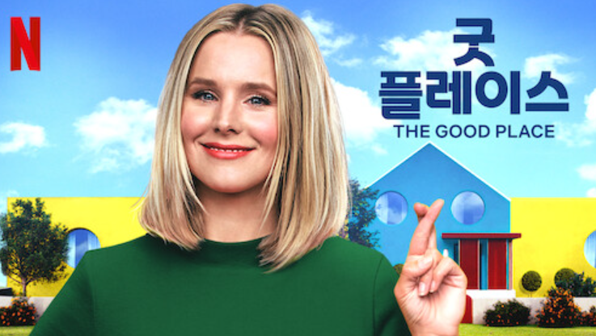

## 주말동안 넷플릭스 시리즈 "Good place (굿플레이스)"를 보고. 추천함!

할게 많은데... 공부도 해야하는데... 읽어야 할 논문이 산더미인데...

그냥 이번 주말은 놀았습니다. 그게 저니까요.

​

​

제가 본 시리즈의 제목, 굿플레이스(Good place)는 좋은 장소에 대한 이야기입니다.

사람이 죽고, 쌓은 덕에 따라 Good place / Bad place를 갑니다.

​

상세한 내용은 아래 영화리뷰를 참고해보세요~

설명 : #지무비 #넷플릭스 #천국넷플릭스 오리지날 미드, 굿 플레이스입니다.▶ 다른 넷플릭스 소개영상 둘러보기https://bit.ly/3b4Te5q▶ 지무비 채널 멤버십 가입https://goo.gl/LrQJgy▶ 지무비 구독https://goo.gl/4ETvXY▶ 지무비 공식 인스타그...

시리즈를 볼 때 더 재밌게 보기 위하여, 플라톤, 아리스토텔레스, 칸트, 니체, 슈바이처 등의 철학자들의 생각을 소개하고자 합니다.

드라마 "Good Place"는 인간의 삶과 죽음, 그리고 영혼의 존재와 그에 대한 다양한 철학적 고찰을 다루는 작품으로, 많은 철학자들의 생각과 이론이 은근하게 쓰이고 있습니다. 

​

인간의 삶이란? 어떻게 살아야하는가?

플라톤(Plato)

"Good Place"에서는 플라톤의 "국가론"과 "파이돈"의 개념이 나옵니다. 플라톤은 정의, 복지, 공동체, 교육 등에 대한 철학적 고찰을 제시하며, 이를 바탕으로 인간의 행복과 삶의 의미를 논의합니다.

​

2. 인간은 무엇을 위해 살고, 어떤게 행복인가?

아리스토텔레스(Aristotle)

아리스토텔레스는 행복과 우정, 미덕과 공동체 등에 대한 철학적 고찰로 유명합니다. "Good Place"에서는 이러한 아리스토텔레스의 철학을 바탕으로, 인간이 어떻게 행복을 추구할 수 있는지, 그리고 이를 위해 어떤 미덕적인 행동을 해야 하는지를 논의합니다.

​

3.도덕적 옳고 그름의 판단이란?

칸트(Immanuel Kant)

칸트는 인간의 도덕적 책임과 의무, 그리고 이에 따른 인간의 자유와 존엄성에 대한 철학을 제시했습니다. "Good Place"에서는 칸트의 철학을 바탕으로, 인간의 행동이 도덕적으로 올바른지 판단하는 기준이 무엇인지, 그리고 이를 바탕으로 어떻게 자신의 행동을 정렬해야 하는지를 논의합니다.

​

4. 인간은 어떻게 더 나은 삶을 살 수 있는가?

니체(Friedrich Nietzsche)

니체는 초인이라는 개념을 제시하며, 이를 바탕으로 인간의 자유와 창조성, 그리고 이를 통해 인간이 얻을 수 있는 높은 가치에 대한 철학적 고찰을 전개합니다. "Good Place"에서도 이러한 니체의 철학이 반영되어, 인간이 어떻게 자신의 인생을 책임지고, 이를 통해 더 나은 삶을 살아갈 수 있는지를 논의합니다.

​

5. 인간의 존재?

슈바이처(Martin Heidegger)

슈바이처는 인간의 존재에 대한 철학적 고찰로 유명합니다. "Good Place"에서는 이러한 슈바이처의 철학을 바탕으로, 인간이 어떻게 자신의 삶을 살아가며, 이를 통해 어떻게 자신의 존재를 의미있게 만들 수 있는지를 논의합니다.

​

6.나의 행복이 다른 이에게 어떤 영향을 끼칠까?

존 스튜어트 밀(Francis Hutcheson)

존 스튜어트 밀은 "유틸리티론" 이론으로 유명합니다. 이론은 인간의 행동이 유용성에 따라 평가되어야 한다는 것입니다. "Good Place"에서는 이러한 밀의 철학을 바탕으로, 인간의 행동이 어떻게 다른 인간들의 행복에 영향을 미치는지, 그리고 이를 통해 어떻게 더 나은 공동체를 만들 수 있는지를 논의합니다.

​

7. 어떻게하면 인간이 더 나은 세상을 만들며 의미있게 살 수 있을까?

에릭 바나(Erik Bana)

에릭 바나는 인간의 삶에 대한 철학적 고찰로 유명한 철학자입니다. "Good Place"에서는 바나의 철학을 바탕으로, 인간이 어떻게 자신의 삶을 의미있게 만들 수 있는지, 그리고 이를 통해 어떻게 더 나은 세상을 만들어 나갈 수 있는지를 논의합니다.

​

​

​

분명 저는 드라마를 더 재밌게 볼 수 있도록 + 이 드라마 추천하려고 글을 쓴건데... 괜히 제 글 때문에 이 드라마 안 보시게 될까봐 걱정이 되네요 ㅋㅋㅋㅋ

​

미국식코미디 + 사후세계 + 따뜻함 느끼고싶은 분들에게 추천합니다~~

​

 해시태그 : 