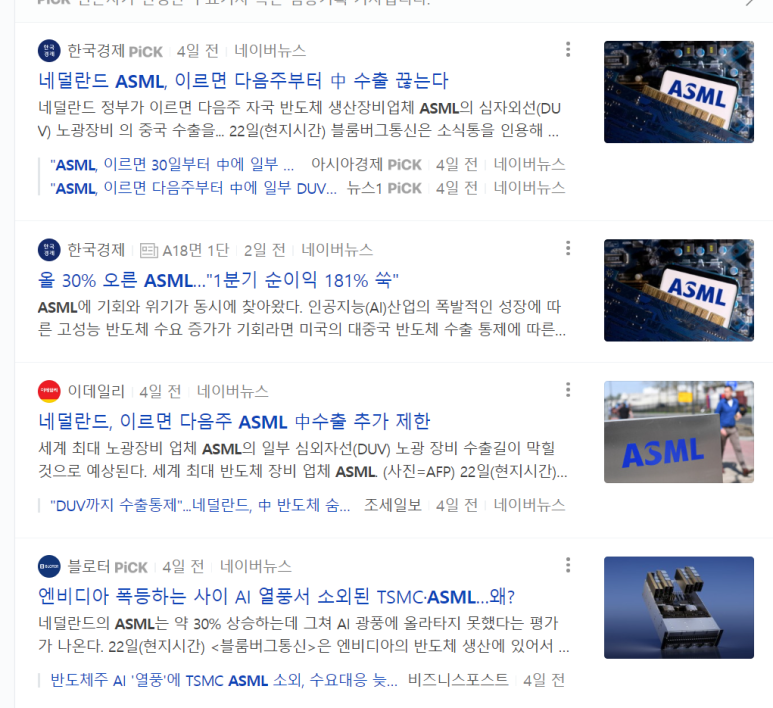

## [2023년 6월 27일] 반도체 뉴스 요약 - VLSI Korea

1.'반도체' 기술 유출 前 삼성 임원 기소장 공개 (g-enews.com)

​

2.네덜란드 ASML, 이르면 다음주부터 中 수출 끊는다 | 한국경제 (hankyung.com)

​

​

3.애플, 칼텍 특허 침해 소송 패소… “수천억원 물어줘야” - 조선비즈 (chosun.com)

​

 해시태그 : 