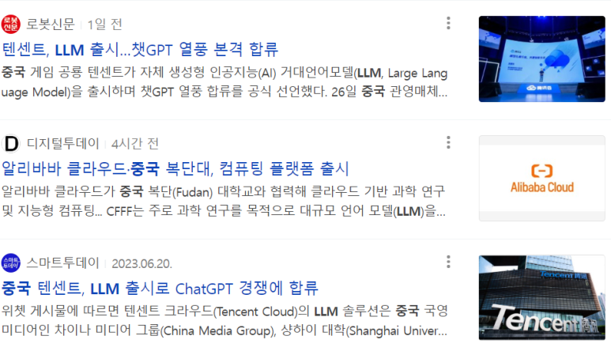

## [2023년 6월 28일] 반도체 뉴스 요약 - VLSI Korea

1.삼성전자 "2025년 모바일 2나노 양산, 2027년 전장 확대" :: 공감언론 뉴시스통신사 :: (newsis.com)

​

2.대세로 자리잡은 대형언어모델(LLM) 오픈소스 공개 < 트랜드 < 산업 < 기사본문 - AI타임스 (aitimes.com)

중국에서 Large Language Model 오픈소스 공개.

​

3.美, 엔비디아 등 'AI칩' 中수출 제한 확대한다…"밀수 더 늘어날 것" - 머니투데이 (mt.co.kr)

​

 해시태그 : 