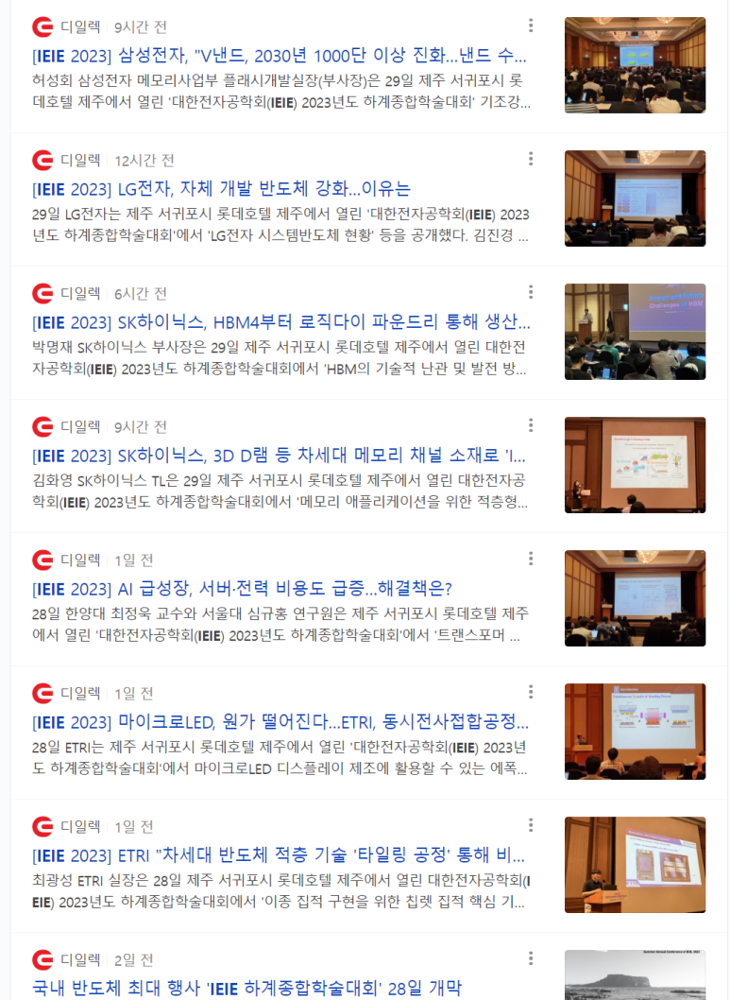

## [2023년 6월 29일] 반도체 뉴스 요약 - VLSI Korea

1.인텔, ‘가우디 2’ 딥러닝 가속기…AI 벤치마크서 경쟁 우위 자신감 - IT조선 > 기업 > 컴퓨팅·IT서비스 (chosun.com)

2.미국, 대중 반도체수출통제 최종본 다음달 공개 전망…한국 기업 영향 주목 | KBS 뉴스

​

3.IEIE 개최

​

​

 해시태그 : 