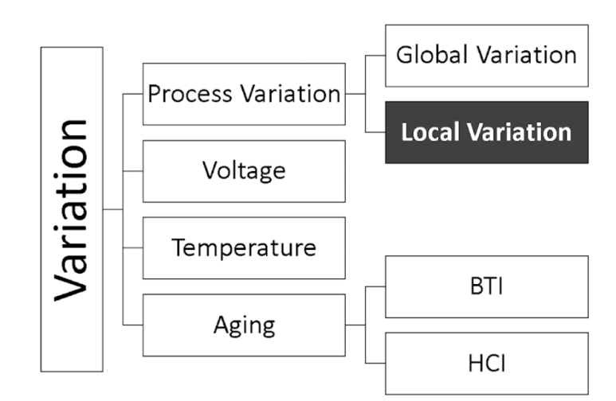
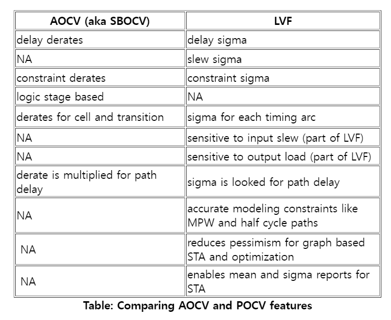

## On-Chip Variation OCV, POCV, AOCV와 Static Timing Analysis : 왜 Clock Frequency를 더 올리기 어려운걸까?

Clock이 active edge를 만들 때마다 Flip flop들은 신호를 처리합니다. Clock을 빠르게 하면 할 수록 신호 처리가 빨라지게 됩니다. 그러면 무한정 Clock frequency를 높이면 성능이 올라갈텐데, 이게 어려운 이유가 뭘까요?

​

어려운 이유는 집적회로 내에서의 Parameter variation입니다.

Parameter varation이란.. 한 기계로 반도체를 만들어낸다고해도, 미세하게 차이가 발생합니다. 이런걸 공정 노이즈라고 하고, 온도 변화, 전압 변화, 빛, 자기장, 노화, 공정 중에 산화막 두께가 어느정도인지... 등등 다양한 물리적인 요인들로 반도체 물성 차이가 발생합니다.

저속의 반도체에선, 이런 노이즈들이 있어도 매우 작지만, 고성능 집적회로에서는 이미 Clock frequency를 최대한 높여놓은 것이기 때문에 이러한 Variation이 타이밍에 미치는 비율이 큽니다.

​

​

Timing sign-off를 하기 위해 적당한 positive slack이 필요한데... 

Parameter variation 때문에 Clock Frequency 끝도 없이 높이는 건 어렵다는 겁니다.

​

​

digital design에서 꼭 지켜야할 Setuptime을 예로들어봅시다.

Setup time = Period - Combo delay 이게 기본적인 식이잖아요? 

얘기했던 것처럼 "온도마다, 전압마다, 칩마다 반도체 물성이 조금씩 다르다"라고 했습니다. 물성이 다르다는 것은, 전압이 1->0, 0->1 변화하는 Threshold voltage가 조금씩 다르다는 것이고,, 이 Threshold voltage가 다르면, chip 동작이 이상적일 때보다 느릴 수도 있겠죠.

그래서 실제적으로 계산을 하면,

Setup time = (Period * Clock Derate) - (Combo delay * Data Derate) - uncertainty가 되는거죠. 계산식이 복잡해졌죠? 그렇기 때문에 OCV를 사용하면 Tool Resource 사용량도 늘어납니다.

​

​

이런식으로 Derate와 uncertainty를 관리해야하는데, 묶어서.. Variation을 관리하고 타이밍 분석에 정확하게 반영하기 위해 등장한 개념이 바로 On-Chip Variation (OCV)입니다. OCV는 실제 Operating condition에서 발생하는 Parameter Variation을 모델링하고 이를 타이밍 분석에 반영하는 기술로서, 고성능 집적회로 설계에서 절대적으로 필수적인 요소로 자리잡았습니다.

​

얘기 드린것처럼, OCV를 고려해야 실제적입니다. 타이밍 분석의 정확성을 높이지만, 추가적인 계산이 필요하므로 타이밍 분석 도구의 수행 시간이 증가합니다. 따라서 큰 규모의 디자인에서는 타이밍 분석의 수행 시간이 길어질 수 있으며, 이를 관리하기 위한 최적화 기법이 요구됩니다.

​

OCV를 최대한 실제적으로 맞추려면, 정말 다양한 물리적인 공식들이 필요합니다. 그렇게되면 수식적으로도 어렵고, 이를 위해 Tool resource도 많이 필요합니다.

A. 디지털 회로가 처음 나오던 당시에는 OCV 고려도 필요 없을 정도로 느린 반도체 chip이 만들어졌기 때문에 OCV 자체가 없었고,

B. clock frequency를 높이다보니 Chip이 High voltage에선 동작을 하는데, Low voltage에선 동작을 안하네? + 온도마다 다르네? + 똑같은 공정 똑같은 웨이퍼에서 나온 Chip인데 어떤 Chip은 동작을하고 어떤 Chip은 동작을 안하네?

-> Proccess + Voltage + Temperature. 3개의 개념이 있는 PVT라는 모델 탄생

C. 기존 OCV modeling은 High frequency에서 negative slack을 만드는데... 실제로는 Chip이 동작을 하네? 실제 물성은 PVT보다 더 복잡한 식이 있구나. 그 식을 사용하면 좀 더 Chip을 High frequency로 만들 수 있네..

-> OCV, AOCV, POCV, LOCV, SBOCV, SOCV and LVF 등 이전보다 더 복잡하고, 정교한 수식으로 된 OCV Model이 나왔습니다.

[Industry Leaders Collaborate with Synopsys on Modeling Standards to Address Design Down to 2nm](https://news.synopsys.com/2018-12-19-Industry-Leaders-Collaborate-with-Synopsys-on-Modeling-Standards-to-Address-Design-Down-to-2nm) : Highlights: Liberty extensions drive optimal implementation/QoR for ultra-low power applications Extended parasitic extraction modeling for advanced process and device technologies Collaboration...

​

OCV라는게 그냥 상수로 위 식에 더하고 빼고 곱해주는게 아닙니다.

Flipflop 간의 Distance

Combinational logic의 Depth

매달려 있는 RC

등등 다양한 정보들이 필요해요.

​

이런 정보들에 따라, 얼마만큼의 derate를 줄 것인지 정보도 필요하구요.

그래서 CCS, ECS 등 추가적인 정보가 들어있는 파일들이 사용됩니다.

​

더 효율적인 반도체를 위해 미세공정을 개발하고있고.. 미세공정에서 High frequency를 도달하려면 더 발전된 OCV Model이 필요하고.. 발전된 OCV는 더 많은 정보들을 필요로 하고.. 이러다보니, 미세공정일 수록 더 많은 설계엔지니어, 검증엔지니어, 컴퓨팅 시스템이 필요합니다.

​

이런 OCV는 SDC에서 아래처럼 사용하여 적용됩니다.

% set_timing_derate -cell_delay -rise -data -early 0.92

% set_timing_derate -cell_delay -rise -data -late 1.10

% set_timing_derate -cell_delay -rise -clock -early 0.95

% set_timing_derate -cell_delay -rise -clock -late 1.06

% set_timing_derate -cell_delay -fall -data -early 0.90

% set_timing_derate -cell_delay -fall -data -late 1.12

% set_timing_derate -cell_delay -fall -clock -early 0.94

% set_timing_derate -cell_delay -fall -clock -late 1.07

​

AOCV Model은 Liberty IEEE-ISTO에서 정해진 Standard입니다. Liberty format으로 되어있어요. 아래처럼 depth에 따라 derate value를 결정합니다.

library (guna_lib) {

ocv_table_template(ocv_template) {

variable_1: path_depth;

index_1 (“1,2,3,4,5,6,7,8,9,10”);

}

ocv_table_template(ocv_template_2D) {

variable_1: path_depth;

variable_2: path_distance;

index_1 (“1,2,3,4,5,6,7,8”);

index_2 (“1,2,3,4,5,6,7,8”);

}

…

cell (BUFX4) {

…

…

ocv_derate_factors(ocv_template) {

rf_type: rise;

derate_type: late;

path_type: clock;

values(“1.18, 1.145, 1.12, 1.10 1.10 1.08 1.074 1.065 1.06 1.055”);

}

}

} 

​

POCV Model은 LVF File을 추가로 요구합니다. LTAB at IEEE-ISTO Standard입니다. POCV는 depth와 distance를 갖고 3-sigma로  통계적인 방법을 사용해 variation을 줄인 것입니다.

ocv_sigma_cell_rise ("pocv_template_4x4") {

    sigma_type : "late";

    index_1("0.01, 0.04, 0.12, 0.80");

    index_2("0.01, 0.02, 0.03, 0.10");

    values( "σ11, σ12, σ13, σ14", \

            "σ21, σ22, σ23, σ24", \

            "σ31, σ32, σ33, σ34", \

            "σ41, σ42, σ43, σ44", );

}

​

앞으로 더 미세공정으로 갈 수록 더 복잡한 OCV Model이 나올건데, 

​

요약하면,

1. OCV는 실제 환경에서 Chip 동작을 위해 필요한 Parameter variation이다.

2. High frequency로 갈 수록, Timing modeling 은 더 정교해져야한다.

3. 더 복잡한 OCV 모델은, 더 다양한 파일들을 요구한다.

​

​

​

 해시태그 : 