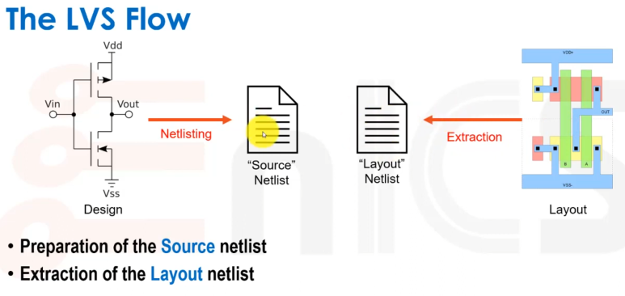
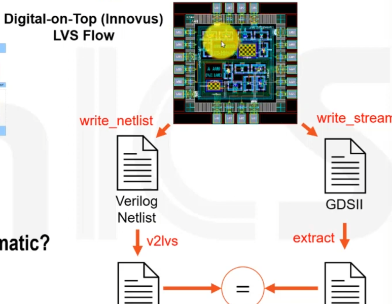
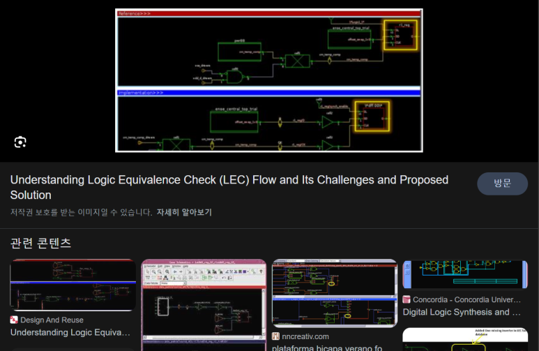

## 반도체 디지털 회로 설계 직무 정리 Frontend Backend, RTL, ASIC, FPGA, PI, PD, DT 등..

반도체에서 디지털 회로설계 직무는 주로 Frontend와 Backend로 구분되며 여러 가지 하위 분야로 나뉩니다.

그런데 Frontend나 Backend나 다 회사마다 다르고, 사람마다 기준이 다르고, 대략 이렇구나~ 하시면 될 것 같습니다.

​

아래 사진들은 구글에서 Frontend Backend in vlsi라고 검색했을 때 나오는 사진들입니다.

위 그림에선, RTL 설계/검증까지 Front-end, 나머지는 Backend

위 그림에선 RTL을 Gate-level Netlist로 변환하고 Verification하는 것까지 Frontend

위 그림은 Synthesis + DFT(Design For Test)까지 Frontend네요.

​

국내에서 반도체 설계

Digital Design : RTL 설계 및 IP를 integration

DV : RTL / IP를 검증

PI : RTL에서 Netlist로 설계/검증

PD : Netlist에서 GDS로 설계/검증

Foundation IP : Standard cell / IP 개발

DT : Methodology 연구 개발

위와 같은 하는 부서라고 보시면 됩니다. 아래에서 위 팀들의 직무와 어떤 툴을 쓰는지 소개하겠습니다.

​

[1] RTL 디자인 엔지니어:

대부분 HDL 코딩 및 VHDL/Verilog를 사용하여 다양한 모듈과 블록을 디자인하며 설계가 합성 가능한지 확인합니다.

​

[2] IP Integration 엔지니어:

IP Integration 엔지니어의 역할은 범용 IP(USB, Ethernet, PCIe) 등을 내 Design의 속성에 맞게 수정하고 integration합니다.

https://youtu.be/T1FAPDqIJK8

설명 : Sonics CTO Drew Wingard talks about the challenges of integrating IP into SoCs.

[3] RTL Top 엔지니어 / Full chip RTL 엔지니어 / RTL Integration 엔지니어:

[1], [2]에서 설계된 각 module들을 하나의 Chip에 통합시키는 설계를 합니다.

​

[4] SOC/IP/Subsystem 검증 엔지니어:

System Verilog/UVM을 사용하여 테스트벤치를 만들고, 블록의 검증 및 function test coverage 등을 목표치에 맞춥니다.

​

[5] Physical Design Engineer:

Chip은 사실 내부에 작은 반도체 트랜지스터들로 구성이 되잖아요?

이 트랜지스터들을 배치하고, 배선하는 실제 설계도를 만드는... Floor plan, PnR 등을 합니다.

관련 Tool : Synopsys IC Compiler, Cadence Innovus

​

[6] STA(Static Timing Analysis) 엔지니어:

RTL 설계/검증까지는 Timing을 보통 이상적으로 보지만, 실제 칩 동작은 이상적이지 않습니다.

어떤 회로이냐에 따라 다르고, Noise도 있고, 온도에따라.. chip 동작속도가 달라지기도 하구요. 이런 모든 것을 고려해서 타이밍 검증을 합니다.

관련 Tool : Synopsys Primetime, Cadence Tempus

​

[7] 아날로그 레이아웃 엔지니어 / Physical Verification 엔지니어 / Rule Deck :

주로 CMOS 회로 Layout과 관련이 있으며.. ERC, DRC, LVS, DFM 같은 규칙들을 검증합니다.

설계한 레이아웃이 이 회로의 스케메틱과 정확히 일치하는지 체크를 합니다. NMOS의 위치, PMOS의 위치, VDD와 GND가 잘 연결되어있는지.. Open/Short 등 체크합니다.

관련 Tool : SIEMENS (구 Mentor)의 Calibre

​

​

[8] DFT(Design For Test) 엔지니어:

Chip이 만들어졌을 때 Chip의 양품 테스트가 용이하도록.. RTL이나 Netlist에 약간의 테스트용 회로를 추가하고, 칩테스트시에 사용할 테스트 입출력 벡터를 만듭니다.

Synopsys의 Design Compiler로 Logic synthesis 뿐만 아니라 DFT가 가능합니다. Vector 생성은 TestMAX 혹은 TetraMAX로 할 수 있습니다. 지멘스의 Tessent도 많이 사용합니다.

​

​

​

[9] Logical Equivalance Check Engineer:

디지털 회로는 RTL부터 GDS까지 엄청나게 많은 연속 작업을 거칩니다. 이 과정에 Logic이 수정되었는지 체크가 필요한데, 이것을 여기서 합니다.

RTL vs RTL

RTL vs Netlist

RTL vs Netlist+DFT

관련 Tool : Cadence의 Conformal, Synopsys의 Formality

​

​

 해시태그 : 