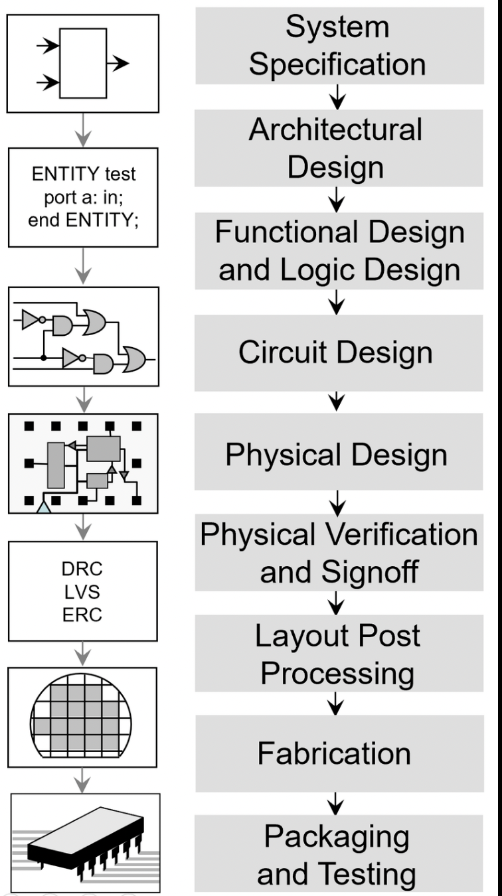
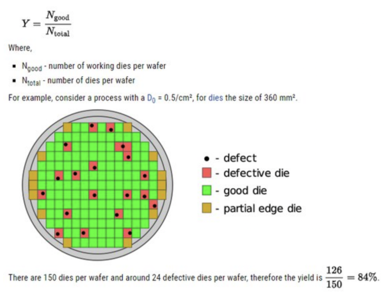

## Design for Manufacturing, DFM이란(제조 가능성 및 수율 향상을 위한 설계)

반도체 설계 과정을 요약하면, 아래처럼 진행됩니다.

아이디어 -> 디지털 논리 설계 -> 물리적 요소를 고려한, 최종 설계도를 설계하여 Fab에 전달 -> 웨이퍼 위 칩으로 공정.

공정 수준이 점점 더 미세화 되면서, "디지털 논리적으로 이상이 없어도, 물리적인 이유로 수율 이상이 발생"하게 됩니다.

​

DFM이란,

DFM(Design for Manufacturability)은 반도체 제조 공정에서 발생하는 여러가지 노이즈를 염두에 두고 집적 회로를 설계하는 것을 의미합니다.

이상적이지 않은 실제 칩 제조공정을 고려하여, 높은 수율의 Chip을 공정 할 수 있도록 하는 설계방법론입니다.

더 미세한 공정을 할 수록, 더 난이도가 높아지고.. 작은 노이즈에도, 작은 먼지에도 크게 영향을 받게 됩니다.

그래서 미세공정이 어렵고, 미세공정에서 수율이 안 나오고, 수율이 안 나오니 양산이 어렵고, 양산이 어려우니 Chip이 비싸지고.... 이렇게 비싸진 Chip은 주식, 경제, 정치에 영향을 끼치고 있습니다.

​

​

반도체 수율이란, (Yield)

반도체 제조에서 " 수율"은 전체 Chip 대비, 실제 동작에 성공적으로 제조공정된 칩의 백분율을 나타냅니다.

​

실제적인 반도체의 동작은, 전압을 넣어줄 때 1->0 혹은 0->1로 출력에 변화가 있는데.... 이 출력 변화는 "문턱 전압"을 넘었을 때 발생하고, 이 "문턱 전압"은 실제 반도체 제조 공정 과정 중 여러가지 이유로, 웨이퍼 내 각 칩마다 약간씩 다르게 제조공정됩니다.

​

미세공정으로 진입함에 따라, 제조공정의 노이즈 변화가 더욱 큰 비율을 차지하게 됩니다. 공정회사에서는 최대한 이걸 정확하게 계산하여,,, 너무 비관적이지도 않으면서 너무 낙관적이지 않도록 값을 출력합니다. 제조공정으로 발생하는 노이즈를 설계 회사에 미리 알려줘서.... "설계 회사에서는 이걸 감안하여, 좀 더 마진 있는 설계를 하여" 수율을 높일 수 있는 것이죠.

​

그리고.. 어지간한 경우, 반도체 설계와 Simulation이 완벽하게 이뤄졌다고 하더라도, 바로 양산으로 가지 않습니다.

양산은 비싸고, 항상 예상치 못한 일들이 생기기 때문에, Test Chip으로 제조공정을 한번 해보고,

제조공정이 완료 된 Chip들이 잘 동작하는지? 주로 어떤 부분에서 불량이 많이 발생하는지? 등을 살펴봅니다.

​

1) Chip에서 어떤 특정 function을 담당하는 부분에서 제조공정에서 불량이 많이 발생했는지

2) Wafer에서 어떤 부분에서 대부분의 불량이 발생했는지

이런 것들을 체크해보고.. 양산에서 반영하는거죠.

예를들어 Chip size가 매우 커서, 한 웨이퍼 내에 5개의 Chip만 제조 할 수 있다면..  제조공정 중 Wafer에 먼지 5개만 껴도 웨이퍼 한장을 버려야 할 수도 있으니, 이런 경우엔 Chip의 기능을 좀 나눠서 chip size를 줄일 수도 있구요.

​

​

Layout opimization: DFM은 칩 레이아웃을 최적화하여 Routing Congestion, Timing violation, Lithography limitation 등의 문제를 완화합니다. 이러한 최적화는 제조 가능성과 수율을 향상시킵니다.

​

반도체 신뢰성 문제란? (Reliability)

반도체 신뢰성 문제는 주로, "정상 칩이 얼마나 외부 환경에서 버틸 수 있는지"를 의미합니다.

열, 전자기학, 방사선 등 다양한 원인들로 인해, chip의 내부 회로 물성이 변하게 됩니다. 이러한 노이즈 파라미터들도 공정사에서 계산하여 설계사한테 넘겨주고, 설계사들은 "어떤 환경에서 어느 기간동안 버틸 수 있는 반도체"를 설계합니다. 

​

간단히 어떤게 있는지만 소개하고... 세부 소개는 나중에 포스팅을 남길게요.

​

1. Signal EM이란(Electromigration)

높은 전류 및  온도에서 Metal Routing의 Quality/Rule check

​

디지털 회로에서 Signal은 위처럼 같이 Routing을 통해 current는 전자의 흐름에 따라 이동하는게.. 디지털 논리회로에서, 메탈이라고 불리는 것.

이동하는 전자는 많은데 배선의 폭이 좁다면,

1) 병목현상으로 이쪽 부근에 빠르게 부딪히는 전자가 쌓이면서

2) 고온이 발생하게 되고 시간이 지나면 아래와 같이 crack이 발생하게 되며, 아래처럼 OPEN이나 SHORT가 일어날 수 있다.

따라서 반도체 공정 회사들은 위와 같은 현상을 방지하기 위해 단위 면적당 흐르는 current를 버틸 수 있는 metal의 두께, 길이등을 제한을 두어 설계시 반영하여 signal/power EM 등 Design Rule Check가 필요하다.

​

2. HCI란 ( Hot carrier injection, Hot carrier effect)

MOSFET 소자의 기본 동작이.. Gate에 전압을 걸어주면, Source와 Drain 사이에 Channel이 생겨 그쪽으로 Carrier들이 오가는거잖아요?

HCI란, 전자들이 Source에서 Drain으로 흘러가는 과정 사이에, 높은 운동에너지를 가진 일부 전자들이 SiO2와 충돌하다가 SiO2의 Energy band를 넘은 운동 에너지를 가진 전자들이 Oxide에 Trap되는 현상입니다.

좀 더 쉽게 말하면,

MOSFET 소자에서 channel영역 내 전자가 높은 에너지를 받고 SiO2(절연산화막)안으로 들어와서 소자의 물성.. 그러니까 문턱전압을(Vth)를 변화시키는 현상을 말합니다. Vth가 바뀌면, Chip의 동작 속도가 바뀌므로, Timing 관련 문제가 생깁니다.

Source -> Drain으로 가면서.. 운동에너지가 가장 높을 때 이 HCI 문제가 주로 발생하게 됩니다. 그래서 MOSFET의 Drain 근처에서 주로 이런 이슈들이 발생하게 됩니다.

공정사는 이걸 특성화해서, 설계 회사에 넘겨주고, 설계회사는 이걸 갖고 시뮬레이션을 해서.. 내 디자인에서 HCI 이슈가 발생 할 수 있는지 Design Rule Check를 하는겁니다.

​

HCI가 조금 쌓인 상태에선 VTH를 좀 변동 시키는 문제이지만, HCI가 지속되면 아예 한쪽 oxide가 전자로 꽉 막혀 버릴겁니다. 이걸 TDDB (Time Dependent Dielectric Breakdown)라고 하는데... 이렇게 되면, 채널 형성이 거의 안 된다고 보시면 됩니다.

주로 HCI는 높은 이동성과 작은 band offset 가진 전자 때문에 문제가 됩니다.

​

HCI를 방지하기 위해, 공정에서 LDD(Lightly Doped Drain)이라는.. 일종의 보호막을 MOSFET에 해주는 방법도 있긴한데.. 이걸 하면 저항이 늘어나는 단점이 있습니다.

3. BTI, bias temperature instability

4. IBL, Induced Barrier Lowering

5. Punch through

aging, power 등등.. 많이 있는데 wikipedia에 너무 잘 나와 있으니 그거 보시는거 추천합니다. 이거 다 쓰면 하나의 글에서 분량이 너무 많아질 것 같네요;;

[High-temperature operating life - Wikipedia](https://en.wikipedia.org/wiki/High-temperature_operating_life) : High-temperature operating life 1 language Article Talk Read Edit View history Tools From Wikipedia, the free encyclopedia High-temperature operating life (HTOL) is a reliability test applied to integrated circuits (ICs) to determine their intrinsic reliability. This test stresses the IC at an eleva...

​

​

​

요약하면,

1. 리소그래피 및 마스크 최적화: SMO, MBOPC

2. 공정과 신뢰성 관련 파라미터 고려하여 설계 검증: STA

3. Design Rule check: Signal EM 등 다양한 PV Tool 

4. DFM aware Place and Routing: Congestion, lithography hotspot 최소화

5. Dummy filler cell: Etching이 균일하도록 layout density의 균일성을 위해, dummy 역할을 하는 filler cell 삽입.

​

미세공정으로 갈 수록, 작은 노이즈가 큰 문제를 일으키고, 이것은 양산이 되냐 안되냐?로 문제가 커진다.

이 문제로 인해 기업과 국가의 경쟁력이 결정되고,

양산을 고려한 설계 방법론이 필요함.

 해시태그 : 