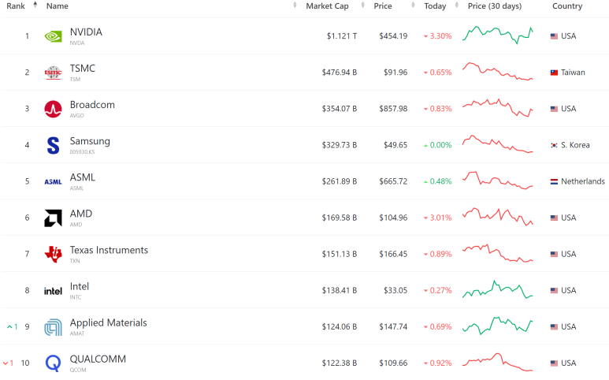

## 반도체 산업의 성장과 전망 : 미국 반도체 생태계를 중심으로.

앞으로, 미국 반도체 생태계 분석을 위해,

전세계 반도체 기업을 시가총액 순서로 1위~50위까지 분석을 해보려고 합니다.

​

주가가 싸다 비싸다 이건 잘 모르겠고,

"이 회사가 뭐 하는 회사인지? 이 회사가 다른 회사대비 경쟁력이 있는지? 왜 요즘 주가가 올랐는지? 떨어졌는지?"를 엔지니어 시점에서, 블로거답게 쉬운 글로 풀어써보려고합니다.

대신에 내용은 길 것 같아요. 쉽게 설명 할 것이긴한데, 빠뜨리는 부분은 없을거라서요.

​

일단, 반도체는.. 현대 모든 분야에 사용됩니다. AI, 5G, 자율주행, 스마트폰 등 모든 기술이 반도체에 의존합니다.

그리고 반도체 기술은 끊임없이 발전하고 있습니다. 미래에는 양자 컴퓨팅, 신소재 활용, 더 빠른 데이터 처리 등의 혁신이 예상됩니다. 이러한 기술들은 우리의 삶을 변화시킬 것입니다.

​

​

일단 반도체는, "무어의 법칙" 등 다양한 유명한 법칙들이 있는데요.

무어의 법칙이 뭐냐면, 반도체 트랜지스터 집적도가 2년마다 두배, 혹은 18개월마다 2배가 된다는거에요.

그 어떤 산업도 이렇게 수십년동안 몇 년마다 성능이 확 좋아진 산업은 없어요.

20세기 휴대폰은 흔히 벽돌이라고 불리는 폰이었고,

2000년대 초반 폰은 작아지긴했지만 겨우 전화+문자 정도 수준,

2007년에서야 아이폰 등장,

2010년 정도에 폰으로 카톡도 하고.. 인터넷 정도 할 수 있는 스마트폰들.

2014년부터 이제 폰으로 고화질 Youtube 영상을 볼 수 있는 정도의 수준이 되었습니다.

반도체 성능은 정말 몇 년마다 훌쩍 높아집니다. 그리고 반도체 성능이 좋아지면, 이 반도체를 활용하여... Youtube나 당근마켓 등 다양한 사업들이 생겨납니다.

그리고, 이 과정 사이에 많은 회사들이 뜨고 많은 회사들이 도태 됩니다.

반도체 산업은 현대 기술의 가장 핵심이라고 보시면 됩니다.

​

​

아래 내용부터는 2023년 전세계 반도체 회사 시가총액 순위입니다.

앞으로, 1위~50위까지 회사에 대한 기업분석을 할 예정입니다. 지켜봐주세요.

​

​

​

​

​

​

​

​

 해시태그 : 